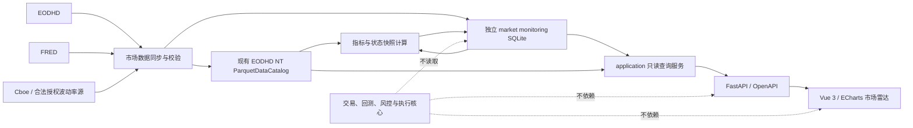

# HeyBoss 市场雷达数据面板高层实施方案

> 归档于 2026-09-16：这是实施前的产品设想，保留用于追溯，不作为当前开发指令。历史 PIT 宽度、十个交易日事件窗和 HY OAS 优先来源等设想已在后续实施中调整。现行能力与口径见 [市场雷达参考](../market-radar.md)，历史实施与验收见 [R0–R7 记录](market-radar-implementation-plan.md)。

> 文档用途：作为 coding agent 的实施输入，定义产品范围、架构边界、数据来源、指标口径、页面结构、里程碑与验收标准。
> 实施基线：2026-09-02，基于 `develop` 分支当前架构。
> 文档层级：高层设计；不规定具体类名、函数签名、SQL DDL 或前端组件代码。

---

## 1. 决策摘要

本次扩展新增一个独立的 **“市场雷达”** 一级入口，定位为日线级、只读、面向人工判断的市场监测模块。

第一阶段只实施以下能力：

1. **市场趋势与宽度**：判断指数上涨或下跌是否得到多数成分股确认。
2. **宏观定价状态**：以实际利率压力和风险偏好构建四象限状态图。
3. **板块领导力矩阵**：同时展示价格相对强弱、内部宽度、盈利修正和估值背景。
4. **盈利预期脉冲**：观察市场及板块的分析师 EPS 修正方向与幅度。
5. **个股雷达表**：以趋势、盈利修正、质量、估值和风险五个独立维度展示自选股。
6. **事件时间轴**：展示未来十个交易日的重要宏观事件与自选股财报。

第一阶段明确不实施：

- 板块轮动视图；
- 期权数据与期权模型；
- 持仓、账户或组合联动；
- 自动交易信号、目标仓位或下单动作；
- 盘中实时行情；
- 新闻、情绪分析和大语言模型摘要；
- 机器学习涨跌概率；
- 自动告警与通知；
- 可用于历史回测的 point-in-time 因子研究系统。

市场雷达必须始终是：

> **数据采集与派生计算 → 只读查询 → 可视化展示**

不得进入：

> `FactorScoreData → TradeSignalEvent → execution → risk → approval → NautilusTrader`

---

## 2. 产品目标

### 2.1 核心目标

市场雷达应帮助用户在每日盘后快速回答五个问题：

1. 当前美股指数趋势是否健康，还是由少数大盘股推动？
2. 实际利率、信用压力和波动率期限结构对风险资产形成什么环境？
3. 哪些板块同时获得价格、内部参与度和盈利预期的支持？
4. 自选股的价格趋势是否得到盈利修正和经营质量确认？
5. 未来十个交易日有哪些可能改变判断的重要事件？

### 2.2 产品定位

市场雷达不是预测器，也不是自动荐股系统。它应是：

- 市场状态诊断器；
- 结构性背离发现器；
- 板块和个股比较工具；
- 数据陈旧、缺失和冲突的显式展示器；
- 人工决策的证据组织层。

### 2.3 设计原则

1. **先展示事实，再展示状态**：原始值、变化值和覆盖率必须可追溯。
2. **不制造伪精确概率**：不显示“上涨概率 73%”一类结论。
3. **不隐藏冲突**：价格强而盈利下修等背离应直接保留，不能被平均成单一买入分。
4. **后端计算，前端表达**：Vue 只负责交互和可视化，不重新计算金融指标。
5. **EOD 语义明确**：所有价格、估值和状态均标注数据日期，不描述为实时。
6. **缺失优于猜测**：数据不足时返回 `unavailable` 或 `insufficient_coverage`，不得静默填补。
7. **固定、透明、可解释**：第一版模型权重固定，不通过回测优化。
8. **最小改动面**：复用现有 Python、FastAPI、Vue 3、TypeScript、ECharts 和 OpenAPI 链路。

---

## 3. 与现有系统的架构边界

### 3.1 必须保持的现有约束

- 交易核心不得依赖市场雷达、Web API 或 Web UI。
- Vue 只能通过 Python Web API 获取数据。
- Web API 继续只提供 GET 查询，不连接 IBKR，不调用执行网关。
- 市场雷达不得产生 `TradeSignalEvent`、审批记录、订单或成交记录。
- 监测标的不能因为进入数据面板而自动成为可交易标的。
- 凭据只能来自环境变量，不能写入配置、数据库、前端或仓库。
- 新增第三方依赖前必须单独说明必要性并获得批准。
- Python 和前端质量门禁沿用现有项目要求。

### 3.2 领域隔离

新增“市场监测域”，与交易域并列，但只有单向只读关系：



### 3.3 存储决策

#### 价格序列

继续复用现有 EODHD → NautilusTrader Bar → `ParquetDataCatalog` 数据链路，不建立第二套价格数据库。

- 监测标的使用独立的“监测宇宙”配置或成员表；
- 不将数百只监测股票加入交易标的配置；
- Catalog 中存在数据不代表标的可交易；
- 所有 Catalog 写入继续串行，避免并发覆盖；
- 数据与系统页面需要区分“交易宇宙”和“监测宇宙”的覆盖状态。

价格语义：

- 收益率、相对强弱、均线、宽度和动量使用现有 **INTERNAL 总回报调整序列**；
- 用户需要查看实际 EOD 价格时使用 **EXTERNAL 拆股调整序列**；
- 总览中的 SPY 趋势图优先归一化为 100，避免把总回报序列误认为真实成交价。

#### 非价格数据与派生快照

新增独立 SQLite 数据库，例如逻辑名称 `market monitoring database`，存储：

- 指数成员关系与分类；
- 宏观和波动率观测；
- 分析师一致预期快照；
- 财务与估值快照；
- 事件日历；
- 市场、板块和个股派生指标；
- 同步运行状态、覆盖率和错误摘要。

该数据库不得与 live/backtest 审计库混用。同步进程可写，Web API 必须以只读模式打开。

---

## 4. 信息架构

新增一个一级导航入口：**市场雷达**，归入“研究与系统”分组。

市场雷达内部保留三个视图：

1. **总览**；
2. **板块**；
3. **个股**。

路由或标签状态应可通过 URL 恢复，延续现有前端深链和刷新恢复原则。

### 4.1 总览页面

桌面端推荐布局：

```text
┌──────────────────────────────────────────────────────────────┐
│ 六项微型状态条：趋势｜宽度｜等权｜实际利率｜风险偏好｜EPS修正 │
├──────────────────────────────────────┬───────────────────────┤
│ 市场趋势与宽度                       │ 宏观定价四象限        │
│ 约 65%                               │ 约 35%                │
├──────────────────────────────────────┴───────────────────────┤
│ 板块领导力矩阵                                               │
├──────────────────────────────────────┬───────────────────────┤
│ 盈利预期脉冲                         │ 未来十个交易日事件轴  │
│ 约 70%                               │ 约 30%                │
└──────────────────────────────────────┴───────────────────────┘
```

总览不放置个股明细表，也不展示大段自动解释文字。

### 4.2 板块页面

第一阶段只提供矩阵和详情，不提供轮动图。

页面由以下部分组成：

- 11 个主要美股板块的领导力矩阵；
- 排序、指标说明和数据日期；
- 点击板块后打开右侧详情抽屉；
- 抽屉展示相对价格、内部宽度、盈利修正和估值背景的小型时间序列。

### 4.3 个股页面

只覆盖独立配置的自选股，不读取持仓作为默认集合。

页面由以下部分组成：

- 搜索与板块筛选；
- 多维热力表；
- 点击股票后打开详情抽屉；
- 财报日期直接作为表格标记和价格图事件线。

不提供单一“综合买入分”。

---

## 5. 数据来源设计

### 5.1 数据源清单

| 数据来源 | 第一阶段用途 | 重要约束 |
|---|---|---|
| EODHD EOD | SPY、RSP、板块 ETF、自选股和 S&P 500 成分股日线 | 复用现有适配与 Catalog；保持 INTERNAL/EXTERNAL 语义 |
| EODHD Index Fundamentals v1.1 | S&P 500 当前成分、历史成员区间、行业/板块分类 | 市场宽度使用 point-in-time 成员；早期历史覆盖需按供应商说明限制 |
| EODHD Calendar Trends | 当前及 7/30/60/90 日前 EPS 一致预期、分析师上调/下调人数 | 必须每日留存快照，不能假装存在完整历史日序列 |
| EODHD Earnings Calendar | 财报日期、盘前/盘后、实际与预期 EPS、Surprise | 缺少预期时不能将差值 0 解释为“符合预期” |
| EODHD Fundamentals v1.1 | 财务报表、当前估值、行业、股份数和经营质量字段 | 财务低频更新；缺失字段不得填 0 |
| EODHD Economic Events | 未来宏观事件时间轴 | 只保留预先定义的重要事件类别 |
| FRED `DFII10` | 10 年期实际利率水平与变化 | 日频；API 观测日期与采集时间均需保存 |
| FRED `BAMLH0A0HYM2` | 高收益债信用利差，可选增强项 | 仅限内部使用；不得在公开仓库或公开数据导出中再分发 |
| Cboe `VIX`、`VIX3M` 或等价合法授权源 | 波动率水平与期限结构 | 接入前确认数据访问方式和使用条款 |

### 5.2 信用压力输入的优先级

宏观模型的信用输入按以下顺序处理：

1. **优先**：FRED 高收益债 OAS，适用于本地个人内部使用；
2. **回退**：EODHD 中 `HYG/LQD` 的 20 日相对收益；
3. 两者均不可用时，宏观四象限不得仅凭 VIX 生成完整风险偏好状态。

页面必须标明当前使用的是 `HY OAS` 还是 `HYG/LQD proxy`。

### 5.3 波动率输入

优先使用：

- VIX：短期期权隐含波动率；
- VIX3M：三个月期隐含波动率；
- `VIX / VIX3M`：期限结构状态。

若 VIX3M 数据源尚未确认，宏观四象限应显示为“不完整”，而不是静默改用 VIX 单指标。

### 5.4 数据权限门槛

正式编码前必须完成一次数据能力核验，确认当前 EODHD 套餐是否允许访问：

- S&P 500 历史成员数据；
- Calendar Trends；
- Earnings Calendar；
- Fundamentals；
- Economic Events；
- 所需历史范围和调用配额。

若权限不足，应先形成“缺少字段—替代来源—额外成本—影响模块”的差异表，再决定是否更换或增加数据源。

---

## 6. 监测宇宙

### 6.1 市场基准

固定核心标的：

- `SPY`：市场趋势和相对收益基准；
- `RSP`：等权与市值权重差异；
- `HYG`、`LQD`：信用代理回退；
- 11 个 Select Sector SPDR ETF：板块价格代理。

### 6.2 板块 ETF

```text
XLB  XLC  XLE  XLF  XLI  XLK
XLP  XLRE XLU  XLV  XLY
```

### 6.3 市场宽度股票池

- 使用 S&P 500 point-in-time 成员关系；
- 每个交易日只纳入当日有效成员；
- 新上市或历史不足股票按对应指标的最小历史要求进入分母；
- 退市或退出指数的公司在其有效期间保留；
- 市场宽度不使用“今天的成分股回看历史”。

### 6.4 板块成员映射

- 按 GICS Sector 或供应商等价分类将 S&P 500 成分股映射到 11 个板块；
- 从首次正式同步起保存分类快照；
- 若供应商不能提供历史 GICS 变更，历史回填的板块宽度必须标记为“使用当前/最近分类近似”；
- 市场整体宽度仍使用 point-in-time 指数成员，不受该限制。

### 6.5 个股自选池

新增独立监测自选配置，不复用交易标的清单作为唯一来源。

要求：

- 自选股可以不具备交易配置；
- 交易标的也不会自动进入自选股；
- 第一阶段以几十只至约一百只为合理规模；
- 不实施全市场扫描器。

---

## 7. 时间、快照与陈旧度语义

### 7.1 必须保留的时间字段

所有非价格观测至少保存：

- `observation_date`：数据所描述的日期；
- `available_at_utc`：数据可被投资者看到的时间，若来源提供；
- `ingested_at_utc`：本系统采集时间；
- `calculated_at_utc`：派生指标计算时间；
- `as_of_date`：该面板快照代表的市场日期。

财报与分析师预期还需保存：

- 财政期间结束日；
- 年度或季度期间类型；
- 当前财年、下一财年等 period 标签；
- 一致预期快照日期。

### 7.2 完整快照原则

- 页面默认读取“最近一次完整、校验通过的快照”；
- 失败或不完整同步不能覆盖上一份完整快照；
- 同一模型的关键输入必须来自允许的共同日期范围；
- 不允许把最新价格与长期陈旧的信用或盈利数据组合成“最新状态”；
- 每个模块独立显示其 `as_of`、来源和覆盖率。

### 7.3 建议陈旧阈值

| 数据 | 建议有效窗口 | 超出后的行为 |
|---|---:|---|
| EOD 价格 | 2 个美股交易日 | 标记 stale；不生成最新市场状态 |
| VIX / VIX3M | 2 个美股交易日 | 宏观风险偏好不完整 |
| 实际利率 | 3 个工作日 | 标记 stale；四象限不切换状态 |
| 信用利差 | 3 个工作日 | 风险偏好不完整或使用明确回退源 |
| EPS 修正 | 3 个日历日或 2 个交易日 | 修正模块 stale，不沿用为当前状态 |
| 财务基本面 | 14 个日历日的采集陈旧度 | 可展示，但必须保留原始报告期和更新时间 |
| 事件日历 | 24 小时 | 不展示为“已更新” |

上述阈值是产品默认值，不应通过回测优化。

---

## 8. 总览顶部微型状态条

顶部只显示六项，每项包含：当前值、短 sparkline、方向箭头、数据日期和简短 tooltip。

| 项目 | 主显示值 | 作用 |
|---|---|---|
| SPY 趋势 | 20 日总回报与距 200 日均线 | 市场表面趋势 |
| 市场宽度 | 高于 50 日均线比例 | 中期参与度 |
| 等权确认 | RSP/SPY 20 日相对收益 | 少数权重股与普通股票差异 |
| 实际利率 | `DFII10` 20 日变化 | 折现率压力 |
| 风险偏好 | 信用压力与 VIX 期限结构合成状态 | ERP/流动性背景 |
| EPS 修正 | 全市场下一财年 30 日修正宽度 | 现金流预期方向 |

顶部状态条不显示长句；状态只使用“改善、稳定、恶化、缺失”一类短标签。

---

## 9. 模型一：市场趋势与宽度

### 9.1 目标

回答：

> 指数趋势是否得到多数 S&P 500 成分股确认？

### 9.2 核心指标

#### 高于 50 日均线比例

\[
B_{50,t}=\frac{\#\{i:P_{i,t}>MA_{50,i,t}\}}{N_{eligible,50,t}}
\]

#### 高于 200 日均线比例

\[
B_{200,t}=\frac{\#\{i:P_{i,t}>MA_{200,i,t}\}}{N_{eligible,200,t}}
\]

#### 10 日涨跌家数冲量

先计算每日净上涨比例：

\[
AD_t=\frac{N_{up,t}-N_{down,t}}{N_{eligible,t}}
\]

再计算：

\[
AD10_t=EMA_{10}(AD_t)
\]

#### 52 周新高—新低比例

\[
NHNL_t=\frac{N_{new\ high,t}-N_{new\ low,t}}{N_{eligible,252,t}}
\]

#### 等权相对强弱

\[
EqualWeightRS_{20,t}=R_{20,t}^{RSP}-R_{20,t}^{SPY}
\]

### 9.3 次要诊断指标

以下指标保留在 tooltip、详情或折叠区域，不占首页主视觉：

- 20 日横截面收益离散度；
- 20 日平均股票相关性；
- 成分股数据覆盖率；
- 当日上涨、下跌和平盘家数；
- 各板块的宽度贡献。

### 9.4 市场状态模型

趋势分数：

\[
TrendScore_t=
0.5\times HP_{3Y}(R_{20,t}^{SPY})
+0.5\times HP_{3Y}(P_t^{SPY}/MA_{200,t}^{SPY}-1)
\]

其中 `HP3Y` 将三年历史百分位映射到 `[-100, 100]`。

宽度分数：

\[
BreadthScore_t=
0.40HP_{3Y}(B_{50,t})+
0.30HP_{3Y}(B_{200,t})+
0.20HP_{3Y}(AD10_t)+
0.10HP_{3Y}(NHNL_t)
\]

宽度分数映射到 `[0,100]`。

状态规则：

| 趋势 | 宽度 | 状态 |
|---|---|---|
| 正 | 强 | 广泛上涨 |
| 正 | 弱 | 狭窄上涨 |
| 负 | 改善或强 | 内部修复 |
| 负 | 弱 | 广泛下跌 |
| 任一轴处于中性区 | 任意 | 过渡状态 |

默认中性区：

- `TrendScore` 在 `[-10, +10]`；
- `BreadthScore` 在 `[45, 55]`。

状态连续三个有效交易日进入新区域后才切换；明显越过中性区时可立即切换。该规则用于减少边界抖动，不代表预测。

### 9.5 视觉形式

主图采用一个共享时间轴：

1. 上部：SPY 归一化趋势线；
2. 中部：`B50`、`B200`、`AD10`、`NHNL` 四行连续热力带；
3. 下部：RSP/SPY 相对强弱线；
4. 右上角：当前市场状态短标签；
5. tooltip：显示当日原始值、分母、覆盖率和状态分项贡献。

不使用仪表盘、四个独立大数字卡或技术指标堆叠。

---

## 10. 模型二：宏观定价四象限

### 10.1 目标

回答：

> 当前市场主要处于折现率缓解、增长/再通胀、增长担忧，还是紧缩冲击环境？

四象限仅用于该模型，因为两个坐标分别代表相对独立的连续驱动因素。

### 10.2 横轴：实际利率压力

\[
X_t=RobustZ_{3Y}(DFII10_t-DFII10_{t-20})
\]

- 向右：实际利率上升，折现率压力增加；
- 向左：实际利率下降，折现率压力缓解。

实际利率绝对水平及其三年历史百分位作为图边缘微型信息，不进入横轴。

### 10.3 纵轴：风险偏好

优先版本：

\[
Y_t=
-0.60RobustZ_{3Y}(\Delta_{20}HY\ OAS)
-0.40RobustZ_{3Y}(\ln(VIX/VIX3M))
\]

分数越高代表风险偏好越强。

使用 ETF 信用代理时：

\[
Y_t=
0.60RobustZ_{3Y}(\Delta_{20}\ln(HYG/LQD))
-0.40RobustZ_{3Y}(\ln(VIX/VIX3M))
\]

所有 Robust Z-score 在展示前截断至 `[-3,+3]`，避免极端值压缩图形。

### 10.4 四个状态

| 象限 | 实际利率压力 | 风险偏好 | 状态名称 |
|---|---|---|---|
| 左上 | 下降 | 改善 | 宽松型 Risk-on |
| 右上 | 上升 | 改善 | 增长 / 再通胀 |
| 左下 | 下降 | 恶化 | 增长担忧 |
| 右下 | 上升 | 恶化 | 紧缩冲击 |

横纵轴各设置约 `±0.35` 的中性带。点处于中性带时显示“过渡”，不强行归入象限。

### 10.5 视觉形式

- 当前点；
- 最近 60 个交易日轨迹；
- 起点低透明度，终点突出；
- 中央中性区域；
- 四个象限只保留短标题；
- 图边显示实际利率、信用输入、VIX、VIX3M 的小型趋势线；
- tooltip 显示计算来源、20 日变化和状态持续天数。

SPY、黄金和长债收益不进入模型坐标，避免循环定义。它们可在未来作为验证层添加，但不属于第一阶段主图。

---

## 11. 模型三：板块领导力矩阵

### 11.1 目标

回答：

> 哪些板块的相对价格、内部参与度和盈利预期相互确认？哪些板块只是短期反弹或估值较低？

### 11.2 默认矩阵字段

| 列 | 定义 | 视觉 |
|---|---|---|
| 绝对趋势 | 板块 ETF 距 200 日均线 | 小型上/下趋势符号及数值 |
| RS 20D | 板块 ETF 20 日总回报减 SPY 20 日总回报 | 以 0 为中心的发散热力格 |
| RS 60D | 板块 ETF 60 日总回报减 SPY 60 日总回报 | 以 0 为中心的发散热力格 |
| Breadth 50D | 板块内 S&P 500 成分股高于 50 日均线比例 | 0–100 连续热力格 |
| EPS Revision | 下一财年 EPS 30 日修正宽度 | 以 0 为中心的发散热力格 |
| Valuation | 当前板块估值吸引力 | 0–100 连续热力格 |
| Rank | 领导力模型横截面排名 | 数字与升降箭头 |

### 11.3 领导力评分

\[
Leadership_i=
0.35Rank(RS60_i)+
0.20Rank(RS20_i)+
0.25Rank(Breadth50_i)+
0.20Rank(Revision_i)
\]

规则：

- 所有 `Rank` 为 11 个板块间的横截面百分位；
- 估值不进入领导力分数；
- 不使用回测优化权重；
- 若任一核心分项缺失且无法达到最小覆盖率，该板块不生成领导力排名；
- 排名变化对比最近五个交易日前的有效排名。

### 11.4 估值背景

第一阶段不声称拥有完整的五年 point-in-time 历史估值。

板块估值列优先使用：

- 成分股的 Forward Earnings Yield；
- FCF Yield；
- 在板块内部和 11 个板块之间进行稳健聚合与横截面比较。

将结果转换为“估值吸引力”：数值越高代表相对更便宜，以保持颜色语义一致。

要求：

- 负 EPS 公司不参与 Forward Earnings Yield 聚合，但计入覆盖率；
- FCF 缺失或为负时不填 0；
- 金融和 REIT 若缺少适配指标，应显示 `not_comparable`，不能套用工业企业估值；
- 自首次快照起积累历史估值；没有足够历史前不显示“自身五年百分位”。

### 11.5 板块详情抽屉

点击某一板块后只显示四组图：

1. 板块 ETF 相对 SPY 的 20/60/120 日表现；
2. 板块 `B50` 与 `B200` 历史；
3. EPS 修正宽度与修正幅度历史；
4. 当前估值、覆盖率和自首次记录以来的历史区间。

第一阶段不出现相对轮动四象限或轨迹图。

---

## 12. 模型四：盈利预期脉冲

### 12.1 目标

回答：

> 分析师对市场和板块未来盈利的预期正在普遍上调，还是由少数公司推动？

### 12.2 EPS 修正宽度

使用下一财年（`+1y` / FY1）一致预期：

\[
RevisionBreadth_t=
\frac{N_{up,t}-N_{down,t}}{N_{covered,t}}
\]

方向判断基于当前 EPS 预期与 30 日前预期的差异，并设置极小容差，避免浮点噪声被算作修正。

### 12.3 EPS 修正幅度

\[
RevisionMagnitude_t=
Median\left(\frac{EPS^{current}_{i}}{EPS^{30d}_{i}}-1\right)
\]

仅对分母为正且远离零的公司计算百分比幅度。

对于 EPS 为负或接近零的公司：

- 仍可根据绝对变化判断上调或下调，进入宽度；
- 不进入百分比幅度聚合；
- 单独报告此类公司的数量与覆盖率。

### 12.4 财报 Surprise 宽度

作为次要覆盖层：

\[
SurpriseBreadth=
\frac{N_{positive}-N_{negative}}{N_{reported\ with\ estimate}}
\]

缺少一致预期的报告不得按 Surprise 为 0 处理。

### 12.5 历史限制

Calendar Trends 提供当前与固定滞后点，不等同于完整的历史每日快照。

因此：

- 第一次接入即可展示当前 7/30/60/90 日变化；
- 完整日度“盈利脉冲”时间序列从系统首次每日采集后自然增长；
- 不根据今天的数据反向伪造过去每日一致预期；
- 页面明确显示历史起点。

### 12.6 视觉形式

- 主体：修正宽度的发散柱或面积带；
- 叠加：修正幅度细线；
- 财报季：Surprise 宽度使用小型事件点；
- 可切换“市场整体 / 11 个板块”；
- 默认窗口为一年，自有历史不足时展示全部可用区间；
- tooltip 展示覆盖公司数、正/负 EPS 数量和数据日期。

---

## 13. 事件时间轴

### 13.1 范围

默认展示未来十个美股交易日：

- FOMC 利率决议及重要会议；
- CPI、PCE；
- 非农就业；
- GDP；
- ISM；
- 零售销售；
- 自选股财报；
- 已知的重要公司投资者日或拆股，仅在数据源可靠时纳入。

不展示所有低重要性宏观事件。

### 13.2 视觉形式

- 横向时间轴；
- 圆点或图标区分宏观与公司事件；
- 图形大小只表示预定义重要性等级；
- 默认只显示事件名称缩写；
- tooltip 展示时间、前值、预期值、公司盘前/盘后和数据来源；
- 时间戳在后端保存 UTC，前端显示方式沿用全站明确标注的时区规则。

### 13.3 数据质量

- 不确定或无时间的事件显示为“日期已知，时间待定”；
- 已过去的事件自动移出未来时间轴；
- 事件更新失败时保留上一份数据但标记 stale；
- 财报日期变化必须更新，不保留冲突的旧日期作为当前事件。

---

## 14. 模型五：个股雷达表

### 14.1 目标

回答：

> 自选股在趋势、盈利预期、经营质量、估值和风险五个维度分别处于什么位置？

不把五个维度合成为单一买入分。

### 14.2 默认字段

| 字段 | 主显示 |
|---|---|
| 股票 | 代码、名称、所属板块、微型价格线 |
| 趋势 | 0–100 行业内百分位 |
| 盈利修正 | 0–100 行业内百分位 |
| 质量 | 0–100 行业内百分位或 `not_comparable` |
| 估值 | 同行相对位置；历史位置有足够数据后再显示 |
| 风险 | 0–100 风险百分位，数值越高风险越高 |
| 事件 | 距下一次财报的交易日数和盘前/盘后标记 |

### 14.3 趋势维度

\[
TrendScore_i=
0.60Rank_{industry}(R_{126-21,i}-R_{126-21,sector})+
0.40Rank_{industry}(P_i/MA_{200,i}-1)
\]

其中 `126-21` 表示过去约六个月收益并跳过最近一个月。

表格微型价格线可显示最近 60 个交易日，tooltip 同时给出 20 日相对表现，避免长期动量掩盖近期转折。

### 14.4 盈利修正维度

\[
RevisionScore_i=
0.60Rank_{industry}(EPSRevision30D_i)+
0.40Rank_{industry}(RevisionBreadth30D_i)
\]

其中：

\[
RevisionBreadth30D_i=
\frac{AnalystsUp_{30D}-AnalystsDown_{30D}}{AnalystCount}
\]

若分析师数量过少，显示低覆盖，不与高覆盖股票直接同等解释。

### 14.5 质量维度

一般经营性公司使用：

- ROIC；
- FCF Margin；
- Net Debt / EBITDA。

综合方式采用行业内稳健百分位的中位数，不使用简单原始值平均。

特殊行业：

- 金融股不得使用 Net Debt / EBITDA；
- REIT 不应在缺少 FFO/AFFO 时生成通用质量分；
- 对尚未定义专用口径的行业显示 `not_comparable`，并展示可用原始指标。

第一阶段宁可缺失，也不强行制造跨行业统一分数。

### 14.6 估值维度

盈利正常公司优先使用：

- Forward Earnings Yield；
- FCF Yield；
- EV / EBITDA。

亏损成长公司：

- 不计算 P/E；
- 可显示 EV / Sales；
- 标记为“成长估值口径”，不与盈利公司直接合成同一分数。

金融股：

- 优先使用 Price / Book 与 ROE 组合背景；
- 不与普通工业企业直接横向比较。

REIT：

- 在没有可靠 FFO/AFFO 数据源前不生成综合估值分。

历史估值：

- 第一阶段以当前同行相对估值为主；
- 从首次快照起积累自身历史；
- 至少拥有 252 个有效日度快照，或接入经确认的 point-in-time 历史估值源后，才显示自身历史百分位。

### 14.7 风险维度

建议使用：

- 20 日实现波动率；
- 126 日最大回撤；
- ATR20 / Price。

\[
RiskScore_i=
0.50Rank(RV20_i)+
0.30Rank(|MaxDrawdown126_i|)+
0.20Rank(ATR20_i/P_i)
\]

风险分数数值越高代表风险越高，不能沿用“高分更好”的颜色语义。

### 14.8 个股详情抽屉

只展示四组核心视觉：

1. 实际 EOD 价格与相对所属板块表现；
2. 当前、7/30/60/90 日前 EPS 一致预期；
3. 最近八个季度的营收、经营利润率和自由现金流趋势；
4. 当前同行估值位置与自首次记录以来的历史区间。

财报日期作为价格图垂直事件线。缺失数据通过空态表达，不使用长篇自动分析。

---

## 15. 标准化与评分统一规则

### 15.1 宏观时间序列

使用三年滚动 Robust Z-score：

\[
RobustZ(x)=\frac{x-Median(x)}{1.4826\times MAD(x)}
\]

若 MAD 为零或有效历史不足，则该分数无效。

### 15.2 市场状态

使用三年历史百分位，保留时间序列自身的历史位置。

### 15.3 板块和个股

- 板块排名使用 11 个板块横截面百分位；
- 个股质量、估值和修正优先在行业内比较；
- 极端值在横截面内进行稳健截尾；
- 不使用全市场统一原始阈值比较不同行业。

### 15.4 缺失值

- 不以 0 代替缺失；
- 综合分至少需要达到规定的有效分项数量；
- 缺少关键分项时显示“部分数据”，并暴露覆盖率；
- 前端不得自行补全、重新排名或猜测。

---

## 16. 视觉传达规范

### 16.1 图形选择

| 信息类型 | 默认视觉 |
|---|---|
| 时间趋势 | 折线、面积带、热力带 |
| 多板块多指标比较 | 矩阵热力表 |
| 两个连续驱动变量 | 四象限轨迹图 |
| 个股多维比较 | 可排序热力表 |
| 未来事件 | 横向时间轴 |
| 单个数值历史位置 | sparkline 或区间点 |

### 16.2 明确禁用

第一阶段不使用：

- 仪表盘速度表；
- 雷达图；
- 饼图；
- 3D 图；
- 大面积品牌渐变；
- 大量红绿数字卡；
- 自动生成的长篇市场解读；
- 颜色是唯一信息载体的设计。

### 16.3 颜色语义

- 绿色 / 红色：仅表达明确的改善 / 恶化或正 / 负方向；
- 琥珀：陈旧、覆盖不足或需要注意；
- 蓝 / 紫：中性强度、排名或品牌强调；
- 风险分数单独定义“越高风险越高”，必须有文字或图标辅助；
- 热力格中保留数值，不能只靠颜色判断。

### 16.4 信息密度

- 主页面只显示状态、方向、强度和异常；
- 计算解释放在 tooltip 或详情抽屉；
- 数据来源、日期和覆盖率始终可见，但使用次级字号；
- 单张大图只回答一个问题。

### 16.5 响应式与可访问性

- 桌面：按总览布局完整展示；
- 平板：左右图表纵向堆叠；
- 手机：状态条转为两列，矩阵和表格在卡片内部横向滚动，不产生页面级横向溢出；
- 图表提供等价文字摘要；
- 抽屉支持 Escape、焦点恢复和窄屏全屏；
- Tooltip 不是获取核心数值的唯一方式。

---

## 17. 高层数据模型

以下是逻辑实体，不是强制 SQL 表名。

### 17.1 同步与来源

- **Market Sync Run**：一次同步的开始、结束、状态、来源、覆盖率和错误摘要；
- **Source Observation**：宏观、信用和波动率的日期观测；
- **Source Freshness**：各来源最后成功时间、预期频率和陈旧状态。

### 17.2 宇宙与分类

- **Index Membership**：指数、股票、加入日期、退出日期；
- **Instrument Classification**：股票、板块、行业、有效日期；
- **Monitoring Watchlist**：显式配置的个股集合。

### 17.3 基本面与预期

- **Earnings Estimate Snapshot**：股票、财政期间、period、快照日期、当前及历史滞后预期、分析师数量和修正人数；
- **Fundamental Snapshot**：股票、报告期、来源更新时间、质量与估值所需字段；
- **Earnings Event**：财报日期、盘前/盘后、实际值、预期值和 Surprise。

### 17.4 派生结果

- **Market Metric Snapshot**：市场趋势、宽度、宏观状态和各分项；
- **Sector Metric Snapshot**：11 个板块各项指标、排名和覆盖率；
- **Stock Metric Snapshot**：自选股五个独立维度、原始分项和有效性；
- **Market Event**：未来宏观和公司事件。

### 17.5 幂等与发布

- 同一 `as_of_date + entity + metric` 保持唯一；
- 同一天重跑在完整校验通过后替换当日结果；
- 不完整运行不得删除上一份成功结果；
- API 选择最近一次 `complete` 快照；
- 不引入无实际消费者的 schema 版本注册表或通用插件机制。

---

## 18. 数据同步与计算流程

第一阶段使用显式的一次性同步任务，不在应用内部引入常驻调度器。

建议流程：

1. 读取监测配置并确定目标市场日期；
2. 同步 S&P 500 成员和分类；
3. 使用现有数据适配层同步缺失 EOD Bar；
4. 同步实际利率、信用和波动率；
5. 同步分析师预期、财报日历和宏观事件；
6. 按较低频率同步财务基本面；
7. 对每个来源执行独立质量校验；
8. 计算市场、宏观、板块、盈利和个股快照；
9. 在事务内发布完整快照；
10. 记录同步状态和失败摘要。

### 18.1 建议刷新频率

| 数据 | 刷新频率 |
|---|---|
| EOD 价格与市场宽度 | 每个美股交易日盘后 |
| S&P 500 成员 | 每个交易日检查，成员变化时更新 |
| 实际利率、信用、VIX/VIX3M | 每个工作日 |
| EPS Trends | 每个交易日；覆盖市场和板块所需成分股 |
| 财报日历与宏观事件 | 每日 |
| 财务报表与质量字段 | 每周检查，检测到新报告时更新 |
| 派生快照 | 每次关键来源同步完成后 |

调度可由用户现有运行方式或宿主机外部机制触发；第一阶段不引入 Celery、Redis、Kafka 或新的任务平台。

---

## 19. 只读查询与 API 边界

### 19.1 查询层职责

`application/` 中新增与传输协议无关的市场监测查询服务，负责：

- 读取最近完整快照；
- 读取有限时间窗口；
- 聚合数据来源、覆盖率和陈旧状态；
- 返回不可变的普通 Python 查询模型；
- 不调用外部 API；
- 不在请求路径上扫描和重算全部 S&P 500 原始数据。

### 19.2 HTTP 接口分组

建议形成以下逻辑接口：

| 接口组 | 职责 |
|---|---|
| Market Summary | 顶部六项状态和各模块 freshness |
| Market Breadth | SPY、热力带、RSP/SPY、状态和覆盖率 |
| Macro Regime | 四象限点、轨迹、组成指标和状态 |
| Sector Metrics | 11 板块矩阵、排名及详情时间序列 |
| Earnings Revisions | 市场/板块修正宽度、幅度和 Surprise |
| Market Events | 指定未来窗口的宏观与财报事件 |
| Stock Radar | 自选股表格、筛选和排序 |
| Stock Detail | 单只股票四组详情视觉所需数据 |

具体 URL 和响应 Schema 由 coding agent 在里程碑开始前提交，但必须保持：

- 仅 GET；
- OpenAPI 是前端类型的唯一来源；
- 错误继续使用统一 `application/problem+json`；
- 不返回本地路径、Token、底层栈或供应商完整原始响应；
- 列表遵循现有分页约定；
- 时间统一为 UTC ISO 8601；
- 每个响应包含 `as_of`、`generated_at`、`freshness`、`coverage` 和 `sources`。

---

## 20. 数据质量与失败关闭规则

### 20.1 市场宽度

- S&P 500 当日有效成员数量明显异常时，整日宽度无效；
- `B50` 和 `B200` 分别使用具备足够历史的有效分母；
- 主宽度状态建议要求至少 95% 的应有成员拥有当日价格；
- 90%–95% 可展示但标记低覆盖；
- 低于 90% 不生成状态；
- 不能以前一日价格静默补全当日缺失成分股。

### 20.2 宏观状态

- 实际利率、信用和 VIX 期限结构任一关键输入超出陈旧阈值时，不切换新象限；
- 使用回退信用代理时必须在响应和 UI 标明；
- VIX 或 VIX3M 非正、缺失或日期不匹配时，期限结构无效；
- 不因单一来源失败而将风险偏好默认为中性。

### 20.3 盈利修正

- 覆盖率低于预设阈值时不生成市场或板块修正状态；
- 分析师数量为 0 或缺失时不计算 revision breadth；
- EPS 接近零时不计算百分比幅度；
- 缺少预期的财报不能计入 Surprise 正负分母；
- 数值字符串必须在后端规范解析，解析失败视为缺失而非 0。

### 20.4 个股指标

- 行业样本过少时不生成行业百分位；
- 特殊行业无专用口径时返回 `not_comparable`；
- 任何综合维度必须返回其有效分项数；
- 前端不根据缺失分项自行重新加权。

### 20.5 故障体验

统一区分：

- 未配置；
- 尚未采集；
- 空数据；
- 覆盖不足；
- 数据陈旧；
- 内容损坏；
- 请求失败；
- 使用回退源。

这些状态不能合并成一个通用“暂无数据”。

---

## 21. 安全、凭据与数据许可

### 21.1 凭据隔离

- 市场同步进程持有所需 EODHD/FRED 凭据；
- `web-api` 不接收 EODHD、FRED、IBKR 或 Telegram Token；
- Vue 不持有任何数据供应商凭据；
- 市场数据库、Catalog 和报告继续只读挂载到 Web 服务；
- 新数据库和下载数据加入 `.gitignore` 与 Docker ignore。

### 21.2 数据许可

- EODHD 数据仅按当前个人套餐和条款用于本地展示；
- ICE BofA HY OAS 只按内部使用限制处理，不能随公开仓库、测试 fixture、静态演示数据或下载接口再分发；
- Cboe 指数数据接入前确认允许的本地显示和保留方式；
- 仓库只提交适配代码、字段定义和合成测试数据，不提交真实供应商数据；
- API 不提供“导出全部供应商历史数据”的功能。

---

## 22. 里程碑计划

根据仓库 `AGENTS.md`，每个里程碑编码前，coding agent 必须先提交：

1. 预计修改和新增的文件清单；
2. 关键接口与数据契约；
3. 验收方式；
4. 是否新增第三方依赖及理由。

获得确认后再编码。

### M0：事实核验与实施契约

**目标**

- 完整阅读 `AGENTS.md`、`docs/project-context.md`、`docs/technical-reference.md`、`docs/web-rebuild.md`；
- 核验数据套餐、字段、历史覆盖和许可；
- 固化指标词典、监测宇宙和页面结构；
- 明确 HY OAS 与 HYG/LQD 的实际选择；
- 明确 VIX3M 的实际合法数据入口。

**交付物**

- 数据能力差异表；
- 指标口径表；
- 文件清单和接口草案；
- 无法满足项及明确降级行为。

**验收**

- 不依赖未确认存在的字段；
- 不以模糊“未来可接入”掩盖第一阶段缺口；
- 所有关键模型都能由确认的数据字段计算。

### M1：监测数据域与同步基础

**目标**

- 建立独立市场监测数据库；
- 建立监测宇宙与 S&P 500 成员同步；
- 扩展现有 EODHD 数据链路以同步监测标的，但不改变交易宇宙；
- 建立同步运行、freshness、coverage 和错误记录；
- 保持 Catalog 写入串行。

**验收**

- 监测数据库与 live/backtest 数据库分离；
- 监测标的不自动进入策略或执行配置；
- 失败同步不覆盖最后完整结果；
- 重复运行幂等；
- Web API 尚不需要写权限。

### M2：市场宽度与宏观状态

**目标**

- 完成 S&P 500 point-in-time 宽度计算；
- 完成 SPY、RSP/SPY 及市场状态；
- 接入实际利率、信用和 VIX 期限结构；
- 完成宏观四象限及轨迹快照。

**验收**

- 选定多个历史日期人工复算一致；
- 成员进入、退出和历史不足样本处理正确；
- 宏观缺少关键输入时失败关闭；
- 回退信用代理有显式标记；
- 状态缓冲规则可由测试证明。

### M3：盈利、板块与个股派生数据

**目标**

- 接入 Calendar Trends、Earnings Calendar 和 Fundamentals；
- 保存每日一致预期快照；
- 计算市场与板块盈利修正脉冲；
- 计算板块领导力矩阵；
- 计算自选股五个独立维度；
- 建立事件时间轴数据。

**验收**

- 正 EPS、负 EPS、接近零 EPS 和无分析师覆盖场景均有测试；
- 金融与 REIT 不被错误套用普通企业指标；
- 估值历史不足时不显示虚假的五年百分位；
- 领导力分数不包含估值；
- 不产生总买入分。

### M4：只读查询层与 OpenAPI

**目标**

- 建立传输无关的市场查询模型；
- 建立只读 API；
- 输出页面所需的预计算结果、时间窗口、freshness 和 coverage；
- 更新 OpenAPI 并生成前端类型。

**验收**

- 全部接口仅 GET；
- 请求路径不触发外部采集或全市场重算；
- SQLite 使用只读方式；
- 错误响应不泄露路径、凭据和栈；
- 前端类型可由 OpenAPI 确定性生成；
- Web API 不导入交易 runner、执行网关或 Telegram。

### M5：总览页面

**目标**

- 新增市场雷达导航和总览路由；
- 完成顶部微型状态条；
- 完成市场趋势与宽度热力带；
- 完成宏观定价四象限；
- 完成板块矩阵摘要、盈利脉冲和事件轴；
- 完成正常、空、陈旧、覆盖不足和请求失败状态。

**验收**

- 页面不出现期权、持仓或交易动作；
- 图表只渲染后端结果；
- 数据日期与来源始终可见；
- 没有大段自动解释；
- 桌面、平板和手机无页面级横向溢出；
- 图表有等价文字摘要。

### M6：板块与个股页面

**目标**

- 完成板块完整矩阵和详情抽屉；
- 完成个股多维热力表和详情抽屉；
- 完成 URL 状态恢复、排序、筛选和移动端交互；
- 保持板块轮动视图缺席。

**验收**

- 11 个板块数据齐全或明确标记缺失；
- 表格不生成综合买入分；
- 特殊行业比较边界正确；
- 抽屉支持键盘关闭和焦点恢复；
- 财报事件直接体现在表格和价格图中；
- URL 刷新后保留当前视图、筛选和选中对象。

### M7：部署、质量与文档

**目标**

- 将市场监测数据库和 Catalog 以只读方式提供给 Web API；
- 同步进程单独获取凭据；
- 完成测试、真实浏览器验收和文档更新；
- 验证 Web 模块可删除性和交易核心隔离。

**验收**

- Python：ruff、format、mypy strict、pytest、pre-commit 全部通过；
- 前端：TypeScript strict、ESLint、Prettier、Vitest、生产构建全部通过；
- Web 服务停止或删除不影响 TradingNode、审批、回测或 IB Gateway；
- Web API 不持有供应商和券商凭据；
- 公开仓库不包含真实市场数据、账户数据或受限数据；
- README、项目事实源和技术文档与实际实现一致。

---

## 23. 全局验收标准

### 23.1 功能

- 市场雷达拥有总览、板块和个股三个视图；
- 总览包含六项状态条、宽度图、宏观四象限、板块矩阵、盈利脉冲和事件轴；
- 板块页不包含轮动视图；
- 个股页不包含总买入分；
- 不包含期权、持仓或自动交易功能。

### 23.2 数据正确性

- 市场宽度使用 point-in-time S&P 500 成员；
- 收益与相对强弱使用一致的总回报价格语义；
- 关键指标可在样本日期独立复算；
- 每个聚合指标暴露分母和覆盖率；
- 不使用未来已知的财报或一致预期数据回填历史；
- 数据不足时不生成虚假状态。

### 23.3 架构

- 交易核心不依赖市场监测域；
- Web API 继续只读；
- 不形成第二条下单路径；
- 不在前端计算金融模型；
- 不建立第二套价格真相源；
- 不引入当前需求不需要的队列、缓存或通用插件系统。

### 23.4 用户体验

- 主页面通过图形而非长文字表达；
- 所有图表有明确数据日期、来源和陈旧状态；
- 色彩语义一致且不只依赖颜色；
- 1440、768、375 三类宽度可用；
- 加载、空数据、陈旧、损坏和网络失败均可区分；
- 详情使用抽屉，不通过多个新页面堆叠信息。

### 23.5 安全与许可

- Token 不进入 Web API、Vue、Git、日志或错误响应；
- Web 挂载只读；
- ICE/Cboe/EODHD 数据按允许范围本地使用；
- 测试使用合成 fixture，不提交真实受限数据。

---

## 24. 后续路线图，但不属于本次实施

按优先顺序记录，不提前建设接口或抽象：

1. 板块轮动视图；
2. 自选股与真实持仓的可选叠加；
3. 期权 IV、期限结构与偏度；
4. ETF 资金流与更完整信用指标；
5. 收益预期与营收修正的长期快照；
6. 可靠的 point-in-time 历史估值数据源；
7. 用户自定义观察列表管理；
8. 人工告警规则；
9. 新闻和财报文本 NLP；
10. 因子研究、IC、分层回测与机器学习。

以上项目不得成为第一阶段代码中的预留插件、空接口或未使用参数。

---

## 25. 交给 coding agent 的固定指令

coding agent 开始执行时必须遵守以下不可自行重解释的决定：

1. 市场雷达是独立只读域，不接入信号、风控、审批和执行。
2. 第一阶段只有总览、板块、个股三个视图。
3. 板块页面不实施轮动视图。
4. 不实施期权模型。
5. 不读取持仓来改变图形大小、外圈或排序。
6. 不生成单一综合买入分。
7. 不在 Vue 中计算指标或状态。
8. 不将监测股票自动加入交易标的配置。
9. 不以 0 代替缺失，不静默使用陈旧数据。
10. 不新增第三方依赖，除非先提交必要性、替代方案和验收方式并获批准。
11. 每个里程碑开始前先提交文件清单、关键接口和验收方式。
12. 若现有结构无法容纳需求，先提出最小、无行为变化的重构方案，等待裁决。

第一步不是写代码，而是完成 **M0：事实核验与实施契约**。

---

## 26. 依据文件与外部数据说明

实施前应核对以下资料的当前版本：

### 仓库内部

- `AGENTS.md`
- `docs/project-context.md`
- `docs/technical-reference.md`
- `docs/web-rebuild.md`
- 根目录 `README.md`

### 外部数据文档

- EODHD Fundamental Data API v1.1；
- EODHD S&P and Dow Jones Historical Constituents；
- EODHD Calendar API：Earnings 与 Trends；
- EODHD Economic Events Data API；
- FRED `DFII10`；
- FRED `BAMLH0A0HYM2` 的使用限制；
- Cboe VIX 与 VIX3M 指数数据及使用条款。

供应商字段、套餐和条款可能变化；M0 应以实施当天的官方文档和实际 API 响应为准。
