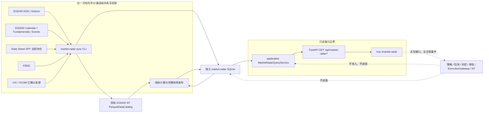

# 市场雷达实施方案（基于当前仓库）

> 归档于 2026-09-16：本文保留截至 2026-09-06 的阶段契约与验收记录。各阶段的“尚未实现”“待批准”“下一步”只描述当时状态，不再作为新任务的前置要求；历史容器状态、成员数量和数据日期不代表当前值。现行实现见 [市场雷达参考](../market-radar.md)。交易日历来源已在后续联合方案中选定，但尚未实施；本次归档不改变市场事件窗的十四个日历日口径。

> 状态：R0 至 R7 已完成。一次性同步、正式库四源初始化、新版 Web 本机部署、真实 URL 三档宽度与删除恢复验收均通过。用户已取消恢复完全相同旧页面的前置要求；实际部署及恢复均使用新版镜像。
> 最近核对：2026-09-06（本轮采集 UTC 日为 09-05），分支 `feat/market-radar`。
> 原始产品设想：[HeyBoss 市场雷达数据面板高层实施方案](HeyBoss_market_radar_implementation_plan.md)。
> 事实优先级：`AGENTS.md` 与 [项目事实源](../project-context.md) 高于原始设想；本文再以当前代码和实际供应商能力收敛实施路径。

## 1. 文档结论

市场雷达适合加入当前项目，但必须作为**独立、只读、可删除的市场监测域**，不能放入策略、因子、风控或执行目录，也不能把监测股票自动变成可交易股票。

当前仓库可以直接复用的部分是：

- EODHD EOD、splits、dividends 到 NT Instrument/双 BarType/ParquetDataCatalog 的链路；
- SQLAlchemy + SQLite、FastAPI、OpenAPI 生成、Vue 3、ECharts 与现有状态组件；
- Web API 只读数据库、只读挂载、同源代理和可删除性边界；
- 现有 Python 与前端质量门禁。

当前仓库**不能直接支撑**原始设想中的完整面板：

- EODHD 业务适配器已覆盖 EOD、拆股、分红、Calendar Trends/Earnings、指数当前成分行业分类、watchlist 当前 Fundamentals 和美国 Economic Events；历史指数成分仍只有能力探测；
- `config/instruments.yaml` 仍只管理 10 只可交易普通股；25 只固定监测池和 503 只动态当前成员已与交易资格隔离；
- 25 只价格监测池和当前 503 个成员均已进入共享 Catalog，但当前成员代理不能用于历史/PIT 宽度回放；
- 独立市场数据库已有同步运行、价格、当前成员、当前宽度、风险偏好、FRED 当前修订观测、宏观象限、盈利成员/分类、全市场 FY1 预期、watchlist 财报事件、统一盈利修正快照、可复算的当前基本面规范输入与指标快照，以及美国经济事件规范快照；
- Web API 与 Vue 已交付价格、当前宽度、完整宏观象限、市场/watchlist/板块盈利修正、watchlist 基本面与含当天 14 日事件轴；经济事件和同批财报事件独立读取与降级；
- 已有 FRED DFII10 适配器，但没有 Cboe 适配器、常驻调度器或可靠的未来美股交易日历能力；
- 当前 EODHD Token 已证明 EOD、VIX/VIX3M、Calendar、Fundamentals、Economic Events 及当前/历史指数成分均可用；Calendar、当前成分行业分类、watchlist Fundamentals 和美国 Economic Events 已进入业务链路，历史成分尚未进入。

因此不能直接从“画完整页面”开始。推荐采用**数据能力门禁 → 价格纵向切片 → 宽度 → 宏观 → 盈利/基本面/事件 → 完整 UI**的顺序。每一步都能独立验收，缺少数据时返回明确状态，不用占位数据伪装完成。

## 2. 当前实现核对

### 2.1 已有架构

```text
EODHD EOD / IBKR 历史
        ↓
HistoricalBarSource + HistoricalDataPipeline
        ↓
NT Instrument + INTERNAL/EXTERNAL Bar + ParquetDataCatalog
        ↓
策略 Actor → TradeSignalEvent → ExecutionGateway → 风控/审批 → NT 执行

交易审计 SQLite / Catalog / 回测报告 / 白名单配置
        ↓
application 只读查询服务
        ↓
FastAPI GET /api
        ↓
Vue 3 八个一级页面
```

现有 Web 已经完成八个页面：`/`、`/portfolio`、`/strategy`、`/activity`、`/orders`、`/market-radar`、`/backtests`、`/system`。市场雷达包含 URL 可恢复的总览、板块和个股视图。Web 没有写请求，没有 IBKR 或供应商凭据，停止 Web 不影响交易核心。

### 2.2 能力与缺口矩阵

| 需求 | 当前事实 | 处理决定 |
|---|---|---|
| EOD 价格 | 已实现 EODHD EOD + 双 BarType | 复用同一适配和 Catalog，不建另一套价格数据库 |
| 监测宇宙 | 25 只固定监测池 + 503 只动态成员已实现 | 与交易清单隔离，Catalog 存在不代表可交易 |
| 当前市场成员 | State Street SPY 每日持仓适配器已实现；升级套餐下 EODHD 当前/历史成分接口也已可用 | R3 继续采用已验收的当前 SPY 持仓代理；是否切换来源另立里程碑，不在 R5 中顺带改变口径 |
| 市场宽度 | 已离线计算并原子发布四项当前快照 | API 只读快照，不现场扫描 500 只股票 |
| FRED 实际利率/信用 | DFII10 当前修订适配、存储、计算、页面和真实 bootstrap 已完成 | 首版信用继续使用 HYG/LQD，不接入受限 HY OAS |
| VIX/VIX3M | 已作为 NT `IndexInstrument` 接入 EODHD EOD 与共享 Catalog | R4A 已验证；任一序列缺失时风险偏好模块失败关闭 |
| EPS Trends/财报日历 | 当前成员 Trends、10 只 watchlist 事件、统一市场/板块聚合、每日存储、CLI、只读 API、Vue 和真实幂等验收已完成 | 从首次采集日起积累，不回填伪 PIT 历史；事件请求不随市场成员扩张，Web 不暴露原始 Trends |
| Fundamentals | 10 只 watchlist 的规范输入、行业适用性、单项比率、原子存储、CLI、只读 API 和 Vue 已完成 | 价格与基本面独立状态；ROIC、同行评分与 FY1 Earnings Yield 暂缓，不伪造历史 PIT |
| Economic Events | 严格批次、一次性 CLI、原子存储与只读 API/Vue 已实现 | 采集 31 日、展示含当天 14 日；来源时钟不冒充已确认的 UTC 发布时间 |
| 未来 10 个交易日 | 没有可靠未来交易日历 | MVP 改为 14 个日历日并准确标注；若必须精确 10 个交易日，单独申请日历依赖 |
| 监测数据库 | 运行、价格、当前成员、宽度、宏观、盈利、基本面与经济事件合计十四张表 | 使用独立 `market-radar.db`；基本面和经济事件不写 Catalog 或交易审计库 |
| 查询/API | 价格、当前宽度、宏观、盈利与基本面均已有只读分层 | 保持请求路径不访问供应商、Catalog 或计算器 |
| Vue/ECharts | 市场雷达三视图、当前宽度卡片、宏观象限图、盈利脉冲、板块盈利矩阵及个股基本面列表/详情已具备 | 后续模块继续使用独立状态和相同设计语言 |
| 调度 | 没有常驻调度 | 第一阶段仅提供一次性 CLI；由人工或宿主机外部调度触发 |
| 交易联动 | 唯一执行链路已有硬约束 | 市场雷达永不发布 `TradeSignalEvent`，不提供下单或审批操作 |

### 2.3 原始设想中需要修正的假设

1. **“已有 EODHD 适配即可同步全部监测数据”不成立。**现有类只有 `/eod`、`/splits`、`/div` 三类请求，非价格端点需要新增严格解析和测试。
2. **“直接扩充 `config/instruments.yaml`”不可接受。**该文件同时参与策略、回测和执行身份解析；监测宇宙必须独立。
3. **“每日用现有 replace 管道刷新 500 只股票”成本过高。**当前 EODHD 路线按完整范围替换，以 500 只股票每日全量重拉不合理。监测同步需要首次全量、日常重叠窗口、周期性全量校验三种明确动作，但仍复用同一 EODHD 解析、BarType 和 Catalog。
4. **当前阶段不再建设历史/PIT 宽度。**虽然升级套餐现可访问 EODHD 当前与历史成分，但 R3 已明确采用带 `as_of_date` 的官方 SPY 当日持仓计算当前横截面；不能借新权限回填混合口径历史、输出历史宽度走势图，或把代理来源标成精确指数成分。
5. **“Calendar Trends 等于完整日度预期历史”不成立。**它包含财政期间记录和固定滞后预期，但不是逐交易日 PIT 快照；连续时间序列只能从首次采集后积累。
6. **“FRED HY OAS 可稳定提供长期历史”需要重新评估。**FRED 当前提示该 ICE 系列自 2026-04 起只保留三年观测，且有再分发限制；不能把它作为无条件长期真相源。
7. **“未来十个交易日”暂时没有可靠计算基础。**不能用周一至周五代替交易所日历并忽略节假日。

## 3. 最终架构



### 3.1 依赖方向

- `market_radar/` 可以复用 `data/` 中的 EODHD HTTP、NT Bar 和 Catalog 能力；
- `application/` 可以读取 `market_radar` 的只读仓储和不可变查询模型；
- `web_api/` 只依赖 `application/`；
- `web-ui/` 只依赖 OpenAPI；
- `signals/`、`strategies/`、`execution/`、`risk/`、`backtest/`、`live/`、`notify/` 和交易 `storage/` 不得反向依赖市场雷达；
- 删除 `market_radar/`、对应 API、页面和数据库后，交易与回测仍应完整运行。

### 3.2 数据写入与查询边界

同步/计算 CLI 是唯一写入者：

- 读取环境变量中的供应商凭据；
- 串行写现有 EODHD Catalog；
- 写 `market-radar.db`；
- 完成质量检查后把同步运行标记为 `complete`；
- 失败运行保留诊断，但不能覆盖最近完整派生快照。

Web API：

- 只以 SQLite `mode=ro` 打开 `market-radar.db`；
- 不接收 EODHD、FRED、Cboe、IBKR 或 Telegram 凭据；
- 不在 HTTP 请求内下载数据、扫描全市场或重新计算指标；
- 不返回供应商原始响应、本地路径或受许可限制的批量数据。

## 4. 目录与文件设计

以下是目标结构。每个里程碑开始前仍需按 `AGENTS.md` 给出当次精确文件清单并获得确认。

```text
config/
└── market-radar.yaml                 监测宇宙、阈值、板块映射和来源选择；无凭据

scripts/
├── check_market_radar_sources.py     权限/字段/额度探测，不保存原始响应
├── sync_market_radar.py              固定价格池 bootstrap/daily/reconcile 与快照
├── sync_market_breadth.py            当前成员 bootstrap/daily 与宽度快照
├── sync_market_macro.py              宏观价格、FRED 实际利率与象限原子发布
├── sync_market_earnings.py           当前市场盈利预期与 watchlist 财报事件
└── sync_market_fundamentals.py       当前 watchlist 基本面串行采集与原子发布

src/trading_assistant/
├── data/
│   └── eodhd_http.py                 从现有适配器抽出的共享认证 HTTP/JSON 边界
├── market_radar/
│   ├── config.py                     监测配置加载与失败关闭校验
│   ├── membership.py                 当前成员中立模型与唯一来源 Protocol
│   ├── state_street.py               State Street SPY holdings 首个来源适配器
│   ├── models.py                     独立同步运行、成员与派生快照表
│   ├── storage.py                    独立 SQLAlchemy Base、运行状态与只读/写仓储
│   ├── prices.py                     InstrumentSpec 装配与 INTERNAL Catalog 读取适配
│   ├── metrics.py                    无 IO 的价格指标、覆盖率和有效性计算
│   ├── macro.py                      无 IO 的风险偏好计算与严格 payload
│   ├── fred.py                       FRED 当前修订观测来源适配器
│   ├── regime.py                     无 IO 的实际利率压力、as-of 对齐与象限计算
│   ├── eodhd_calendar.py             Calendar Trends/Earnings 适配
│   ├── eodhd_components.py           可替换的 EODHD 当前行业分类及共用板块映射
│   ├── earnings.py                   统一市场/watchlist/板块盈利聚合
│   ├── eodhd_fundamentals.py         当前 Fundamentals 解析及身份/结构校验
│   ├── fundamentals.py               最小规范财报、行业适用性、单项比率与严格快照
│   └── service.py                    同步、质量检查、计算与事务发布编排
├── application/
│   └── market_radar.py               与 HTTP 无关的只读查询服务
└── web_api/
    └── routes/market_radar.py        只读 GET 路由

web-ui/src/
├── pages/MarketRadarPage.vue         一级页面、三个内部视图和模块独立状态
└── components/MacroRegimeChart.vue   后端坐标驱动的响应式宏观象限图

tests/
├── market_radar/                     配置、来源解析、存储、指标和编排测试
├── application/test_market_radar.py
└── web_api/test_market_radar.py

web-ui/tests/market-radar-page.test.ts
```

约束：

- 不新建 `signals/market_radar.py`；
- 不在交易 `storage/models.py` 中加入市场表；独立 Base 防止 market DB 被创建出交易审计表；
- 不新建第二个图表库、前端状态库或 UI 框架；
- 不拆出只有一个实现、没有调用方的 provider registry 或插件框架；
- `schemas.py` 是否继续集中维护由里程碑代码量决定，但不能手写另一套 TypeScript 字段模型。

## 5. 配置契约

R1 已新增 `config/market-radar.yaml`，R2A 增加 watchlist 到板块的显式映射。配置只保存确定的产品信息，不保存动态成员和凭据。当前加载器严格接受六个顶层区段：`market`、`sector_etfs`、`watchlist`、`watchlist_sectors`、`monitor_instruments` 和 `probe`。以下仅为省略重复项的结构摘要，完整可运行内容以仓库配置文件为准。

```yaml
market:
  benchmark: SPY.US
  equal_weight_benchmark: RSP.US
  credit_proxy: [HYG.US, LQD.US]
  volatility:
    vix: VIX.INDX
    vix3m: VIX3M.INDX
  index_membership_symbol: GSPC.INDX

sector_etfs:
  materials: XLB.US
  communication_services: XLC.US
  energy: XLE.US
  financials: XLF.US
  industrials: XLI.US
  information_technology: XLK.US
  consumer_staples: XLP.US
  real_estate: XLRE.US
  utilities: XLU.US
  health_care: XLV.US
  consumer_discretionary: XLY.US

watchlist: [AAPL.US, MSFT.US, NVDA.US, GOOGL.US, AMZN.US, META.US, JPM.US, XOM.US, JNJ.US, TSLA.US]

watchlist_sectors:
  AAPL.US: information_technology
  GOOGL.US: communication_services
  JPM.US: financials
  # 其余条目必须与 watchlist 一一对应

watchlist:
  - AAPL.US
  # 其余 9 只见实际配置，且必须能在 config/instruments.yaml 中解析。

monitor_instruments:
  - symbol: SPY
    instrument_id: SPY.US
    data_symbol: SPY.US
    instrument_kind: equity
    primary_exchange: ARCA
    first_trading_date: 1993-01-29
  - symbol: VIX
    instrument_id: VIX.INDX
    data_symbol: VIX.INDX
    instrument_kind: index
    primary_exchange: CBOE
    first_trading_date: 1990-01-02
  # 其余 15 只监测标的使用相同显式结构，完整清单见实际配置。

probe:
  # R0 代表性非价格端点探测标的仍供复验使用。
```

`monitor_instruments` 只包含不在交易清单中的 15 只市场 ETF 和 2 个波动率指数；10 只 watchlist 的完整 `InstrumentSpec` 复用交易配置。ETF 显式声明为 `equity`，VIX/VIX3M 显式声明为 `index`。动态 S&P 500 成员、公司名称、分类和供应商返回字段不得复制进 YAML。

环境变量新增项只允许出现在 `.env.example`：

```dotenv
MARKET_RADAR_DATABASE_URL=sqlite:///./data/market-radar.db
MARKET_RADAR_REPORT_ROOT=./reports/market-radar
```

`EODHD_API_TOKEN` 复用已有变量。R4B 已确认采用 FRED v1 API，因此 `.env.example` 包含 `FRED_API_KEY`；实际 key 仍只允许填写在未提交的本地 `.env`。

## 6. 数据源与现实门禁

### 6.1 R0 必须实测的请求

使用用户本地 Token 发起最小请求，只输出状态码、顶层字段、行数、最早/最晚日期、空值比例和错误类别，不输出 Token 或完整 payload：

| 能力 | 最小探测 | 通过条件 |
|---|---|---|
| EOD | `SPY.US` 小日期窗 | 当前适配仍可解析且配额可接受 |
| EODHD 当前/历史成分 | `GSPC.INDX` Components 与 HistoricalTickerComponents | 记录套餐边界；不再作为 R3 当前宽度的开工门禁 |
| SPY 当前持仓 | State Street 官方每日 holdings xlsx | 有明确持仓日期、固定字段、约 503 个可映射股票代码；不保存或对外提供原始文件 |
| Calendar Trends | `AAPL.US,MSFT.US` | 财政期、当前/7/30/60/90 日预期、分析师计数字段可解析 |
| Earnings Calendar | 30 日日期窗 + 两个 symbol | report date、盘前/盘后、actual/estimate 缺失语义明确 |
| Fundamentals | `AAPL.US` 和 `JPM.US` | 普通企业与金融业字段差异可识别；更新时间可记录 |
| Economic Events | 美国 30 日日期窗 | 事件类别、日期/时间、重要性、actual/estimate 字段可识别 |
| VIX/VIX3M | 候选 EODHD 指数代码 | 两条序列均存在、日期对齐、使用权明确 |
| FRED DFII10 | 最近三年 | 复用生产 FRED v1 JSON 适配器，日频、缺失值和当前修订时间语义可处理 |
| HY OAS | 不发请求 | 已裁决退出首版；固定记录为 `not_in_plan`，信用继续使用 HYG/LQD ETF 代理 |

输出一份被 Git 忽略的 `reports/market-radar/capability-check-*.json`，并生成一份可提交的字段差异摘要。真实供应商数据不进入 fixture；测试使用合成 payload。

### 6.2 已由官方资料与真实能力探测确认的事实

- EODHD EOD API支持按 symbol 返回日/周/月 OHLC、adjusted close 和 volume；现有项目已用日线实现。
- EODHD Fundamentals 的指数响应包含当前成分与历史成员区间；升级套餐实测两个过滤入口均返回可解析数据。
- State Street 的 SPY 产品页提供带日期的每日全持仓下载；SPY 以跟踪 S&P 500 为目标，但基金持仓与指数成分不是同一法律和数据产品，因此页面必须标注为 SPY 持仓代理。
- EODHD Calendar 包含 earnings 和 trends；真实响应均为对象信封，记录分别位于 `earnings` 与二维 `trends` 字段。trends 返回财政期间记录及固定滞后的一致预期，不等于每日 PIT 归档。
- EODHD Economic Events 是独立端点；升级套餐及 R5G 实测可用，日期字段包含来源时钟，但没有明确时区、可验证日内发布时间、重要性或数值单位。
- FRED `DFII10` 是日频 10 年期实际利率序列。
- FRED `BAMLH0A0HYM2` 是日频 HY OAS，但官方页面当前说明自 2026-04 起仅保留三年观测，并带 ICE 数据使用约束。
- Cboe 提供 VIX 官方历史数据页面；VIX3M 的稳定程序化入口和许可仍需单独确认。

### 6.3 第一版来源选择

推荐顺序：

1. 固定价格、板块价格、个股趋势/风险：EODHD + 现有 NT Catalog；
2. 当前市场宽度成员：State Street SPY 每日持仓；成员价格仍使用 EODHD + 现有 NT Catalog；
3. 实际利率：FRED `DFII10`；
4. 信用：固定使用 `HYG/LQD` 20 日相对收益；HY OAS 已退出首版，未来若重新考虑须另立数据许可与模型口径裁决；
5. 波动率：只有 VIX 和 VIX3M 同时有可靠来源时才计算期限结构；
6. 盈利、基本面和事件：权限门禁已通过；当前市场/板块盈利、watchlist 基本面、美国经济事件与 watchlist 财报事件均已接通独立市场库和只读 API/Vue。事件轴只做日期分组、来源状态与详情，不引入金融计算、采集控制或交易能力。

任何关键源未通过时，相关模块返回 `unconfigured`、`missing`、`stale`、`insufficient_coverage` 或 `unavailable`，不得偷偷改公式。

### 6.4 R0 实际核验结果（2026-09-03）

R0 已使用本地有效 Token 串行执行 10 次 EODHD 和 2 次 FRED 只读探测。运行时报告位于被 Git 忽略的 `reports/market-radar/capability-check-*.json`，报告只保存状态、字段、数量和日期范围，不保存数据值、完整 URL 或 Token。

| 能力 | 实际结果 | 已证明的边界 | 后续影响 |
|---|---|---|---|
| `SPY.US` EOD | `available`，HTTP 200 | 返回标准 EOD OHLC、adjusted close 与 volume；本次窗口 22 行 | R2 价格纵向切片可直接推进 |
| `GSPC.INDX` 当前成分 | `forbidden`，HTTP 403 | 当前 Token 可访问 EOD，但不能访问该 Fundamentals 过滤项 | R3 改用明确标注的 SPY 每日持仓代理 |
| `GSPC.INDX` 历史成分 | `forbidden`，HTTP 403 | 无法验证成员历史字段和实际覆盖起点 | 历史/PIT 宽度退出当前实施路线 |
| Calendar Trends | `forbidden`，HTTP 403 | 无法验证一致预期字段 | R5 盈利修正阻塞 |
| Earnings Calendar | `forbidden`，HTTP 403 | 无法验证财报事件字段 | R5 财报时间轴阻塞 |
| AAPL/JPM Fundamentals | `forbidden`，HTTP 403 | 普通公司与金融业字段均不可验证 | R5 质量与估值阻塞 |
| Economic Events | `forbidden`，HTTP 403 | 无法验证宏观事件字段 | R5 宏观事件轴阻塞 |
| `VIX.INDX` | `available`，HTTP 200 | EOD 序列和候选代码有效 | R4 波动率输入之一可用 |
| `VIX3M.INDX` | `available`，HTTP 200 | EOD 序列和候选代码有效 | R4 期限结构价格输入可用 |
| FRED `DFII10` | `unknown` | 官方 CSV 可由 `curl` 通过 HTTP/2 访问，但当前 Python 标准库 HTTP 请求断开或超时 | R4 实际利率阻塞；优先申请 FRED API Key，不增加临时依赖绕过 |
| FRED HY OAS | `unknown` | 与 DFII10 相同的程序化连接问题，且仍有历史与许可限制 | 不作为首版信用输入；首版保留 HYG/LQD 代理 |

以上保留 R0 当时的原始结论。R4B 在 2026-09-04 配置 FRED API Key 后已通过 v1 JSON 适配器完成真实 DFII10 bootstrap；HY OAS 仍未启用。

当时同一 Token 对 EOD 与波动率端点返回 200、对附加端点返回 403，因此原结论确为套餐授权边界而非 Token 失效；该结论已被下述升级后复验取代。

R0 后的实际执行顺序调整为：

1. R1 可继续建立独立存储和发布边界；
2. R2 可使用 EOD、VIX 和 VIX3M 已证明能力推进价格型页面；
3. R3 降级为当前市场宽度：只计算最新 SPY 持仓快照的横截面，不提供 PIT 或历史宽度；
4. R4 先保留 HYG/LQD 与 VIX/VIX3M 输入，DFII10 在获得 FRED API Key 后复验；
5. R5A 在套餐升级后重新核验能力契约；通过后才允许为 Calendar、Fundamentals 和 Economic Events 冻结业务模型。

### 6.5 R5A 升级套餐复验（2026-09-04）

R5A 使用本地有效的 EODHD 与 FRED 凭据重新运行同一只读能力 CLI。探测器已按真实 Calendar 对象信封取出记录容器，并删除与生产代码分叉的 FRED 公共 CSV 路径，改为直接复用 R4B 的 FRED v1 JSON 来源适配器。HY OAS 不再发起网络请求，而是记录已裁决的 `not_in_plan`。

| 能力 | 实际结果 | 记录/结构摘要 | R5 结论 |
|---|---|---|---|
| `SPY.US` EOD | `available`，HTTP 200 | 22 行，最新 2026-09-03 | 既有价格链路保持可用 |
| `GSPC.INDX` 当前成分 | `available`，HTTP 200 | 503 个成员 | 新来源可用，但不在 R5 内替换已验收的 R3 来源 |
| `GSPC.INDX` 历史成分 | `available`，HTTP 200 | 819 条成员区间 | 权限已具备；历史/PIT 宽度仍不在当前路线 |
| Calendar Trends | `available`，HTTP 200 | `trends` 二维列表共 194 条，覆盖两只探测标的 | EPS 预期与修正可以进入严格业务建模 |
| Earnings Calendar | `available`，HTTP 200 | `earnings` 列表 9 条，含 report date、盘前/盘后、actual/estimate | 财报事件可以进入严格业务建模 |
| AAPL/JPM Fundamentals | `available`，HTTP 200 | 两种行业样本均返回 13 个顶层区块 | 质量与估值可以进入字段适用性设计 |
| Economic Events | `available`，HTTP 200 | 美国窗口 667 条；含日期、actual/estimate/previous/type，不含可靠日内时间和重要性 | 事件轴只能按日历日期和已有字段表达 |
| `VIX.INDX` / `VIX3M.INDX` | `available`，HTTP 200 | 分别 22/24 行，最新 2026-09-03 | R4 输入继续可用 |
| FRED `DFII10` | `available`，HTTP 200 | 749 个有效观测、33 个显式缺失，最新 2026-09-02 | 生产与能力探测使用同一适配路径 |
| FRED HY OAS | `not_in_plan`，未请求 | 无远端调用 | 首版信用固定使用 HYG/LQD ETF 代理 |

本次 11 项在计划内的远端能力全部为 `available`，CLI 正常返回 0；唯一非 available 项是主动退出计划的 HY OAS。报告仍只保存状态、字段、数量、日期范围和脱敏错误类别，位于 Git 忽略目录，原始响应和凭据均未进入仓库。R5 的外部权限门禁已经解除，但业务解析、PIT 语义、存储、计算、API 和页面均尚未实现，不能把“端点可访问”表述成“R5 功能已完成”。

## 7. 价格与监测宇宙设计

### 7.1 宇宙隔离

- 交易宇宙：继续只由 `config/instruments.yaml` 决定；
- 监测基准/ETF/自选股：由 `config/market-radar.yaml` 决定；
- 当前宽度成员：由已发布的 State Street SPY 持仓快照选择，来源日期必须不晚于价格日期且未陈旧；
- Catalog 中存在某个 Instrument/Bar 不代表其可交易；
- 市场雷达不得写 `config/instruments.yaml`。

同一 canonical ID 如果已在交易配置存在，必须复用其既有 Instrument 定义。动态监测股票由成员来源适配器输出已校验的 `instrument_id + data_symbol`，再构建不可执行的分析用 `InstrumentSpec`；与既有 ID 冲突或身份含糊时失败关闭，不能由下游按展示 ticker 猜测。

### 7.2 当前成员来源替换边界

`CurrentMarketMembershipSource.fetch_current_membership()` 是编排层依赖的唯一成员接口，返回按规范 ID 排序且去重的 `CurrentMarketMembership`。中立模型只包含来源名、成员日期，以及每行的 `source_symbol`、`instrument_id`、`data_symbol`。

首个 `StateStreetSpyHoldingsSource` 负责所有供应商细节：固定 HTTPS 地址、下载上限、xlsx sheet/header、日期解析、USD 校验、现金/占位过滤，以及经验证的类别股映射。`openpyxl` 只出现在该适配器；指标、价格、存储和服务均不得导入它或 State Street 模块。具体适配器只在 `sync_market_breadth.py` 组合根构造，测试使用实现同一 Protocol 的内存 fake。

未来接入付费 EODHD/S&P 或其他可靠来源时，只需增加或替换一个实现该 Protocol 的来源模块，并修改 CLI 组合点。规范成员模型、动态 `InstrumentSpec`、EODHD 价格链路、宽度公式、数据库表和 R3B API 契约保持不变；当前只有一个生产实现，因此不增加 provider registry、插件系统或无调用方的来源选择配置。

### 7.3 Catalog 语义

- 所有收益、均线、宽度和相对强弱使用 `1-DAY-LAST-INTERNAL`；
- UI 显示实际 EOD 价格使用 `1-DAY-LAST-EXTERNAL`；
- 不新增 `RADAR` BarType，不复制 CSV 价格仓库；
- 市场雷达指标只读取 Catalog，API 只读取计算后快照；
- Catalog 写入仍串行，交易同步和雷达同步不能并发执行。

### 7.4 同步模式

R2A 已在共享 `HistoricalDataPipeline` 上实现三种显式模式，监测服务不再照搬“每日完整 20 年 replace”行为：

1. `bootstrap → append_missing`：请求完整目标窗口，补齐序列两端缺口，不覆盖已有时间戳；
2. `daily → replace_range`：已有起点覆盖充分时从最后完整日期向前重叠 `overlap_days`，只替换该闭区间并追加新 Bar；
3. `reconcile → replace_full`：人工或低频请求并替换完整目标历史，处理深层供应商修订和公司行动变化。

三种模式都复用现有 EODHD 解析、公司行动规范化、双 BarType、质量规则和 `CatalogRepository`。范围替换由仓储集中实现：窗口外 Bar 和公司行动会保留，任一 BarType 写入失败会恢复替换前窗口；监测服务不直接调用底层删除 API。

R3A 当前宽度只开放 `bootstrap` 与 `daily`。它不开放 `reconcile`，因为宽度只请求约 400 个日历日，而 `replace_full` 会截断共享 Catalog 中交易与回测标的的更早历史。固定 25 只价格池仍可用完整目标历史执行 `reconcile`。

共享管道默认仍强制每个固定标的覆盖请求起点。只有当前宽度调用显式关闭该门禁，让新上市/拆分成员的已有 Bar 通过原质量检查后写入，再由每项指标的实际历史要求与覆盖率决定有效性；普通数据同步、回测和交易调用保持原有严格默认值。

## 8. 独立数据库

使用 `market-radar.db`，不使用 live/backtest 审计数据库，也不把原始 EOD Bar 存入 SQLite。

### 8.1 最小表集合

| 表职责 | 唯一键/关键字段 | 说明 |
|---|---|---|
| 同步运行 | `run_id` | 来源、开始/结束、状态、覆盖、错误摘要 |
| 当前成员快照 | `membership_date + instrument_id` | 只保存 SPY 当日持仓中的规范标识和来源代码；不构造成员区间 |
| 宏观观测 | `source + series_id + observation_date` | value、available/ingested 时间 |
| 一致预期快照 | `instrument_id + fiscal_period + period_type + snapshot_date` | 当前与滞后值、分析师/修正人数 |
| 基本面规范输入 | `as_of_date + instrument_id` | UTC 采集日唯一；最小计算字段、财政期、币种和来源更新日 |
| 基本面派生快照 | `as_of_date` | 与输入同事务发布的当前 watchlist 单项指标，无版本 payload |
| 观察股财报事件 | `as_of_date + instrument_id + report_date + fiscal_period_end` | 同批盈利运行的盘前/盘后/未知、actual/estimate 与 currency |
| 美国经济事件快照 | `as_of_date`、唯一 `run_id` | 固定 31 日窗口、规范批次与原始行/重复计数；来源时钟不冒充 UTC，不编造重要性或单位 |
| 派生快照 | `snapshot_kind + entity_id + as_of_date` | 计算结果、覆盖率、有效性、来源和计算时间 |

派生结果可以在单一 `payload_json` 中保存模块专用结构，因为它只由一个计算器写、一个查询服务读，当前没有跨版本兼容需求。必须有 Pydantic/dataclass 校验和唯一键，但不引入 `schema_version`、版本注册表或内容哈希。

### 8.2 当前实际存储边界

价格、当前成员、宽度、宏观输入和象限占七张表；R5C 增加盈利成员/分类、最新 FY1、watchlist 财报事件和统一盈利快照四张表；R5E 增加 `fundamental_observations` 与 `fundamental_snapshots`；R5G 增加 `economic_event_snapshots`。运行表记录 `RUNNING → COMPLETE/FAILED`、请求日期、标的数量和 Bar 计数；经济事件的股票与 Bar 计数固定为零，事件数量另存快照批次。快照以 `as_of_date` 唯一保存严格 dataclass/Pydantic 校验的无版本 payload。NT Bar 仍在 Catalog；SQLite 不保存供应商原始响应、原始成员工作簿或虚构历史可用时间。基本面保留可复算输入；经济事件没有派生指标，不重复保存第二份事件输入表。

- `MarketRadarBase` 与交易审计 `Base` 完全分离；market DB 只包含十四张已有真实写入方的表；
- Web 后续使用 `MarketRadarRepository(..., read_only=True)`，SQLite 自身拒绝写入；
- 失败详情只保存异常类型或 `data_quality`，不保存 Token、URL 或供应商 payload；
- `latest_complete_run()`、各价格/宽度读取方法和 `latest_macro_bundle()` 都忽略失败运行；宏观 bundle 只返回同一 COMPLETE 运行的风险偏好和象限；
- 快照 upsert 与 `RUNNING → COMPLETE` 在同一数据库事务内发生；R4B 的当前修订观测、风险偏好、象限和运行完成也一次提交，任一更新失败会整体回滚；
- EOD Bar 和 Instrument 继续只保存在 NT `ParquetDataCatalog`，不会复制到 SQLite。

### 8.3 发布规则

```text
RUNNING
  → 来源逐项校验
  → Catalog 更新完成
  → 原始非价格记录写入
  → 指标计算完成
  → 单事务写入当日派生快照
  → COMPLETE

任一步失败 → FAILED；最近 COMPLETE 快照继续可读并被标记 stale
```

Catalog 与 SQLite 无法组成同一个事务。因此 Web 永远只读 `COMPLETE` 运行关联的派生快照，不能直接把半更新 Catalog 当成已发布面板。

上述 Catalog 步骤仅适用于价格来源；基本面、盈利和经济事件不扫描或更新 Catalog。经济事件没有派生指标，规范批次直接与 COMPLETE 在一个事务发布。是否陈旧由各来源查询口径独立判断，失败本身不修改上一次成功快照的日期或字段有效性。

### 8.4 R2A 价格快照口径

价格计算器没有 IO，也不依赖 EXTERNAL Bar。同步完成质量检查后，适配层只从 Catalog 读取 `1-DAY-LAST-INTERNAL`，再按 SPY 的最新日期对齐全部 25 个配置标的：

- 市场：SPY 20 日总回报、SPY 距 200 日均线、RSP 减 SPY 的 20 日总回报；
- 板块：11 个板块 ETF 相对 SPY 的 20/60 日强弱；
- 个股：126-21 动量、相对所属板块动量、距 200 日均线、20 日年化实现波动率、126 日最大回撤、ATR20/价格；
- 覆盖：`eligible` 固定取本次配置监测池，`observed` 只计最新日期与 SPY 相同的序列；
- 有效性：单项只返回 `complete`、`insufficient_history` 或 `unavailable`，没有足够数据时 `value=null`，禁止补零、向前填充或切换到 EXTERNAL。

payload 不含 `schema_version`、manifest 或内容哈希；当前只有一个同步升级的写入者与读取者。

## 9. 时间、覆盖率和有效性契约

### 9.1 时间字段

各模块必须明确区分以下时间语义，实际字段以已冻结模块契约为准，不强求每条记录使用同一套字段：

- `observation_date`：数据描述的日期；
- `available_at_utc`：来源可证明的公开时间，可空；
- `ingested_at_utc`：本系统采集时间；
- `as_of_date`：价格快照对应的美股市场日期；基本面和经济事件为 UTC 采集日期；
- `calculated_at_utc`：派生计算时间。

`available_at_utc` 不可证明时必须为 `null`。这类记录可以用于当前盘后监测，但不能声明可用于无前视历史回测。

经济事件无可验证公开时间，也没有派生指标，因此不增加 `available_at_utc` 或 `calculated_at_utc` 占位字段；只保存快照 `captured_at_utc`、请求窗口，以及每条事件的 `event_date/source_time`。来源时钟无已确认时区，不能按通用 UTC 时间字段解释。

### 9.2 统一模块状态

沿用现有 `SourceState` 表达源是否存在/可读，再为雷达模块增加独立有效性字段：

```text
source_state: available | empty | missing | invalid | unconfigured | unobserved
validity: complete | partial | stale | insufficient_history |
          insufficient_coverage | unavailable
```

不要扩写既有 `SourceState` 并改变七个现有页面语义。

金融指标模块的通用展示字段为：

- `as_of_date`；
- `calculated_at_utc`；
- `validity`；
- `coverage = {eligible, observed, ratio}`；
- `sources`；
- `freshness`；
- 对应原始分项和派生状态。

经济事件不套用股票覆盖分母或指标有效性；R5H 使用独立事件来源状态、24 小时采集检查线与日期交集覆盖，不为遵循上述通用字段而虚构计算时间或全市场事件总数。

### 9.3 覆盖与陈旧默认值

- 价格：晚于最近完整美股交易日 2 个交易日后 stale；
- 实际利率/信用：3 个日历日；
- EPS 修正：3 个日历日；
- 基本面采集：14 个 UTC 日历日；来源更新另设 3 日提示线，并独立披露报告期。R5F 已在查询时计算两条状态，不以采集新鲜或来源近期更新证明估值报价实时性；
- 事件：24 小时；
- 当前宽度每个指标分别计算覆盖率：`ratio >= 0.95` 为完整，`0.90–0.95` 只展示 raw/partial，低于 `0.90` 不返回数值；
- 任何比例都使用该指标真实 eligible 分母，不能用固定 500。

## 10. 指标实现口径

原始方案中的方向可保留，但实现时使用以下明确边界。

### 10.1 市场趋势与宽度

必需输入：SPY、RSP、最近未陈旧的 SPY 官方持仓快照，以及持仓股票的 INTERNAL Bar。

计算：

- SPY 20 日总回报；
- SPY 距 200 日均线；
- B50/B200：当日收盘严格高于含当日在内最近 50/200 个 INTERNAL 收盘均值的成员比例；
- AD10：只接受同时覆盖 SPY 最近 11 个交易日期的成员，逐日计算 `(上涨数-下跌数)/observed`，再对 10 个日值以 `alpha=2/(10+1)`、首值初始化做递归 EMA；平盘贡献 0；
- NHNL：当前 high 等于/高于最近 252 个观测最高 high 记新高，当前 low 等于/低于最低 low 记新低，最终为 `(新高数-新低数)/observed`；同日同时命中时净贡献 0；
- RSP 减 SPY 的 20 日总回报；
- 成员覆盖率和各指标实际分母。

R3 只发布最新横截面原始值、分项分母和覆盖率，不保存或返回宽度历史序列，不做三年标准化、热力带、连续三日状态切换或历史板块宽度。该状态只描述当前结构，不输出涨跌概率或交易建议。

### 10.2 宏观四象限

R4A 交付风险偏好纵轴：

- 信用项为 `Δ20 log(HYG/LQD)`；
- 波动率期限项为 `log(VIX/VIX3M)`；
- 分数为 `0.60 × RobustZ(信用项) - 0.40 × RobustZ(波动率项)`；
- 两项分别使用最多 756 个原始观测，至少需要 504 个观测，MAD 为零时返回 `unavailable`；
- 两项 Z-score 分别截断到 `[-3, 3]`，快照保存当前点和最多 60 个已评分点；
- 信用来源固定披露 `credit_source=etf_proxy`。

四条 EOD 序列只按精确共同日期内连接，不前向填充，且最新日期必须一致。关键输入缺失直接使同步失败；共同历史不足时可以发布 `insufficient_history` 快照，但不暴露分数或轨迹。

R4B 已冻结并实现实际利率横轴：FRED v1 JSON 的 `DFII10` 当前修订值相对 20 个有效观测前的变化。变化序列使用最多 756 个观测、至少 504 个观测计算 Robust Z，并截断至 `[-3, 3]`；同时披露当前利率水平和三年窗口百分位。当前修订值可被后续同步按相同日期更新，但不声称具备历史 vintage/PIT 语义。

关键规则：

- VIX3M 不可用时不计算风险偏好分数；
- 风险纵轴仍只在四条价格精确共同日期上计算；DFII10 则按每个风险日期向后选择最近观测，不允许未来值且最多滞后 3 个日历日；
- 实际利率或风险纵轴少于 504 个有效变化观测时标记 `insufficient_history`；
- Robust Z 截断到 `[-3, 3]`；
- 中性带固定为 `±0.35`；任一轴落入中性带时为“过渡区”，其余四区为“宽松型 Risk-on”“增长 / 再通胀”“增长担忧”“紧缩冲击”；
- 快照最多保存 60 个成功对齐的轨迹点，象限、中文标签和连续状态观测数由后端计算，Vue 只绘图。

### 10.3 板块领导力

11 个固定板块 ETF 继续用于价格代理。当前 SPY 持仓文件的实测 `Sector` 字段为空占位，R3 不据此生成板块宽度。

在可靠分类与 EPS Revision 来源接入前，板块页只展示已完成的 RS60/RS20，不生成混合领导力排名。当前市场宽度不得作为板块宽度替代品。

### 10.4 盈利预期

- State Street SPY 每日持仓决定当前成员，EODHD Components 只补充板块分类；两侧差异不改变成员集合；
- Trends 覆盖当前成员与 watchlist 并集，固定每批 50 只顺序请求；财报事件仍只覆盖 watchlist；
- FY1 当前与 30 日前预期计算修正宽度；
- 正且远离零的 EPS 才进入百分比修正幅度；
- 负/近零 EPS 只进入方向宽度，并单独报告数量；
- 无分析师覆盖不填 0；
- endpoint 提供的固定滞后值可展示当前横截面，日度历史从首次采集后积累。

### 10.5 个股雷达

只覆盖配置 watchlist，不读取持仓自动扩充。

- 趋势：126–21 日相对板块动量 + 距 200 日均线；
- 修正：30 日 EPS 变化 + 分析师上调/下调宽度；
- 财务：R5E 普通公司计算 FCF Margin、Net Debt/EBITDA；ROIC 在投入资本与税率口径确认前暂缓；
- 估值：计算 FCF Yield，另外保留供应商 ForwardPE、EV/EBITDA，不把 ForwardPE 倒数命名为 Calendar FY1 Earnings Yield；
- 风险：20 日实现波动率、126 日最大回撤、ATR20/Price；
- 同行评分暂缓，不基于当前十只观察股生成可比排名，也不为它增加占位算法；
- 行业规则来自供应商 General.Sector/Industry；金融只保留 ROE/PB，REIT 在专用 FFO/AFFO 口径建立前将通用指标标为不适用；
- 五个维度永远不合成“买入分”。

## 11. API 契约

统一前缀 `/api/market-radar`，不增加无兼容需求的 `/v1`。

| 方法与路径 | 页面消费者 | 返回内容 |
|---|---|---|
| `GET /summary` | 顶部状态条与总览卡片 | 六项摘要、各模块有效性、最近完整日期 |
| `GET /breadth` | 总览当前宽度卡片 | B50/B200、AD10、NHNL、各自覆盖、持仓与价格日期、代理来源 |
| `GET /macro` | 宏观四象限 | 当前点、最多 60 点轨迹、两轴状态、来源、当前修订口径与新鲜度 |
| `GET /sectors` | 总览摘要和板块页 | 11 行矩阵、排名、覆盖、有效性 |
| `GET /sectors/{sector_id}?window=1y` | 板块详情抽屉 | RS、宽度、修正、估值时间序列 |
| `GET /earnings-revisions?scope=market&window=1y` | 总览/板块 | 修正宽度、幅度、surprise 和覆盖 |
| `GET /events` | 总览事件面板 | 固定含查询当天的 14 个日历日期；经济事件与已发布 watchlist 财报，两个来源独立状态 |
| `GET /stocks?sector=...&query=...&offset=0&limit=50` | 个股表 | 后端筛选、排序和分页的五维结果 |
| `GET /stocks/{instrument_id}?window=1y` | 个股详情抽屉 | 价格、相对表现、预期、财务和估值 |

约束：

- 全部只有 GET；
- 已实现的无窗口端点不接受任意范围参数；后续时间序列端点的 `window` 只允许白名单值；
- 列表沿用 `offset/limit/has_more`；
- `sector_id` 和 `instrument_id` 必须由数据库实体白名单解析；
- 统一 `application/problem+json`；
- OpenAPI 生成 TypeScript；前端不手写响应字段；
- 请求路径不调用供应商、不触发计算、不打开可写数据库；
- API 不提供供应商历史原始数据下载。

## 12. 前端信息架构

在现有“研究与系统”导航组新增第八个一级入口：`/market-radar`，名称“市场雷达”。不修改既有“操作总览”的交易运行语义。

页面内部使用现有胶囊标签和 URL 查询参数：

```text
/market-radar?view=overview
/market-radar?view=sectors&sector=information_technology
/market-radar?view=stocks&sector=...&query=...&instrument=AAPL.US
```

### 12.1 总览

1. 六项能力状态：SPY 趋势、市场宽度、等权确认、实际利率、风险偏好、EPS 修正；不把基本面与事件塞入这六项既有 API 字段；
2. SPY 与 RSP/SPY 当前价格横截面；
3. 宏观四象限与已有有效观测轨迹；
4. 当前市场宽度四项卡片，不绘制历史宽度时间轴；
5. 盈利预期脉冲；
6. 含查询当天的 14 个日历日未来事件。

板块矩阵集中放在“板块”视图，不为满足早期草案在总览复制一份展示逻辑。模块不可用时显示精确原因，不使用模拟数据填充正式页面；数据日期、来源和覆盖分别以各接口为准。

### 12.2 板块

- 以已发布板块价格列表为行，标准配置包含 11 个板块；缺行不由前端伪造；
- 价格相对强弱、盈利修正宽度/幅度、真实分母和各自日期；色阶辅助阅读，不代表交易建议；
- 当前没有可证明的历史排名变化，不新增排名变动或历史宽度；
- 点击打开现有 `SideDrawer` 风格详情；
- 不做板块轮动图。

### 12.3 个股

- “趋势与风险”使用现有 watchlist 搜索、板块筛选、后端排序/分页；
- “财务与估值”展示整批已发布基本面及逐字段适用性，不伪装成同一份价格股票池；
- 点击复用一个个股详情抽屉，价格与基本面按完整标的 ID 独立匹配；
- 个股 EPS 修正、ROIC、同行评分与 FY1 Earnings Yield 暂缓，不新增占位评分列；
- 不读取持仓、不形成综合买入分、不提供交易按钮。

### 12.4 组件复用与新增

直接复用：`AppShell`、`SegmentedTabs`、`DataState`、`SideDrawer`、`StatusPill`、分页、格式化工具和现有设计 token。

价格/宽度/盈利卡片、`MacroRegimeChart`、`StockFundamentalsPanel` 和 `MarketEventsPanel` 已有实际实现，R6 复用并验收，不创建第二套组件或通用仪表盘框架。事件按日分组展示，不新增精确时钟时间轴；没有连续快照时不画连续热力带。

继续使用 ECharts，不增加图表依赖。图表保留 `aria-label` 与文字摘要，表格保留可读列名和数值；颜色、hover 不是唯一信息载体。

## 13. 运行与部署

### 13.1 一次性同步

R2A 当前可运行的价格同步与快照发布：

```bash
uv run --frozen --env-file .env python scripts/check_market_radar_sources.py

uv run --frozen --env-file .env python scripts/sync_market_radar.py \
  --mode bootstrap \
  --start 2006-09-03 \
  --end 2026-09-03
```

能力检查 CLI 同时要求 `EODHD_API_TOKEN` 与 `FRED_API_KEY`；它对 EODHD 能力发起有限串行请求，并通过生产 FRED v1 适配器探测 DFII10，不请求已退出计划的 HY OAS。

`--mode` 必填，避免默认执行具有不同覆盖含义的写入。省略日期时按 `config/data.yaml` 的 `history_years` 计算目标窗口；`--instrument` 可重复使用以选择本次同步标的。快照计算始终读取 Catalog 中完整的 25 只配置监测池，因此首次隔离联调至少需要包含 SPY，正式发布前应完成全池 bootstrap。

三个模式都有真实且不同的写入实现：

```bash
uv run --frozen --env-file .env python scripts/sync_market_radar.py \
  --mode bootstrap

uv run --frozen --env-file .env python scripts/sync_market_radar.py \
  --mode daily

uv run --frozen --env-file .env python scripts/sync_market_radar.py \
  --mode reconcile
```

当前市场宽度首次和日常同步分别使用：

```bash
uv run --frozen --env-file .env python scripts/sync_market_breadth.py \
  --mode bootstrap

uv run --frozen --env-file .env python scripts/sync_market_breadth.py \
  --mode daily
```

宽度脚本不提供 `reconcile`。省略日期时请求截至当前 UTC 日期、向前 400 个日历日；成员来源只在 CLI 装配，替换来源时无需修改价格管道、指标、数据库或 API。

第一阶段不实现守护进程。日常运行计划为“美股 EOD 数据稳定后由操作者或宿主机外部调度运行 `daily`”。失败返回非零，不自动重试无限次，也不触发交易节点。

### 13.2 Compose

Web API 的 market DB URL 和只读挂载已在 R2B 交付。R7 已增加一次性 `market-radar-sync` 服务，通过隔离容器验收并完成正式新版 Web 部署与删除恢复，具体记录见第 14 节：

- 只显式传入 `EODHD_API_TOKEN`、`FRED_API_KEY`、`CATALOG_PATH`、`MARKET_RADAR_DATABASE_URL`、`MARKET_RADAR_REPORT_ROOT` 和 `LOG_LEVEL`；
- 不继承 `TWS_PASSWORD`、Telegram token 或 VNC 密码；
- Catalog、data、reports 对同步服务可写；
- 不声明 `restart`，任务完成即退出；
- `web-api` 保留 market DB URL，继续通过现有 `./data:/app/data:ro` 读取；
- `web-ui` 无供应商变量。

默认命令只展示价格 CLI 的 `--help`；其他六类任务通过现有 CLI 显式选择。服务不继承应用锚点、`env_file`、端口、依赖或重启策略。同步挂载是目录级可写而非逐数据库文件沙箱；路径必须与交易库区分，所有共享 Catalog 写入串行。操作 Compose 必须明确服务名，不能依赖 profile 阻止无目标 `up/down` 操作核心服务。

## 14. 实施里程碑

每个里程碑开始前必须再次提交精确文件清单、关键接口、依赖变化和验收方式，获得确认后编码。

### R0：数据能力与契约核验

状态：已完成（2026-09-03），原始结论见 6.4；套餐升级后的能力契约校正见 6.5 与 R5A。

目标：证明当前 Token、字段、历史范围、额度和许可，不改交易行为。

预计改动：

- 新增来源探测脚本及合成测试；
- 固化 `market-radar.yaml` 最小配置；
- 输出能力差异表和最终字段词典。

验收：

- 九类最小探测均有明确 `available/forbidden/not_in_plan/invalid/unknown` 结果；
- Token、URL 查询串和完整 payload 不进日志或 Git；
- 确认 VIX3M 入口、EODHD 当前/历史成分套餐边界和 Calendar/Fundamentals 权限；
- 对未通过项给出页面降级行为；
- 不新增第三方依赖。

停止条件：当前成员代理无法取得明确日期或无法稳定映射到 EODHD 标的时，不进入当前市场宽度开发；VIX3M 不可用时，不进入完整宏观四象限开发。

### R1：无行为变化的 EODHD 边界重构与市场存储

状态：已完成（2026-09-03）。

目标：为多个 EODHD 端点建立可复用 HTTP/JSON 边界，创建独立市场数据库，并以真实价格 bootstrap 作为存储调用方。

实际改动：

- 共享 EODHD HTTP/JSON 边界因 R0 探测需要已在 R0 提前完成，现有 EOD/split/div 共用同一实现；
- 保持现有 EOD/split/div 输出逐字节/逐对象行为不变；
- 扩充 market config，将 15 只市场 ETF 与交易配置中的 10 只 watchlist 明确隔离；
- 增加独立 SQLAlchemy Base、`sync_runs`、原子状态转换和只读打开方式；
- 从现有同步服务提取接收已解析 `InstrumentSpec` 的共享入口，交易 CLI 行为不变；
- 增加只支持 bootstrap 的 `sync_market_radar.py`，没有提前加入单实现的 `--mode` 参数。

验收：

- 真实 Token 在隔离 `/private/tmp` 中完成 `SPY.US` 2026-08-18 至 2026-09-02 同步：12 个交易日、两种规范 BarType，共 24 根 Bar，质量问题为零；
- 现有 EODHD、交易同步、回测、Web API 测试全部回归通过；
- market DB 不创建交易审计表；
- read-only 模式无法写入；
- failed run 不改变最后 complete run；
- 完整 Python 门禁通过；
- 不新增第三方依赖。

### R2：EOD 价格纵向切片

状态：已完成（2026-09-03）。

目标：先交付真实可用的价格型市场雷达，而不是等待全部外部数据。

范围：SPY、RSP、HYG、LQD、11 个板块 ETF 和 watchlist。

交付：

- 在已有 bootstrap 上增加安全的 daily/reconcile 价格同步；
- 价格 freshness 与覆盖；
- SPY 趋势、RSP/SPY、板块相对强弱、watchlist 趋势和风险；
- 完整快照发布；
- 最小只读 API；
- `/market-radar` 页面骨架、总览/板块/个股三视图；
- 尚未实现的宽度、宏观、盈利模块显示明确 unavailable 原因。

验收：

- 交易配置仍为原 10 只股票；
- Catalog 使用既有 INTERNAL/EXTERNAL 语义；
- API 请求不触发计算；
- 页面没有模拟数据和交易按钮；
- 日常同步不会完整重拉所有历史；
- 现有七页回归通过。

#### R2A：安全同步、价格指标与原子发布

状态：已完成（2026-09-03）。

实际改动：

- 为共享 Catalog 管道增加调用方显式选择的 `append_missing`、`replace_range`、`replace_full`，不改变既有交易同步默认行为；
- 为 NT Catalog 增加带恢复路径的 Bar 闭区间替换，为公司行动 sidecar 增加保留区间外记录的闭区间替换；
- CLI 以必填 `--mode` 暴露 `bootstrap`、`daily`、`reconcile`，三者分别映射上述写入语义；
- 增加 watchlist 的 11 标准板块显式归属；
- 增加无 IO 的 INTERNAL 价格计算器、覆盖率和单项有效性；
- 增加 `price_snapshots`，在同一事务内 upsert 当日快照并完成同步运行；
- 未增加 API、Vue 页面或第三方依赖。

验收：

- 范围替换保留窗口外历史，模拟写入失败可恢复原窗口；
- daily 使用重叠窗口而不是完整重拉，公司行动窗口外记录保留；
- 价格指标公式、日期对齐、历史不足、实体当日缺失和 payload 严格恢复均有单元测试；
- 指标只加载规范 `1-DAY-LAST-INTERNAL`；
- 快照发布或运行完成任一步失败时事务整体回滚，失败运行不替代最新快照；
- 真实 Token 在隔离 `/private/tmp` 对 `SPY.US`、2026-08-18 至 2026-09-02 完成 bootstrap：12 个交易日、双 BarType 共抓取/写入 24 根，发布 2026-09-02 快照；
- 同一隔离 Catalog 随后运行 daily 只抓取重叠窗口的 16 根，而非完整窗口 24 根；数据未修订所以写入 0 根，Catalog 仍各保留 12 根 INTERNAL/EXTERNAL；
- 单标的验收快照覆盖为 `1/25`，这是配置全池中只有 SPY 已同步的真实结果，不伪造成完整覆盖；
- 真实验收发现并修复了 NT `ts_init` 位于次日零点前 1–2 纳秒而 `time.max` 仅有微秒精度的边界，范围末端现统一使用“下一自然日零点减 1 纳秒”并有回归测试。

#### R2B：只读 API 与价格页面

状态：已完成（2026-09-03）。

实际改动：

- 增加与 HTTP 无关的 `MarketRadarQueryService`，只读取最近完整价格快照；
- Web API 每个请求以 SQLite `mode=ro` 打开独立 market DB，请求结束关闭连接；
- 增加 `summary`、板块列表/详情、个股列表/详情五个 GET 接口；
- 个股列表支持后端搜索、板块筛选、白名单排序和偏移分页；
- OpenAPI 生成 Vue 类型，前端没有手写响应字段；
- 增加第八个一级页面 `/market-radar`，以 URL 参数恢复总览、板块和个股状态；
- 板块与个股详情复用 `SideDrawer`；页面只展示当前价格横截面；
- 宽度、实际利率、风险偏好、盈利修正、质量和估值均显示明确 unavailable 原因；
- 没有历史序列时不绘制伪时间图，不生成综合买入分，不提供交易按钮；
- Compose 的 Web API 只增加 `MARKET_RADAR_DATABASE_URL`，继续只读挂载 `data`。

验收：

- 缺失数据库、空数据库、损坏快照和未知实体都有显式测试；
- API 请求不读取 Catalog、不调用供应商、不计算金融指标且全部为 GET；
- 页面筛选、排序、分页和详情对象可由 URL 恢复；
- 既有七个页面回归通过；前端共 14 个测试文件、36 项测试通过；
- Python 共 342 项测试通过，总覆盖率 91.33%；
- Vue lint、TypeScript strict 检查和生产构建通过；
- 没有新增第三方依赖，交易配置和唯一下单链路未改变。

#### R2 正式数据验收（2026-09-03）

- 使用本机有效 EODHD Token 对完整 25 只监测池执行默认 20 年 `bootstrap`：处理 25/25，抓取双 BarType 共 235,776 根，新增写入 140,298 根，公司行动写入 18 条；
- Catalog 中 25 只标的均同时存在 INTERNAL 与 EXTERNAL 日线，两侧各 117,888 根；所有序列最新日期均为 2026-09-02，最短序列 XLC 也有 2,063 个观测；
- 原子发布的价格快照为 2026-09-02，覆盖 25/25，包含 11 个板块和 10 只 watchlist；market DB 没有遗留 `RUNNING`；
- 质量报告无 error。warning 包括 19,898 条既有 Catalog 与当前供应商响应的历史修订差异、8,782 条工作日候选缺 Bar，以及 14 条极端日收益提示；后两类继续受“真实交易日历暂缓”和人工质量复核约束；
- `bootstrap=append_missing` 按设计不覆盖既有 Bar，因此历史修订 warning 不会自动应用。需要把整段 Catalog 对齐到供应商当前口径时，应由操作者另行执行一次 `reconcile`，不能把 bootstrap 当作 reconcile；
- 正式 market DB 下五个只读接口全部返回 200；浏览器实测总览、板块、个股、URL 筛选/排序和两个详情抽屉，网络记录只有 GET 且均成功；
- `pre-commit run --all-files` 全部通过，包含 ruff、mypy strict、342 项 Python 测试（覆盖率 91.33%）、OpenAPI 类型再生成、Vue format/lint/typecheck 与 36 项前端测试；Compose Web 配置校验通过。

### R3：当前市场宽度

目标：在不购买指数成分权限、不伪造历史成员的前提下，交付一个来源透明、可复算的当前大盘宽度横截面。

#### R3A：当前成员、价格与原子快照

状态：已完成（2026-09-03）。

交付：

- 从 State Street 官方 SPY 每日 holdings xlsx 读取带日期的当前持仓；
- 只接受严格股票代码，过滤现金与基金会计占位行；将 `BRK.B`、`BF.B` 等类别股显式映射为 EODHD 的连字符代码；
- 复用 EODHD 历史管道、NT Instrument、INTERNAL/EXTERNAL 双 BarType 和现有 Catalog，为当前成员同步足够覆盖 252 个交易日的价格；
- 在独立 market DB 保存最小成员快照，并原子发布 B50、B200、AD10、NHNL 和各自真实覆盖率；
- 持仓快照超过 7 个日历日、持仓日期晚于价格日期、成员重复或规模不在合理区间时失败关闭；
- 不保存供应商原始 xlsx，不修改交易股票池，不产生交易事件。

验收：

- 合成 xlsx 覆盖字段漂移、日期、重复、现金/占位行和类别股映射；
- 每项指标的分子、分母、历史不足和 `0.90/0.95` 覆盖边界可人工复算；
- 最近失败运行不能替代最后完整宽度快照；
- 当前成员价格仍走既有 Catalog 路径，不建立 CSV/SQLite 行情副本；
- 使用真实持仓和 EODHD 完成一次约 503 只规模的 bootstrap，并记录请求量、运行时间、Catalog 增量和数据库大小。

实际验收：

- `CurrentMarketMembershipSource` 是下游唯一依赖；`StateStreetSpyHoldingsSource` 独占 HTTPS/xlsx、固定八列解析、来源日期、过滤与类别股映射，只有 CLI 组合根导入具体适配器；
- 官方 2026-09-01 SPY holdings 的 505 个数据行严格过滤为 503 个 USD 股票成员；现金和会计占位被排除，`BRK.B → BRK-B.US`、`BF.B → BF-B.US` 显式验证；
- 首次真实 bootstrap 发现 `FDXF`、`HONA`、`Q` 为窗口内新拆分/上市成员。共享管道增加默认保持严格的 `require_start_coverage`，仅宽度调用关闭并把历史充分性下放给指标覆盖；三者分别保留 70、56、214 个真实 INTERNAL 观测；
- 修正后的正式 bootstrap 运行 `0a2ccc17feda4646b924ea0d9c9cc0e2` 处理 503/503，按调用结构约发出 1,512 个远端请求（含 holdings 与一次 action pair 重试），抓取 276,680 根双 BarType，写入 0 根、公司行动写入 0，耗时约 7 分 44 秒，证明重复 bootstrap 幂等；
- 首次落库后 Catalog 约 39.6 MiB、1,585 个文件，market DB 155,648 bytes；原始 holdings xlsx 未落盘，价格未复制到 SQLite；
- 快照价格日为 2026-09-02：B50=`0.481113`（503/503）、B200=`0.664671`（501/503）、AD10=`-0.150220`（503/503）、NHNL=`0.022000`（500/503），四项均为 `complete`；
- 正式质量报告无 error；warning 为历史修订 1,864、工作日候选缺口 10,026、极端日收益 52。工作日候选仍受“真实交易日历暂缓”约束；bootstrap 不应用历史修订；
- 真实运行触发过一次截断 HTTP 响应和一次连接中断。共享 EODHD 与 holdings HTTP 边界现已把此类异常脱敏转换为可有限重试的连接错误；失败运行保留且没有替代最近完整快照；
- 合成测试覆盖字段漂移、日期、重复、现金/占位、非 USD、类别股、成员规模、`0.90/0.95` 阈值、四项公式、存储回滚和来源替换边界。

#### R3B：只读 API 与当前宽度页面

状态：已完成。

交付：

- 新增无 `window` 参数的 `GET /api/market-radar/breadth`；
- 总览状态条接入当前宽度有效性，展示持仓日期、价格日期、代理来源和四项覆盖；
- 使用四项大数字卡片和覆盖说明，不绘制历史曲线、热力带或板块宽度；
- Web API 继续只读数据库，请求内不下载 holdings、不扫描 Catalog、不计算指标。

验收：

- 缺失、陈旧、partial、insufficient coverage 与完整状态均有 API/页面测试；
- 页面明确显示“SPY 当前持仓代理”，不得写成历史或精确 PIT 指数宽度；
- 只有 GET；没有交易按钮、建议分数或第二条下单路径；
- 既有八页、Python、Vue、Compose 与可删除性门禁全部回归通过。

完成记录：

- `GET /api/market-radar/breadth` 只读取最近 COMPLETE 运行发布的快照，无查询参数；缺失时返回结构化 `unavailable`，损坏时返回脱敏 503；
- 总览六项状态条会聚合宽度的 `complete`、`partial`、`stale` 与 `insufficient_coverage`，宽度损坏不会隐藏仍可读取的价格摘要；
- 页面明确使用“SPY 当前持仓代理”口径，四张卡片分别展示 B50、B200、AD10、NHNL 的原始值、实际成员分母、覆盖率和历史要求；
- 陈旧状态按查询日距成员日期超过 7 个日历日判定，不在本阶段引入伪美股交易日历；
- HTTP 查询路径没有供应商、Catalog 或同步计算依赖，Vue 集中客户端仍只有 GET；
- 386 项 Python 测试与 40 项 Vue 测试通过，Python 总覆盖率 91.26%。

### R4A：风险偏好后端（已完成）

交付：

- HYG/LQD 以 NT `Equity`、VIX/VIX3M 以 NT `IndexInstrument` 经同一 EODHD 历史管道写入同一 Catalog；
- `bootstrap`、`daily`、`reconcile` 三种显式同步模式；
- 精确共同日期对齐、20 观测信用变化、三年 Robust Z、当前点与最多 60 点轨迹；
- `complete`、`insufficient_history`、`unavailable` 三种严格快照状态；
- `risk_appetite_snapshots` 与同步运行 COMPLETE 在同一事务发布；
- 本阶段不修改 Web API、OpenAPI 或 Vue。

完成记录：

- 纯计算、配置、指数 Instrument、公司行动空结果、存储事务与编排失败路径均有自动化测试；
- 本机有效 EODHD Token 以 `2022-01-01` 为起点完成 4/4 标的 bootstrap，共抓取 9,468 根双 BarType、写入 4,784 根，并发布 `2026-09-03` 的 `complete` 快照；
- 快照使用 756 个标准化窗口观测和 60 个轨迹点，明确披露 `credit_source=etf_proxy`；
- 质量报告无 error，4 个 warning 均为既有序列的历史修订检测；
- 完整 Python 测试为 406 项通过，总覆盖率 90.89%，ruff 与 mypy strict 通过。

### R4B：实际利率横轴、只读查询与页面（已完成）

状态：已完成（2026-09-04）。

实际交付：

- 新增最小 `FredObservationSource` 契约和 FRED v1 JSON 适配器，只请求 `DFII10` 当前修订观测；认证、429/5xx、网络中断、坏 JSON、`.` 缺失值和重试均失败关闭且不泄露 key；
- `sync_market_macro.py` 现同时编排 EODHD 四条价格和 FRED 实际利率，并原子发布当前修订观测、风险偏好、宏观象限和 COMPLETE 运行；
- 横轴固定为 DFII10 的 20 个有效观测变化 Robust Z，纵轴复用 R4A；按不晚于风险日期且最多滞后 3 个日历日作 as-of 对齐，后端输出中性带、象限标签、连续状态和最多 60 点轨迹；
- 新增无参数 `GET /api/market-radar/macro`；repository/query/API 只读取同次完整运行，不在请求中访问供应商、Catalog 或计算器；
- Vue 总览增加独立宏观状态、来源/当前修订/双轴新鲜度、指标卡和 ECharts 象限图；缺失、损坏、陈旧、历史不足不会拖垮价格和宽度模块；
- OpenAPI 生成 TypeScript 契约，浏览器不计算 Z-score 或象限，也没有交易按钮和写请求。

已完成验收：

- 认证与 HTTP 错误脱敏、缺失值、日期顺序、最小历史、零 MAD、未来观测过滤、3 日对齐边界、中性带/四象限、payload 严格恢复和事务回滚均有 Python 测试；
- API 覆盖缺失、空库、损坏、完整与陈旧状态；前端覆盖完整/缺失/历史不足等独立状态，集中客户端保持只读 GET；
- 合成原子快照在本机 1440、768、375 三档通过浏览器验收，无页面级横向溢出，手机端卡片和象限图正确堆叠，控制台无错误，服务端网络记录只有 GET；
- 完整 Python 回归为 438 项通过、总覆盖率 90.26%；前端 14 个测试文件共 43 项通过，Prettier、ESLint、TypeScript strict、生产构建、ruff、mypy strict 与 Compose 配置校验均通过；
- 使用本地 EODHD/FRED 凭据在 `/private/tmp` 隔离目录完成 `2022-01-01` 起的真实 bootstrap：4/4 个价格标的、9,468 根双 BarType、1,167 个 DFII10 有效观测和 51 个显式缺失值，质量报告为 0 error、0 warning；
- 原子快照日期为 2026-09-03，最新 DFII10 观测为 2026-09-02，滞后 1 个日历日；风险偏好和象限均为 `complete`，轨迹 60 点，当前状态为“过渡区”且已连续 7 个有效观测；
- 对轨迹首、中、末三个真实坐标复算 `0.60 × credit_z - 0.40 × volatility_z` 并核对实际利率日期，公式与最多 3 日的 as-of 约束全部通过；真实 payload、隔离 Catalog、数据库和报告均未进入 Git。

### R5：盈利、基本面与事件

前提：对应 EODHD 端点权限和响应结构已通过 R5A 真实核验。

#### R5A：能力契约校正（已完成）

状态：已完成（2026-09-04）。

实际改动：

- Calendar Trends 与 Earnings 按真实对象信封中的 `trends`、`earnings` 记录容器做结构、数量、日期与空值统计，同时保留信封字段用于结构审计；
- 能力检查要求 `FRED_API_KEY`，并直接复用生产 `FredApiObservationSource` 的 v1 JSON 解析、认证和错误分类，不再维护公共 CSV 特例；
- HY OAS 固定为不发远端请求的 `not_in_plan`，与 R4 的 HYG/LQD 信用代理裁决一致；
- 合成测试只使用结构等价 payload，能力报告仍不保存供应商原始值、完整 URL 或凭据；
- 未修改数据库、API、Vue、市场指标或交易链路，未增加依赖。

验收：

- 9 项能力探测单元测试、ruff 和 mypy strict 通过；
- 真实 CLI 中 11 项计划内远端能力全部 `available`，Calendar Trends/Earnings 分别正确统计 194/9 条，DFII10 统计 749 个有效观测与 33 个显式缺失；
- HY OAS 为 `not_in_plan` 且不发请求；CLI 返回 0；
- 真实报告只写入 Git 忽略的临时目录，未提交凭据或供应商 payload。

#### R5B：watchlist 盈利预期与财报事件后端（已完成）

状态：已完成（2026-09-04）。

实际交付：

- 新增 EODHD Calendar 业务适配器，经共享认证 HTTP 边界请求 `calendar/trends` 与 `calendar/earnings`；只对连接中断、超时、429 和 5xx 做有限重试，认证、请求拒绝、坏 JSON 与字段漂移失败关闭；
- 采集宇宙固定为 `market-radar.yaml` 中 10 只 watchlist，不复用两只探测样本，也不声明为 S&P 500 市场或板块口径；
- Trends 按供应商真实二维对象信封解析；每个标的在全部财政期历史中只选择 `period=+1y` 且 `date` 最大的一条，保留当前/30 日前 EPS、分析师数及 30 日上调/下调计数；
- 修正方向要求当前与 30 日前 EPS 均有限且分析师数大于零，容差固定为 `1e-9`；宽度为 `(up-down)/observed`；幅度只对两期 EPS 都大于 `0.01` 的标的计算相对变化中位数；
- Earnings 固定采集运行 UTC 日期向前 365 日、向后 60 日的 report-date 闭区间，保存财政期、报告日、盘前/盘后/未知、actual、estimate 和 currency；estimate 缺失时不计算 surprise，也不信任供应商可能返回的零 difference；
- 新增 `earnings_trend_observations`、`earnings_calendar_events`、`earnings_revision_snapshots`。真实发布时间不可验证，两个观测表的 `available_at_utc` 明确为 null；
- `scripts/sync_market_earnings.py` 不提供日期或模式参数，避免伪造回填。相同 UTC 日期重跑会在一个事务中替换当日两类观测、更新快照并把运行从 RUNNING 转为 COMPLETE；新日期才追加；
- 没有原始 payload、schema version、manifest 或哈希；没有 Catalog、交易数据库、Web API、Vue、调度、风控或执行改动，也没有新增依赖。

已完成验收：

- 合成测试覆盖嵌套信封、最新 FY1 选择、字符串/null、负值与近零、无分析师、方向容差、幅度排除、事件区间、未知 session、缺失 estimate、重复记录、认证不重试、临时错误重试和坏响应失败关闭；
- 存储测试覆盖空值保留、同日替换、跨日追加、损坏快照拒绝以及“观测 + 快照 + COMPLETE”事务整体回滚；
- 完整 Python 回归 465 项通过、总覆盖率 90.00%；ruff、mypy strict、OpenAPI 类型再生成、Vue format/lint/typecheck/test 等全量 pre-commit 门禁通过；
- 本机有效 Token 在 `/private/tmp` 隔离数据库连续运行两次真实 CLI：每次请求 10/10 标的，读取 962 条 Trends 原始记录并选择 10 条最新 FY1，读取 45 条财报事件，发布 2026-09-04 的 `complete` 修正快照，覆盖 10/10；
- 同日第二次完成后数据库仍只有 10 条 FY1 观测、45 条事件和 1 条当日快照，快照指向第二次 COMPLETE 运行；5 条 actual 缺失保持 null，全部 `available_at_utc` 保持 null；
- 隔离数据库和真实供应商响应未进入 Git。

#### R5C：当前市场与板块盈利修正（已完成）

状态：已完成（2026-09-04）。

实际交付：

- State Street SPY 每日持仓继续作为带日期的当前成员权威来源；新增独立 `CurrentMarketSectorClassificationSource`，首个实现读取 EODHD `GSPC.INDX` Components。分类适配器只能为权威成员补充 11 个标准板块，不能通过交集或并集改变成员集合；
- EODHD 的 11 个供应商板块名称在适配器内显式映射到项目标准板块；普通代码追加 `.US`，`BRK-B`、`BF-B` 等类别股代码保持项目使用的连字符形式。来源侧额外分类被忽略但计数，权威成员未匹配时以 null 行业保存并计入 `unclassified`；
- Calendar Trends 请求集合改为“当前成员与 10 只 watchlist 的并集”，固定每批 50 只、严格顺序执行。任一批认证、网络、JSON 或响应结构失败都会让整次同步 FAILED，不返回或发布部分结果；
- Calendar Earnings 保持原有 10 只 watchlist 和运行日向前 365 日、向后 60 日闭区间，不随市场成员扩张；
- 同一组最新 FY1 记录和同一套分析师/EPS 有效性规则同时计算 watchlist、当前市场和 11 个板块的方向宽度与幅度中位数；合法数据缺失不设任意门槛，而以精确分母、`complete`、`partial` 或 `unavailable` 表达；
- 新增 `earnings_market_members`；原有 Trends、事件和快照表继续构成同一条同步链路。同一 UTC 日期重跑会在一个事务中替换当日成员/分类、Trends、事件与快照后完成运行，新日期才追加；
- R5B 尚未发布的 watchlist-only 快照模型已直接替换为统一无版本 payload，没有兼容层、迁移注册表、manifest 或哈希；没有 API、Vue、Fundamentals、Economic Events、调度、交易链路或第三方依赖改动。

已完成验收：

- 单元与集成测试覆盖 50 只分批边界、第二批失败不发布、两侧成员差异、11 个板块映射、类别股代码、完整/部分/不可用覆盖、统一 payload 严格恢复、成员/观测/事件/快照同日替换及事务回滚；
- 完整 Python 回归 481 项通过，总覆盖率 90.44%；ruff 与 mypy strict 通过；
- 本机有效 Token 使用 `/private/tmp` 隔离数据库连续执行两次真实 CLI，每次取得 503 个 State Street 权威成员和 503 条 EODHD 分类记录；502 个成员成功分类，`VMRK.US` 保持未分类，1 条分类来源记录不属于权威成员；
- 每次按 11 批读取 45,330 条 Trends 原始记录并为 503 只标的各选择一条最新 FY1；watchlist 的 45 条财报事件未扩张。watchlist 修正覆盖 10/10，市场修正覆盖 501/503；
- 第二次同日运行后隔离库仍只有 503 条成员、503 条 Trends、45 条事件和 1 条快照，11 个板块齐全且当日业务记录全部指向第二次 COMPLETE 运行；两个 COMPLETE 运行审计记录均保留；
- 隔离数据库、凭据和供应商原始响应均未进入 Git。

#### R5D：盈利修正只读 API 与 Vue（已完成）

状态：已完成（2026-09-04）。

实际交付：

- 应用查询层新增统一盈利投影和无参数 `GET /api/market-radar/earnings`；只读取最近 COMPLETE 运行发布的快照，不访问 EODHD、Catalog、同步服务或计算器，也不暴露原始 Trends；
- 响应同时携带市场、10 只 watchlist、11 个板块聚合，以及成员与行业分类覆盖。方向宽度、幅度样本、非正/近零排除数和 null 均直接保留，不在传输层重新计算或补零；
- 快照相对查询日超过 3 个日历日时，顶层状态为 `stale`；各聚合仍保留采集时的 `complete`、`partial` 或 `unavailable`，未来日期与损坏 payload 失败关闭；
- 六项总览中的 EPS 修正改为读取全市场真实状态。盈利读取损坏只降级盈利模块，不隐藏价格、当前宽度或宏观象限；
- Vue 总览新增市场与 watchlist 盈利预期脉冲、方向计数、覆盖率、成员/分类来源和新鲜度；板块表及详情抽屉展示对应盈利聚合，并分别标注价格与盈利日期；
- 个股接口没有扩张，页面明确说明当前只发布市场/板块聚合；没有历史曲线、事件轴、同步按钮、交易动作、写请求或新增第三方依赖。

已完成验收：

- Python 覆盖缺库、空库、完整、部分、不可用、3 日边界、4 日陈旧、未来快照、损坏脱敏和模块隔离；API 路由、OpenAPI 生成类型和集中客户端保持 GET-only；
- 本机真实 R5C 隔离数据库经新查询层读出 503 个成员、501 个有效市场修正、10/10 watchlist 和 11 个板块；502/503 行业分类、1 个未分类成员、1 条未使用分类及 7 个幅度排除样本均保持原值；
- 完整隔离场景在 1440、768、375 三档完成浏览器验收：整页均无横向溢出，桌面板块表无需滚动，窄屏只在表格容器内滚动，375px 详情抽屉恰好占满视口；
- 完整 Python 回归 487 项通过，总覆盖率 90.58%；前端 14 个测试文件共 45 项通过，ruff、mypy strict、Prettier、ESLint、TypeScript strict、OpenAPI 再生成和生产构建通过。

#### R5E：watchlist 基本面后端（已完成）

2026-09-05 复核后调整：只完成当前 10 只 watchlist 的规范财报、可解释单项比率、供应商估值背景及原子持久化。ROIC 的投入资本与税率口径、同行评分和 FY1 Earnings Yield 暂缓；本阶段不改 Web API、Vue、Catalog 或交易链路，不增加依赖。

文件范围：新增 `market_radar/fundamentals.py`、`market_radar/eodhd_fundamentals.py`、`scripts/sync_market_fundamentals.py` 及对应测试；修改现有市场 `models.py`、`storage.py`、`service.py`、`__init__.py`、同步/仓储测试及 README/项目事实源。`data/eodhd_http.py` 承接 Calendar/Components 已有的有限重试，删除两个适配器重复实现；板块名称继续复用 EODHD Components 的显式映射。

关键接口：`parse_eodhd_fundamentals(payload, instrument_id, data_symbol, captured_on)` 返回供应商无关 `FundamentalObservation`；`calculate_fundamental_snapshot` 只消费规范观测；`sync_market_fundamentals` 从 watchlist 解析现有 InstrumentSpec 后按单并发采集；仓储提供 `publish_fundamental_bundle_and_complete` 与 `latest_fundamental_snapshot`。

精确数据规则：

- 固定使用已实测的 `/api/fundamentals/{data_symbol}`，一次请求 `General,Highlights,Valuation,Financials`；不读取其中 Earnings、不另行采集 Calendar。标的身份、Common Stock 类型与 USD 上市币种必须核对。行业适用性来自供应商 Sector/Industry，价格用的 `watchlist_sectors` 不参与财务判断；REIT 优先于金融分类识别，未知分类不默认当普通公司。
- 只保留最新四个季度的收入与现金流计算字段，以及最新一季净债务；保留各自财政期末、filing date 和报告币种。不跳过缺失季度取更早记录补足；相邻期末须相隔 70–110 日，四期末跨度须为 250–300 日，以容纳 52/53 周财年。不同报表只在同一期末集合上计算跨表指标，输入缺失只影响相关指标。
- 普通公司：`FCF Margin = 四季 FCF 合计 / 同期四季 Revenue 合计`；`Net Debt/EBITDA = 同期最新 Net Debt / 四季 EBITDA 合计`；`FCF Yield = 四季 FCF 合计 / 供应商当前 MarketCapitalization`。收入、EBITDA、市值分母必须为正，负净债务与负 FCF 保持符号。报告币种须与 USD 上市币种一致，不做隐式汇率换算。
- `ForwardPE`、`EnterpriseValueEbitda` 作为供应商当前估值字段保留，要求正有限值；不取倒数并命名为 FY1 收益率。`ReturnOnEquityTTM` 与 `PriceBookMRQ` 保留为原始背景，金融股只展示这两项；REIT 在 FFO/AFFO 口径建立前不生成通用比率。ROIC 与同行分数不建立占位算法。
- 财报比率携带实际期末，ROE 保留供应商 `MostRecentQuarter`；无法证明精确期间的供应商估值项不推断期末。每项有值或明确缺失原因；同步 RUNNING/COMPLETE/FAILED 与快照 complete/partial/unavailable 独立。HTTP、JSON、结构、身份或未来日期错误让整次运行失败；合法缺失、非正分母、期间不连续、币种或期间无法对齐只使相关指标不可用。
- `as_of_date` 是运行 UTC 采集日，`ingested_at_utc` 是整批采集完成时间；保存供应商更新日期、报告日期和计算时间。`available_at_utc` 始终为 null；filing date 不证明当前修订值的历史可用性。CLI 不接受日期或历史回填模式，跨 UTC 日运行失败关闭。
- 基本面采集 14 日检查线与估值来源更新日期分开保留；陈旧度由后续 R5F 查询层按查询时间判断，不能持久化为永不变化的 stale 标志。估值为供应商日期口径，不冒充精确 EOD 报价。
- `fundamental_observations` 以 `as_of_date + instrument_id` 为唯一键，保存可复算的最小规范输入；`fundamental_snapshots` 以 `as_of_date` 唯一保存严格校验结果。两者与 COMPLETE 状态在一个事务中发布；同日替换、跨日追加，失败保留上一份成功结果。不保存原始响应、不增加版本或哈希。

验收：合成测试覆盖缺季、错期、52/53 周边界、字符串/null、币种、负值/零分母、行业适用性、结构错误与有限重试；数据库验证同日替换、跨日追加、规范输入复算、旧数据库新增表、损坏拒绝和整体回滚。真实 Token 在临时数据库完整同步 10 只并重跑；真实输入只校验当次结果，不固定断言某只股票永远缺字段。季度/年报对账作为独立真实验收依据，差异须说明，不能让舍入或来源口径差异静默改写计算公式。完成 ruff、mypy strict、完整 pytest 和 pre-commit。

已完成验收（2026-09-05）：

- 真实 EODHD 两次完整采集均为 `COMPLETE`、10/10 标的；两次发布后当日仍为 10 条规范输入与 1 条派生快照。隔离环境首次网络受限只留下 FAILED 运行，没有发布半批数据。
- 当次结果为 65 个可用指标、0 个缺失、5 个不适用（JPM 金融业规则）；这仅表示字段与计算有效，不是策略有效性或投资价值判断。9 家报告期末为 2026-06-30，NVDA 为 2026-07-31；来源更新日均为 2026-09-04。
- 两次落库输入均与快照复算一致；9 家普通公司的 27 项自算比率另用独立加总/除法核对通过。真实样本含 7 个负 FCF 季度和 1 家最新净债务为负，均保持符号；所有 `available_at_utc` 为 null。
- 前置真实样本核对 AAPL/MSFT/NVDA/AMZN 的完整财年：四季收入、FCF/CFO/资本开支等与对应年报合计相符；AAPL EBITDA 有约 0.261% 来源口径差异。本阶段始终使用同四季加总，不静默用年报或 Highlights EBITDA 替换。
- 规范输入只保存在 `/private/tmp` 隔离验收数据库；没有修改正式市场数据库、Catalog 或交易状态，也没有提交真实响应 fixture。CLI 为一次性手动命令，没有新增常驻调度。
- 完整 Python 回归 629 项通过，覆盖率 91.11%；新 Fundamentals 解析器与纯计算模块行/分支覆盖率均为 100%。ruff、mypy strict（含 tests，164 个文件）与 Python pre-commit 门禁通过；API/Vue 未修改。

#### R5F：基本面只读查询、API 与个股展示（已完成）

2026-09-05 对照 R5E 实际代码制定，用户确认本节完整契约（含来源更新 3 日提示线）后已完成实现与验收。本阶段不增加依赖、不重新设计页面导航，也不改变 R5E 的计算公式与持久化格式；正式本机服务尚未重新部署。

**前置条件与本轮核对**

- 仍在 `feat/market-radar`，R5E 工作区改动尚未提交，继续在原工作区增量开发，不重置或覆盖已有成果。
- R5E 已提供 `latest_fundamental_snapshot()` 和严格 `FundamentalSnapshot`，可以直接投影七项指标，不需要读取四季输入或重新计算。
- 上轮隔离验收库仍存在，实查为 10 条规范输入、1 条快照、2 次 COMPLETE 和 1 次未发布数据的网络失败运行；可以只读用于接口联调，无需重新提供 Token 或消耗 EODHD 配额。
- 现有 `/stocks` 和个股抽屉基于价格快照；本阶段不能把基本面挂在价格请求成功的条件之下，也不取两种快照的交集来隐藏未匹配标的。
- 现有 `RadarMetricValue.vue` 专用于价格百分比，按正负着色且显示观测数；不能用它表达估值倍数、净现金和财报缺失原因。新增基本面专用显示组件，保留原价格组件职责。
- 尚未运行基本面 CLI 的市场数据库可能没有 `fundamental_snapshots` 表。只读查询需把未初始化视为暂无基本面，不能由 GET 自动建表或把所有 SQL 错误都降级为空。

**精确文件清单**

下列路径均相对项目根目录，除注明“新增”外均修改现有文件。

| 职责 | 文件 | 本阶段变更 |
|---|---|---|
| 查询投影 | `src/trading_assistant/application/models.py`、`src/trading_assistant/application/market_radar.py` | 增加基本面视图、只读查询与查询时新鲜度判断 |
| HTTP 边界 | `src/trading_assistant/web_api/schemas.py`、`src/trading_assistant/web_api/routes/market_radar.py` | 增加响应 Schema 和唯一基本面 GET 路由，沿用现有服务装配与脱敏错误处理 |
| 未初始化读取 | `src/trading_assistant/market_radar/storage.py` | 在既有读取方法中识别未建快照表，统一捕获 ORM 恢复 JSON/日期的损坏异常；不修改写入方法、建表流程或快照格式 |
| 集中客户端 | `web-ui/src/api/client.ts`、`web-ui/src/api/queries.ts`、`web-ui/src/api/types.ts`、`web-ui/src/api/schema.d.ts` | 增加 GET 客户端与独立缓存键；`schema.d.ts` 仅由 OpenAPI 重新生成 |
| 页面编排 | `web-ui/src/pages/MarketRadarPage.vue` | 个股维度切换、价格/基本面独立状态、已有抽屉接入与文案校正；不重写整页 |
| 基本面列表 | `web-ui/src/components/StockFundamentalsPanel.vue`（新增） | 承载本阶段新列表、来源/采集说明与基本面模块状态，避免继续把完整新区域堆入主页面 |
| 指标显示 | `web-ui/src/components/FundamentalMetricValue.vue`（新增） | 列表与抽屉共用的七项指标名称、单位、空值原因和报告期显示，不计算指标 |
| Python 验收 | `tests/application/test_market_radar.py`、`tests/web_api/test_market_radar.py`、`tests/web_api/__init__.py`、`tests/market_radar/test_storage.py`、`tests/test_project_structure.py` | 合成快照、状态/时间边界、只读接口、旧库未初始化与架构隔离回归 |
| Vue 验收 | `web-ui/tests/fixtures.ts`、`web-ui/tests/api-client.test.ts`、`web-ui/tests/market-radar-page.test.ts`、`web-ui/tests/fundamentals-components.test.ts`（最后一个新增） | 集中 API mock、单位/缺失显示、独立状态、维度切换及深链/抽屉回归 |
| 状态与用法 | `README.md`、`docs/project-context.md`、本文 | 完成验收后更新实际能力与边界，删除“基本面尚未展示”的过期文案 |

不修改 `config/`、依赖清单、Docker 编排、同步 CLI、Catalog、基本面计算器、策略、风控、审批、Telegram 或执行链路；不新增后端服务装配层、快照版本、兼容模型或通用组件注册机制。

**唯一查询接口**

- 应用入口：`MarketRadarQueryService.fundamentals() -> MarketFundamentalsView`；同一次响应只取一次查询时钟和一份最近 COMPLETE 基本面快照。
- HTTP：`GET /api/market-radar/fundamentals`，`operation_id=getMarketRadarFundamentals`，响应 `MarketFundamentalsResponse`。
- 无日期、窗口、股票选择、供应商或刷新采集参数，返回该已发布 watchlist 批次的全部标的；不为十只观察股增加另一组分页、历史或详情 API。
- 现有 `/summary` 六项状态、`/stocks` 和 `/stocks/{instrument_id}` 的数据契约不变。基本面列表与抽屉复用同一个新 GET 结果，按完整 `instrument_id` 精确查找，不重新请求供应商或推断证券映射。
- 查询仅允许读取已发布派生快照及必要表元数据，不读取 `fundamental_observations`、其他原始财报、Catalog、账户持仓或原始 Trends；不调用任何计算器、同步方法或交易方法。

响应字段冻结如下：

| 层级 | 字段 | 语义 |
|---|---|---|
| 顶层 | `source_state`、`observed_at_utc` | 只读数据源状态及本次 UTC 查询时间 |
| 顶层 | `as_of_date`、`calculated_at_utc`、`source` | 已发布批次的采集日、计算时间及来源；无快照时为 null |
| 顶层 | `validity` | 原样保留快照 `complete / partial / unavailable`，仅代表字段可计算性；无快照时为 `unavailable` |
| 顶层 | `freshness` | 有快照时返回下面的新鲜度字段，无快照时为 null |
| `freshness` | `snapshot_age_days`、`snapshot_stale_after_days=14`、`snapshot_state` | 按 UTC 日计算采集距今时间；`snapshot_state` 为 `fresh / stale` |
| `freshness` | `source_stale_after_days=3` | 已确认的来源更新滞后提示线；不是供应商 SLA 或报价时效保证 |
| 顶层 | `items` | 最近一次成功发布的全部 watchlist 项；无快照时为空数组，不根据价格库或当前配置补造标的 |
| 单股 | `instrument_id`、`listing_currency`、`provider_sector`、`sector_id`、`industry`、`kind` | 原样保留基本面证券身份和供应商行业规则，不使用价格板块覆盖；`kind` 保留 `operating / financial / reit / unknown` |
| 单股 | `source_updated_date`、`source_age_days`、`source_update_state` | 来源更新日、相对查询 UTC 日的年龄、`recent / stale / unknown` 状态；来源日期缺失时年龄为 null、状态为 unknown |
| 单股 | `metrics` | 固定七项，保持 R5E 的顺序和内容 |
| 指标 | `name`、`value`、`reason`、`period_end` | 逐项投影 R5E，不修改数值、补零、取倒数或推断缺失的报告期 |

时间与状态规则：

1. 采集年龄 `<=14` 日为 fresh，`>14` 日为 stale；来源更新年龄 `<=3` 日为 recent，`>3` 日为 stale，缺失为 unknown。全部以 UTC 日计算，明确是日历日而非美股交易日。
2. 两条新鲜度与快照 `validity` 正交：陈旧时保留可解释的旧值和原字段有效性，展示陈旧提示，不把它改成零、隐藏旧值或宣称同步失败。
3. `source_update_state=recent` 只显示“来源近期更新”；`General.UpdatedAt` 并非可验证的实时估值报价时间。FCF Yield、ForwardPE、EV/EBITDA、PB 的来源日期不得以页面价格日期替代，也不得套用 14 日采集线冒充估值新鲜。
4. 财报期末始终单独展示；采集成功不证明最新财报已经被供应商收录。不能把不同公司的财政期末强制显示成同一自然季度。
5. 快照采集日、来源更新日、指标期末出现不允许的未来日期，或计算时间晚于查询时刻（包含同一天内的未来时间），均失败关闭。查询时钟必须感知时区。
6. 缺数据库返回 `source_state=missing`；已存在数据库但未建基本面快照表，或没有已完成快照，返回 `source_state=empty`。两者均为 HTTP 200、空 items，并指导手动运行已有 CLI；查询不建目录、库或表。
7. 已存在的表结构损坏、payload/元数据矛盾、权限或 SQL 读取异常返回现有脱敏 HTTP 503；前端只降级基本面区域。不能用“未初始化”的例外吞掉损坏。

**页面与交互**

- 保持“总览 / 板块 / 个股”三个主视图。在“个股”中增加“趋势与风险 / 财务与估值”胶囊切换：默认是现有价格维度，基本面维度直接使用新接口，不依赖价格列表先成功。
- URL 使用 `view=stocks&dimension=fundamentals`，继续用 `instrument=AAPL.US` 恢复已有详情抽屉；省略 dimension 时为价格维度。切换维度清除价格专属筛选、分页与旧选择，避免看似筛选了基本面但实际没有生效。
- 价格维度保留原有服务端搜索、板块筛选、排序和分页。基本面维度首版完整展示已发布的小规模观察池，不增加另一套筛选、分页或排序 API；按规范标识展示，不作指标高低排名。
- 基本面列表采用“标的/行业类型、财务概览、估值概览、来源更新/详情”的紧凑布局。普通企业摘要为 FCF Margin、Net Debt/EBITDA、FCF Yield 与 ForwardPE；金融摘要为 ROE/PB；REIT 与未知行业明确说明适用性，不伪造通用分数。
- 复用现有一个个股详情抽屉，分区展示价格与风险、财务比率、供应商估值/ROE/PB，以及来源和各指标报告期。两个来源各自处理 loading/error/empty：价格返回 404 或损坏时，基本面仍可展示；基本面未含该标的时只说明“本批基本面未包含该标的”。两边都查不到则展示不存在，不自动扩大观察池。
- 七项指标单位明确：FCF Margin、FCF Yield、ROE 显示百分比；Net Debt/EBITDA、ForwardPE、EV/EBITDA、PB 显示倍数。使用中性数字，不沿用“负数红、正数绿”暗示投资好坏；负 FCF、负净债务仍显示原符号。
- 空值显示 `—` 并可见地解释：字段缺失、历史不足、季度不连续、错期、币种缺失/不匹配、非正分母、非正倍数、非有限结果、不适用、分类未知。不能仅靠 hover 展示原因，手机和键盘也须可访问。
- 全局现有快照条明确改称“价格数据日期/价格计算时间”；基本面有自己的采集日期、供应商更新日和报告期。行业标签若与价格配置不同，分别标注来源，不暗中合并。
- 删除“质量和估值尚未实现”的旧展示说明；仍明确个股 EPS 修正、ROIC、同行评分未交付。没有雷达评分图、买卖建议、历史估值曲线、事件轴或下单按钮。
- “重新读取”只重新 GET 已发布快照，不触发 CLI、EODHD 或后台任务。使用现有黑白灰、圆角卡片和小范围渐变风格，不新增 UI 依赖。

**实施顺序与验收**

1. 后端：先实现仓储未初始化处理、应用投影、时间判断与新 GET；增加完整、partial、unavailable、缺库、空库、旧库无基本面表、损坏/未来数据及 14/15 日、3/4 日边界测试。
2. 验证读取未触发写入、建表、原始观测读取、Catalog 扫描、供应商连接或指标重算；只返回 COMPLETE 批次，失败运行不会覆盖上批。新 GET 无需 IBKR/Telegram/EODHD 凭据。
3. 生成 OpenAPI TypeScript 类型后接入集中 GET 客户端与独立缓存键，再实现基本面列表、指标组件和原抽屉。覆盖百分比/倍数、负值/零/null、金融/REIT/未知行业、来源日期未知和采集新鲜但来源陈旧的组合。
4. 测试仅基本面成功、仅价格成功、两者独立报错、批次标的不同，以及刷新、深链、维度切换、返回与抽屉关闭/焦点恢复；不能将两种批次取交集或套用同一个数据日期。
5. 使用上轮真实 R5E 隔离库做只读 API 验收，核对 10 个标的、65 个有值指标、5 个不适用及原始报告期。演示数据缺口或陈旧分支用合成样本，不篡改真实验收库、不新建真实供应商 fixture。
6. 在 1440/768/375 三档浏览器中验收：无页面级横向溢出，列表/卡片清晰，375px 抽屉不溢出，日期与缺失原因可见，负数不带“利空”颜色。浏览器验证使用独立本地测试实例，不重启正式交易或 Web 服务。
7. 完整 pytest（覆盖率不低于 90%）、ruff、mypy strict、OpenAPI 再生成、Prettier、ESLint、TypeScript、Vitest 和生产构建通过后，才把本文、项目事实源与 README 标为 R5F 完成。

**R5F 验收记录（2026-09-05）**

- 无参数 GET、应用投影和 OpenAPI 生成类型已接通。旧库无基本面表时只读返回 empty，不执行 DDL；已有表损坏、非法 JSON/时间、未来日期及元数据矛盾明确进入脱敏错误边界，不伪装成“未初始化”。
- 自动化覆盖 14/15 日、3/4 日、UTC 时区换日、同日未来计算时间、完整/部分/不可用与陈旧的独立组合。删除合成库中的规范输入表并禁止计算器调用后，新 GET 仍正常返回已发布快照；查询前后数据库字节一致。
- Vue 新增整批列表和共用指标组件；保持原价格接口/筛选与 `/summary` 六模块不变。覆盖七项单位、负值/零/null、十一类原因、金融/REIT/未知分类、价格 404/503 与基本面错误的独立降级、重试、深链和维度切换。
- 只读复用 R5E 真实隔离库，核对 10 只标的、65 项有值指标、5 项不适用；供应商更新日 2026-09-04、报告期 2026-06-30 / 2026-07-31 保持不变。未请求供应商，未使用 Token，未修改真实验收库。
- Browser 独立实例完成 1440/768/375 验收：页面宽度分别为 1440/768/375，无页面级横向溢出；抽屉内容无横向溢出，手机端不适用原因可见。实际正负指标颜色相同，Escape 关闭恢复原标的焦点，刷新保留深链标的，切回价格维度清除基本面选择。
- 完整 Python 回归 654 项通过，覆盖率 91.20%；Vue 75 项通过。ruff、mypy strict（含 tests，164 个文件）、OpenAPI 再生成、Prettier、ESLint、TypeScript、全部 pre-commit 门禁与生产构建通过。
- 继续保留原分支上的 R5E 改动；本阶段未新增依赖、未提交或推送、未更改正式数据库、Catalog、Compose 或交易链路。独立验收不等于正式服务部署。

#### R5G：美国经济事件后端（精确契约，已确认，已完成）

本节为 R5F 完成后新增、已经用户确认的编码前契约。R5G 按以下文件清单、接口与验收条件实施；API/Vue 事件轴留到 R5H 单独确认，不在一个切片中同时修改两套事件来源和页面。

**编码前事实与范围裁决**

- 当前分支仍为 `feat/market-radar`，R5E/R5F 改动尚未提交。保留全部已有改动，不自动切分支、提交、推送或部署。
- `sync_market_earnings()` 已通过 `EodhdCalendarSource.request_earnings()`，把完整 watchlist 的过去 365 日至未来 60 日财报事件写入 `earnings_calendar_events`，与同批盈利快照、成员和 Trends 原子发布。不能为事件轴复制一条财报采集路径，不能把请求范围扩到全市场。
- 当前没有 Economic Events 业务适配器、模型、表、同步命令或事件查询 API。`capabilities.py` 的成功探测只证明此前权限与响应外形可用，不等于业务解析、分页和时间语义已经通过验收。
- `MarketRadarRepository.start_sync_run()` 当前强制 `instrument_count >= 1`。经济事件没有股票请求，这一入口需仅为 `eodhd_economic_events` 接受零标的计数；其他来源仍保留原校验，不创建第二套运行审计。
- R5G 只新增美国经济事件的一次性采集、严格规范化、原子快照和最小仓储读取；不改盈利计算、财报采集、现有 API 或 Vue。后续事件轴只读两种来源各自已发布的批次。
- 不新增依赖、国家/事件插件注册表、通用事件总线、原始响应归档、版本号、manifest、哈希或调度器。同步参数复用 `config/data.yaml` 的 HTTP 超时、重试和退避；美国范围与采集天数本阶段固定，不新增无人需要的配置项。

**来源证据与时间边界**

2026-09-05 核对 [EODHD Economic Events 官方文档](https://eodhd.com/financial-apis/economic-events-data-api)：端点支持国家、日期范围与 offset/limit；目前文档给出的 offset/limit 上限均为 1000。示例包含日期和时分秒，但没有明确该时间所属时区，也没有重要性、可验证发布时间或数值单位字段。此前 R5A 的成功样本不能替这些缺失字段提供语义保证。

据此冻结以下产品边界，属于本项目的保守设计，而不是对供应商时效或覆盖的承诺：

1. 固定 `country=US`，不按 CPI、就业等名称提前筛掉其他美国事件，不建立主观“高重要性”分类。
2. 每次以开始时的 UTC 日期 D 为采集日，请求闭区间 `[D, D+30]`，共 31 个日历日期。它为后续含当天的 14 日展示窗提供余量；不是历史回填，也不是 30 个交易日。
3. 未来 R5H 展示窗为查询 UTC 日期 Q 的 `[Q, Q+13]`，共 14 个日期；按来源报告日期筛选，不声称这些日期对应精确 UTC 发布时刻。源快照的采集范围和时效须独立显示，不能因今天移动了窗口就宣称未采集的新日期“没有事件”。
4. 接受来源已观察/已文档化的 `YYYY-MM-DD` 或 `YYYY-MM-DD HH:MM:SS`；完整解析并检查合法日期与时间，不简单截取前十个字符来放过坏值。保存报告日期及可空来源时钟文本；不为无时区时间附加 UTC，也不把午夜值当成已验证发布时刻。
5. 本阶段不产生 `event_time_utc`、重要性等级或可验证的 `available_at_utc`。后续 UI 对精确发布时间、重要性和未确认单位明确显示“未确认 / TBD”；来源时钟仅能带“时区未确认”说明，不用于盘中排序、倒计时或通知。
6. 采集时间只说明何时读到供应商当前结果，不能用于历史 PIT 回放。事件日期允许未来；本阶段同步校验开始/完成时间和 UTC 日期一致性，跨 UTC 日期、完成时间早于开始时间均失败关闭。真实验收额外核对采集完成时间不晚于验收时刻；R5H 再由带查询时钟的应用边界拒绝相对于查询时刻处于未来的快照，不在仓储中另添隐式系统时钟。

**精确文件清单**

下列路径相对项目根目录。R5G 不创建任何 Vue 或 Web API 文件，也不提前实现 R5H 组件。

| 职责 | 文件 | 本阶段变更 |
|---|---|---|
| 中立契约 | `src/trading_assistant/market_radar/economic_events.py`（新增） | 严格、冻结的经济事件、采集批次与已发布快照；业务键、日期范围、数值和 payload 恢复校验；不包含 IO 或评分算法 |
| 供应商适配 | `src/trading_assistant/market_radar/eodhd_economic_events.py`（新增） | EODHD 字段解析、受限分页、重复/冲突检查；复用已有 `EodhdHttpClient`，不复制认证或重试逻辑 |
| 数据模型 | `src/trading_assistant/market_radar/models.py` | 只增加 `economic_event_snapshots` 一张表；不增加原始事件表或重复财报表 |
| 原子存储 | `src/trading_assistant/market_radar/storage.py` | 原运行入口只为经济事件允许零标的计数；增加整批发布与最近 COMPLETE 快照读取；复用运行审计、事务和 UTC 工具 |
| 同步编排 | `src/trading_assistant/market_radar/service.py` | 增加 `sync_market_economic_events()` 和运行摘要；其余同步流程保持行为不变 |
| 模块出口 | `src/trading_assistant/market_radar/__init__.py` | 按现有风格导出本阶段契约与服务，不导出未实现的事件轴 API |
| 一次性命令 | `scripts/sync_market_economic_events.py`（新增） | 从环境变量取得凭据与市场库路径，执行一次当前事件同步，输出无敏感数据的运行摘要 |
| 模型/适配验收 | `tests/market_radar/test_economic_events.py`、`tests/market_radar/test_eodhd_economic_events.py`（新增） | 合成输入的字段、时间、分页、业务键、空结果和严格恢复测试 |
| 持久化/服务验收 | `tests/market_radar/test_storage.py`、`tests/market_radar/test_service.py` | 同日替换、跨日追加、失败保留上批、事务回滚、来源隔离与时间边界 |
| CLI 验收 | `tests/market_radar/test_economic_events_cli.py`（新增） | 环境凭据、参数限制、成功空批次和脱敏失败输出 |
| 架构验收 | `tests/test_project_structure.py` | 新模块不能依赖交易控制路径；只读查询不得依赖经济事件供应商适配器 |
| 状态文档 | `README.md`、`docs/project-context.md`、本文 | 验收后记录经济事件后端已实现、事件轴尚未实现，不提前声称 Web 已接通 |

不修改 `config/`、依赖清单、Docker、价格/基本面/盈利公式、`EodhdCalendarSource`、`sync_market_earnings.py`、Catalog、交易审计库、策略、风控、审批、Telegram 或执行链路。

**模型与唯一业务键**

采用项目已有的严格冻结 Pydantic 模型，不添加格式版本。供应商输入由适配器显式提取所需字段；领域模型拒绝多余字段，持久化恢复必须重新校验，不能用跳过验证的构造方式。

| 模型 | 字段 | 约束 |
|---|---|---|
| `EconomicEvent` | `country`、`event_type` | 国家固定 US；事件名称保留来源文本，去首尾空白但不自动改写成类别或评级 |
| 同上 | `event_date`、`source_time` | 合法报告日期；来源时钟为合法 `HH:MM:SS` 或 null，无时区且不等于 UTC 发布时间 |
| 同上 | `comparison`、`period` | comparison 为 `mom / qoq / yoy / null`；period 为来源非空期间文本或 null，不猜测财政年份或自然季度 |
| 同上 | `actual`、`estimate`、`previous`、`change`、`change_percentage` | 有限数值或 null；保留零与负值，不自行加减、相除、缩放或填补缺失；不以 change 推导 surprise |
| `EconomicEventBatch` | `events`、`request_count`、`raw_record_count`、`duplicate_count` | 当前采集实际使用的成功页面数、原始行数与同页完全重复合并数；`raw_record_count = len(events) + duplicate_count` |
| `EconomicEventSnapshot` | `as_of_date`、`captured_at_utc`、`source`、`country` | UTC 采集日/完成时刻；source 固定 `eodhd_economic_events`，country 固定 US，不另造“计算时间” |
| 同上 | `window_start`、`window_end`、`batch` | 保存真实请求闭区间与规范批次；事件必须全部位于该范围，批次排序与业务键唯一 |

本批事件的业务键为 `(country, event_date, source_time, event_type, comparison, period)`：

- 不能只用“名称 + 日期”，否则同日不同期间、同比/环比或不同来源时钟可能相互覆盖。
- 同一页内，业务键和所有规范字段完全相同的重复行可合并并计数；同键字段冲突立即失败，不按返回先后覆盖。
- 不同分页之间若业务键重叠，视为可能发生分页漂移或重复页，整批失败；不静默去重后宣称范围完整。
- 该键仅识别当前采集批次内的记录，不承诺跨日期改期追踪。日期/时间调整通过整批新快照替换反映，不添加事件修订链或稳定 ID 哈希。
- 规范批次按 `(event_date, event_type, comparison or "", period or "", source_time or "")` 稳定排序。来源时钟仅用于相同描述的确定性排列，不表示已经知道事件发生的先后顺序。
- required 字段缺失、国家不符、范围外日期、非法枚举、坏类型、非有限数值均为结构失败。可空数值缺失以及未来事件尚无 actual 都是合法结果，不因此把完整同步判为失败；空字符串等未经确认的数值占位符不擅自转换成零或 null。

**关键接口与运行行为**

```python
parse_economic_events(payload: object, *, start: date, end: date) -> EconomicEventBatch

EodhdEconomicEventsSource.request_events(
    *, start: date, end: date
) -> EconomicEventBatch  # async

sync_market_economic_events(
    *, database_url: str, data_config_path: Path,
    eodhd_api_token: str | None = None,
    eodhd_transport: HttpTransport | None = None,
    clock: Callable[[], datetime] = _utc_now,
    run_id_factory: Callable[[], str] = _run_id,
) -> MarketEconomicEventsSyncSummary  # async

MarketRadarRepository.publish_economic_events_and_complete(
    run_id: str, *, snapshot: EconomicEventSnapshot
) -> None

MarketRadarRepository.latest_economic_event_snapshot() -> EconomicEventSnapshot | None
```

- 纯解析入口处理一页响应，其 `request_count=1`；适配器汇总至一个完整批次。解析函数供该适配器及合成测试使用，不增加另一套业务计算入口。
- 固定 `fmt=json,country=US,limit=1000`。先请求 offset=0；原始行数不足 1000 时结束；恰好 1000 时再请求 offset=1000。第二页不足 1000（允许为空）是本阶段接受分页结束的必要条件；第二页也满、超量响应或重复页均失败关闭，禁止继续猜测文档外 offset 或发布截断数据。因此可接受批次至多包含 1999 条原始记录；若真实需求超过此边界，另行确认分窗采集方案，不在本阶段增加机制。
- COMPLETE 只证明本次请求结果通过结构、分页终止与一致性校验，不保证供应商覆盖所有美国事件，也不保证多次 HTTP 请求之间具有供应商侧原子性。交叠页检查能发现部分漂移，但不能发现所有遗漏；不能把它描述为完整市场日历认证。
- 不把“HTTP 200”当作成功：根响应必须是列表，行字段、计数、日期范围、分页末尾和业务键全部通过后才返回批次。合法空列表仍是成功采集，应发布空快照以表达“该来源在此窗口未返回事件”，不能继续展示上一批已经移除的事件。
- `request_count` 只计成功取得的逻辑页面，不冒充供应商计费次数；临时失败的重试沿用既有 HTTP 层。认证/权限失败不重试，429/5xx/暂时网络故障按现有配置重试，错误不包含 Token、完整请求 URL 或原始响应。
- 发布时按来源身份、采集 UTC 日、请求范围、开始/完成时刻、批次计数及唯一键核对 RUNNING 记录。在一个事务中写入快照并标记 COMPLETE；任何失败不发布部分页，已完成批次保持可读。
- 同一采集日重跑替换整批 payload 和对应 run_id，不能用逐事件 upsert 留下已撤回/改期的旧行；较早完成时间的运行不能覆盖同日较新批次。新采集日追加一份新快照，保留历史运行审计但不声称具有历史时点可用性。
- 只新增 `economic_event_snapshots(as_of_date PK, run_id UNIQUE FK, captured_at_utc, payload_json)`。规范事件直接包含在快照内，无金融派生结果需要第二份输入表；空批次也能明确落库。这使独立市场库由十三张表增至十四张。
- 运行表 source 为 `eodhd_economic_events`；请求日期填写真实闭区间。原 `start_sync_run()` 对该来源要求 `instrument_count == 0`，对其他来源仍要求至少一个标的；负数始终拒绝。经济事件的 instruments_processed 和 Bar 计数也均为 0；事件数量由快照批次和 CLI 摘要表达，不冒用股票或行情计数。
- 最小读取方法用于本阶段持久化与真实验收，之后由 R5H 消费：仅返回最新 COMPLETE 严格快照；缺少新表或无已发布快照时返回 None，不建表。已有表/JSON/时间损坏与 payload/元数据矛盾必须抛出可被只读边界收敛的错误，不能当作空批次。
- CLI 只接受既有风格的 `--data-config` 路径覆盖（默认 `config/data.yaml`）；市场库来自 `MARKET_RADAR_DATABASE_URL`，Token 仅来自 `EODHD_API_TOKEN`。不增加 `--as-of/--from/--to/--country/--symbols`、全市场财报同步或后台模式。

计划命令：

```bash
uv run --frozen --env-file .env python scripts/sync_market_economic_events.py
```

`MarketEconomicEventsSyncSummary` 固定包含 `run_id`、`status=COMPLETE`、`source`、`snapshot_date`、`captured_at_utc`、`window_start`、`window_end`、`request_count`、`raw_record_count`、`event_count`、`duplicate_count`、`source_time_present_count`。这些字段均用于命令结果与验收，不新增无消费者的调度/版本参数。

**验收方式与准入条件**

1. 合成模型/适配测试：两种合法日期形式、无时区来源时间、空期间/null、零/负值/数值字符串、非法日期/时间/布尔数值/NaN/Inf、错误国家、范围边界、结构错误、同名不同期间或 comparison 不冲突、完全重复合并与同键冲突失败。
2. 分页测试：单页、合法空页、1000+空页、1000+不足 1000 行、第二页失败、第二页也满、重复/交叠页、超量响应；验证没有完整尾页证据时不能 COMPLETE。
3. 服务/存储测试：捕获一次 D、同日重跑改期/撤回、成功空批次清除旧事件、新日期追加、写入异常回滚、失败保留上批、较旧运行不得覆盖同日较新批次、跨 UTC 日与倒退时钟拒绝、只读旧库不迁移、已有坏表不能降级成空。额外验证经济事件只接受零标的计数、其他来源仍拒绝零、所有来源拒绝负数。
4. CLI/安全测试：缺 Token、认证失败、共享重试、路径覆盖、输出脱敏、退出码，以及不接受历史/国家/标的参数；同库原价格、宽度、宏观、盈利、基本面和交易核心回归不变。
5. 用户确认后，复用已填写 Token，在 `/private/tmp` 新建隔离验收库，串行执行两次同日真实 CLI 并只读核对同日只保留一批、两次运行审计、业务键、实际范围与来源时间保留。每次至多两个逻辑页面；重试上限来自当前配置。只记录结构/数量/日期等脱敏摘要，不把真实响应写入仓库或 fixtures。若出现影响契约语义的供应商差异或权限不足，停止真实验收并说明所需信息，不擅自放宽规则。
6. 本阶段无需 IBKR、Telegram、FRED 或 2FA，不修改正式数据，不启动调度，不部署服务。
7. 完整 pytest 覆盖率不低于 90%，ruff、mypy strict、pre-commit 通过；OpenAPI 再生成不得改变已交付契约，现有 Vue 测试和构建仍通过。完成后才更新 README/事实源为“经济事件后端已完成，事件轴待 R5H”。

**确认记录**：用户已确认上述 R5G 范围，本阶段按该契约实施，未扩大到 Web、历史回填或调度。

**R5G 验收记录（2026-09-05）**

- 严格冻结的事件/批次/快照、独立 EODHD 适配器、一次性 CLI、原子发布与最小只读仓储均已接通。共新增一张表，不复制财报采集或原始响应；规范模型和适配器覆盖率均为 100%。
- 合成测试覆盖 1000+空页、1000+999 行、第二页也满、同页重复、同键冲突、跨页交叠及认证/结构失败；没有短尾页不能 COMPLETE。覆盖来源日期/时间完整解析、null/零/负值、缺失 estimate、非法类型及严格 payload 恢复。
- 存储验证同日改期、撤回、成功空批次、跨日追加、较旧批次拒绝与提交异常回滚。替换条件在实际 SQL 写入时比较，旧时间不能覆盖同日新结果。只读检查未写数据库字节；缺新表不迁移，坏表、JSON、时间、孤立快照或运行元数据矛盾明确报错。
- 使用现有 Token 在 `/private/tmp/heyboss-r5g-20260905/radar.db` 串行真实同步。首次沙箱连接失败，记录 FAILED 且未发布；放行网络后的两次均 COMPLETE，每次一个逻辑页面、284 条原始/规范事件、零重复。请求窗口为 2026-09-05 至 2026-10-05，返回事件日期为 2026-09-06 至 2026-10-05，不据此声称供应商覆盖完整市场日历。
- 两批各有 284 条来源时钟、53 条 estimate、零条 actual；未知时区和缺失数值原样保留，没有补零。只读验收确认同日一份快照指向后一次成功运行，审计为两次 COMPLETE 加一次连接失败的 FAILED；市场库共十四张表，其他市场模块表均为空，未污染价格、财报或基本面数据。
- 完整 Python 828 项通过，覆盖率 91.43%；mypy strict（含 tests，170 个文件）、ruff、全部 pre-commit 门禁通过。OpenAPI 再生成前后类型内容一致；Vue 75 项、TypeScript、Prettier、ESLint 与生产构建通过。
- 未新增依赖、配置或调度；未提交/推送、未部署，未修改正式市场库、交易库、Catalog 或执行链路。R5H 事件查询 API 与 Vue 事件轴尚未实现。

#### R5H：统一事件轴（精确契约，已确认，已完成）

本节为 R5G 验收后提交并经用户明确确认的精确契约；R5H 按以下文件、接口和验收范围实施，未增加采集或交易入口。

**前置事实与范围**

- R5G 已有 `EconomicEventSnapshot` 和 `latest_economic_event_snapshot()`，可以直接消费；不能在 HTTP 路径重新解析供应商响应或调用同步命令。
- 财报事件已由 `sync_market_earnings()` 与同日统一盈利快照一起原子发布，但没有面向事件查询的仓储读取方法。原 `/earnings` 只返回修正聚合，不能被扩成另一条财报采集路径。
- 财报事件必须绑定最新 COMPLETE 盈利快照的 `run_id/as_of_date`。不能读取全部采集日再按报告日期去重，也不能分别读取快照头和事件行却不保证读事务一致性。
- 盈利快照只保存 `watchlist.eligible` 数量，未持久化完整 watchlist 名单。运行表 `instrument_count` 则是市场成员与 watchlist 并集，不能把它展示成财报覆盖股票数。R5H 不改采集格式、不增加名单字段；明确展示“该次已发布 watchlist”，不读取当前配置来补名单，不承诺逐股无事件检查或名单完整性验证。
- 2026-09-05 只读确认 R5C 隔离库仍有 45 条财报事件、涉及 10 只股票，在 2026-09-05 至 2026-09-18 内为零条；R5G 隔离库有 284 条经济事件。真实空窗口是合法验收分支，不能为了页面有内容而改动真实日期。
- 不新增表、迁移、依赖、采集接口、配置、后台任务、轮询调度或交易能力；不修改原 `/summary` 六项状态、盈利修正与基本面接口。保留 `feat/market-radar` 上未提交的 R5E/R5F/R5G 改动，不自动提交、推送或部署。

**精确文件清单**

下列路径相对项目根目录；新增组件独立承载事件面板，避免把完整展示逻辑继续塞进现有大页面。

| 职责 | 文件 | 本阶段修改 |
|---|---|---|
| 财报组合读取 | `src/trading_assistant/market_radar/storage.py` | 增加只读返回值 `PublishedEarningsEvents` 与 `latest_earnings_event_batch()`；复用原事件/盈利快照模型、运行审计及 UTC 恢复工具 |
| 查询模型 | `src/trading_assistant/application/models.py` | 事件来源状态、新鲜度、窗口覆盖、两类事件投影、每日分组与总响应；不引入通用事件注册表 |
| 查询编排 | `src/trading_assistant/application/market_radar.py` | `events()` 捕获一次查询时钟，独立读取与校验两个来源，过滤及分组固定 14 日窗口；不计算金融指标 |
| HTTP 契约 | `src/trading_assistant/web_api/schemas.py`、`src/trading_assistant/web_api/routes/market_radar.py` | 新增无参数 GET `/api/market-radar/events` 与具名响应模型，不改已有路由行为 |
| 仓储验收 | `tests/market_radar/test_storage.py` | 财报单批一致读取、改期/撤回/空批次、旧表、坏表、元数据及并发替换测试 |
| 查询/HTTP 验收 | `tests/application/test_market_radar.py`、`tests/web_api/test_market_radar.py`、`tests/web_api/__init__.py` | 固定时钟的合成事件样本，窗口、新鲜度、源级降级、严格响应和只读测试 |
| 架构验收 | `tests/test_project_structure.py` | 事件查询不得导入采集器、执行路径或现场金融计算；原独立性门禁保留 |
| 前端 API | `web-ui/src/api/client.ts`、`queries.ts`、`types.ts`、`schema.d.ts` | 集中 GET、独立缓存键与自动生成类型；不增加手写 DTO 或第二个 fetch 入口 |
| 页面装配 | `web-ui/src/pages/MarketRadarPage.vue` | 总览底部挂载事件面板；装配独立查询、URL 来源/日期筛选及 GET 重试；其余视图保持不变 |
| 展示组件 | `web-ui/src/components/MarketEventsPanel.vue`（新增） | 来源状态卡、日期导航、按日列表和事件详情；复用 `DataState`、`StatusPill`、`SegmentedTabs`、`SideDrawer` 与已有样式 token |
| 前端验收 | `web-ui/tests/market-events-panel.test.ts`（新增）、`web-ui/tests/market-radar-page.test.ts`、`web-ui/tests/api-client.test.ts`、`web-ui/tests/fixtures.ts` | 组件、集成、路由恢复、错误隔离、刷新与显示语义；真实数据不进入 fixture |
| 状态文档 | `README.md`、`docs/project-context.md`、本文 | 验收后记录事件轴已接通及具体使用边界，不提前声称已部署 |

不修改 `market_radar/models.py`、经济/财报供应商适配器、同步服务/CLI、领域计算、配置、依赖清单、Docker、Catalog、交易核心或通知模块。已有 `SideDrawer` 等共用组件原则上不改；若发现超出本阶段的共用组件缺陷，单独说明，不扩张修改面。

**仓储读取精确契约**

```python
@dataclass(frozen=True)
class PublishedEarningsEvents:
    as_of_date: date
    captured_at_utc: datetime
    window_start: date
    window_end: date
    watchlist_count: int
    events: tuple[EarningsCalendarEvent, ...]

MarketRadarRepository.latest_earnings_event_batch() -> PublishedEarningsEvents | None
MarketRadarQueryService.events() -> MarketEventsView
```

1. 新读取方法只消费 `earnings_revision_snapshots`、`sync_runs` 与 `earnings_calendar_events`，不读取原始 Trends、成员分类表、Catalog 或当前股票池。
2. 先在 SQL 中选择最新 COMPLETE 盈利快照，再以同一条 SQL 的外连接读取该采集日事件与运行头；避免 SQLite 默认多次 SELECT 之间发生同日替换。连接后逐行校验 `run_id/as_of_date`，不通过过滤错误 run_id 静默丢弃坏行。空事件批次仍保留快照头。
3. 复用 `EarningsRevisionSnapshot.from_payload()` 和 `EarningsCalendarEvent` 校验；核对快照/运行来源分别为 `eodhd_calendar/eodhd_earnings`，快照时间等于运行完成时间，开始/完成不倒退且同 UTC 采集日，请求范围非空、合法且包含采集日。`watchlist_count` 只取已发布快照的 `watchlist.eligible`。
4. 事件记录日期必须落在该运行的真实请求范围，采集时间位于运行开始/完成之间且属同 UTC 日；`available_at_utc` 继续为 null。校验业务键唯一、session、币种文本和有限数值；有事件的不同股票数不得超过 `watchlist_count`，但不能因此宣称验证了完整名单。
5. 没有盈利快照表或没有已发布批次时返回 None，不建表。有快照却缺事件/运行表、孤立引用、坏 JSON/日期/数值或头行不一致则报错，不伪装成成功空批次。选中最新批次后不因损坏或窗口为空退回更旧批次。
6. 完整校验所选财报批次后再在应用层筛选展示窗口；财报采集改期或撤回后的同日替换、以及新日空批次，都不能把旧采集日记录重新带回事件轴。

**唯一新增 GET 与响应**

`GET /api/market-radar/events`，`operationId=getMarketRadarEvents`；无国家、股票、起止日期、分页或历史回放参数。窗口在服务端由一次时区感知查询时刻确定：Q 为其 UTC 日期，闭区间 `[Q, Q+13]`。日期按来源报告日期解释，不承诺精确 UTC 发布瞬间；客户端筛选不改变后端窗口。

响应 `MarketEventsView / MarketEventsResponse`：

| 字段 | 类型/含义 |
|---|---|
| `observed_at_utc` | 本次查询时刻，UTC；两类来源共用同一个值 |
| `window_start`、`window_end` | 14 个日历日期的真实展示闭区间，不称“10 个交易日” |
| `economic_source`、`earnings_source` | 两个独立 `EventSourceView / EventSourceResponse`，字段见下表 |
| `days` | 严格升序且恰好 14 项 `MarketEventDayView / MarketEventDayResponse`；每项有 `day`、`economic_events` 和 `earnings_events` 两个数组 |

每个来源状态的固定字段：

| 字段 | 精确语义 |
|---|---|
| `source` | 经济事件 `eodhd_economic_events`；财报 `eodhd_calendar`。即使暂不可读也保留已知来源名称 |
| `source_state` | 复用 `SourceState`，本接口只产生 available / missing / empty / invalid；不扩展全局枚举 |
| `as_of_date`、`captured_at_utc` | 已发布批次的采集日/完成时刻；来源不存在或损坏时为 null，不返回不可信日期 |
| `window_start`、`window_end` | 该批实际采集请求范围，不能用最早/最晚已返回事件日期代替 |
| `freshness` | `EventFreshnessView / Response`：`age_seconds` 为查询减采集完成时刻的非负秒数，可有小数；`stale_after_seconds=86400`；`state=fresh/stale`，严格大于 86400 秒才 stale |
| `coverage` | `EventWindowCoverageView / Response`：`state=covered/partial/uncovered`、`covered_start`、`covered_end`、`covered_days`；只度量请求区间与展示区间交集，不表示供应商事件覆盖率 |
| `watchlist_count` | 财报取已发布快照数量；经济事件为 null。来源不可读时为 null，不借用当前配置或事件行数 |
| `window_event_count` | 当前展示窗口内已读事件数；有部分日期覆盖时为可读部分数量并同时标出 partial，无任何日期覆盖或来源不可读时为 null，不能写成“0 条事件” |

- `freshness/coverage` 在无有效批次时为 null。完整覆盖为 14 日；部分覆盖为 1–13 日；无交集为 0 日且交集两端为 null。合法空批次为 available，不是 empty；其窗口有覆盖时 `window_event_count=0`。
- `EconomicEventView / Response` 明确投影 R5G 的 country、event_type、event_date、source_time、comparison、period、actual、estimate、previous、change、change_percentage；`EarningsEventView / Response` 投影 instrument_id、fiscal_period_end、report_date、session、currency、actual_eps、estimated_eps。不把两类不同语义强压成一个万能事件对象。
- 日期分组由后端生成，财报按 `(instrument_id, fiscal_period_end)` 稳定排列，经济事件沿用 R5G 的规范顺序；同日先展示经济事件分组再展示财报分组。这是排版顺序，不是日内发生顺序。
- 不增加事件稳定 ID、哈希、版本、UTC 发布时间、重要性、单位推断或 surprise 字段；也不新增单事件详情 API。前端根据当前响应与既有自然键定位详情，不能按数组下标或猜测的时间戳绑定记录。

**失败、陈旧与空窗口**

- 数据库未配置成有效本地来源或文件不存在：两个来源 missing，返回 HTTP 200 与固定窗口、空分组；不会创建数据库。
- 来源没有已发布批次：该来源 empty；有有效批次但窗口内没有事件：available、明确窗口覆盖和真实的零条。源请求范围没有覆盖的日期只能标注“未覆盖 / 未采集”，不能标注“没有事件”。
- 坏表、坏数据、未来采集日或同日未来采集时刻：该来源 invalid，清空该来源元数据/事件，另一来源仍独立投影。实际事件日期位于未来展示窗口是合法值，不与未来采集时间混淆。
- 一方 invalid、另一方 available/empty/missing：HTTP 200 保留两份源状态；禁止用另一方成功掩盖错误。两方均 invalid（包括共享市场库不可读）时返回既有脱敏 `QuerySourceError`/503，不返回原始异常、SQL、路径或 payload；不修改其他 GET 的错误契约。
- stale 和日期覆盖独立判断；允许保留已过期批次中仍处于当前展示窗的事件，但始终标明读取时的新鲜度和缺口，不改变原始值。盈利事件用 24 小时检查线，不沿用 `/earnings` 聚合的 3 日阈值。
- 不按盈利修正 validity、价格/基本面有效性、账户持仓或现时股票池筛除财报事件。股价与 EPS 预期是否可计算，不决定已有事件是否可见。

**Vue 页面与交互精确契约**

1. 保持“总览 / 板块 / 个股”三个视图和六项顶部状态不变；总览盈利脉冲下方新增独立“未来事件”面板，不放在价格摘要或盈利聚合成功的条件块内。面板缺失/失败不阻断其他模块，其他模块失败也不隐藏它。
2. 面板包含：标题与本次读取时间、两个来源状态卡、“全部 / 美国经济 / 观察股财报”胶囊筛选、14 日日期导航、按日列表。默认全部来源及全部 14 日；允许选单个日期。日期导航在手机端换行，不用 ECharts 绘制虚构精确时间轴，不增加第四个顶级标签或新页面。
3. 使用现有中性色、圆角卡片、简洁图标及小范围品牌强调；数值正负不自动涂成利好/利空。来源状态、24 小时新鲜度、实际请求范围、窗口覆盖，以及“已发布 watchlist”范围始终可见。
4. URL 筛选只在总览生效：`event_kind=economic|earnings`，省略为全部；`event_date=YYYY-MM-DD`，省略为全部日期。未知来源、非法日期或不在服务端窗口的日期按全部处理，不能由 URL 扩大 API 查询范围；下次筛选操作清理非法值。切离总览清理事件筛选并关闭事件详情。
5. `MarketEventsPanel` 接收响应、loading、refreshing、错误与日期/来源筛选，向父页面发出 retry、update:kind、update:date；集中查询由 `MarketRadarPage` 装配。查询键固定为 `['market-radar', 'events']`，只在总览启用；筛选与详情都不追加供应商或单事件请求。
6. 经济事件行保留供应商名称、comparison 和 period；来源时钟只能附“时区未确认”，没有时钟则“时间未确认”。财报显示完整标的 ID、财政期、盘前/盘后/未知；不硬编码 09:30/16:00，不按浏览器时区换算来源日期或时钟，不加倒计时。
7. 点击事件复用现有 `SideDrawer` 显示规范字段、来源时间/批次范围及局限说明。经济数值不套用 `formatPercent/formatCurrency`，包括 `change_percentage` 也不自行乘 100 或附加已确认单位；详情保留接口数值的可读精度。财报使用 EPS 标签，currency 缺失时显示“币种未确认”，不得借 .US 后缀补 USD。null 显示 `—` 并解释缺失；零和负数保留。
8. 详情选择只在当前面板内保存，不新增单事件 URL ID 或持久化版本。以自然键匹配当前响应；成功刷新若事件消失/改期则关闭并提示，不能让同一数组位置跳成另一事件。关闭详情保留日期/来源筛选；Escape、Tab 焦点约束和关闭后焦点恢复复用既有抽屉。
9. 日期导航和列表计数只有在对应来源已读且日期已覆盖时才表示真实零；一方缺失/陈旧/未覆盖时同步披露缺口。“筛选后无记录”“该批次在所选窗口未返回事件”“尚未发布”“来源损坏”必须区分，不能统一成空列表提示。
10. “重新读取事件”只重新 GET 已发布批次，不触发采集；API 失败时不把旧缓存伪装成当前可用响应。时间窗和新鲜度以 API 返回的读取时刻为准，显示该时刻，不承诺跨 UTC 午夜或长时间打开页面自动刷新；不新增常驻轮询。切换日期/来源不会偷偷改变查询时钟。

**实施顺序与验收**

1. 先补只读财报组合读取及测试：同一 SQL 读快照头与事件；同日替换前后只返回一个完整批次，旧采集日的改期/撤回不复现，最新空批次不回退。覆盖孤立引用、运行/行日期或 source 不符、损坏字段、旧库和源表缺失；查询前后数据库字节不变。
2. 应用与 HTTP 测试固定时钟：Q/Q+13 纳入、Q-1/Q+14 排除；整日/跨月/跨年；86400 秒恰好 fresh、再多一秒 stale；不同 UTC offset 代表同一瞬间时结果一致；未来事件合法、未来采集 invalid。验证 14/部分/零覆盖与合法空批次，以及不同采集日期的两源并存。
3. 覆盖一方 available 另一方 empty/missing/invalid、两方 invalid 的 503，以及来源陈旧但有值/无值、事件窗口为空但批次完整。单独破坏价格、基本面、盈利修正指标有效性不能错误过滤合法事件；不得读取或重算原始 Trends。GET 无交易凭据，POST/PUT/PATCH/DELETE 不可用，错误脱敏，原 API 回归不变。
4. 生成 OpenAPI 类型后接入集中 GET 与独立查询键。组件/页面测试覆盖不同来源状态、按日分组、URL 恢复、非法筛选、刷新、改期关闭详情、焦点恢复、未知时区、缺失币种/null/零/负值、数值不错误百分比化；确认所有前端请求均为 GET。
5. 真实只读验收复用 `/private/tmp/heyboss-r5g-20260905/radar.db` 与 `/private/tmp/heyboss-r5c-20260904-b.db`，分别启动独立测试实例验证对应来源；不合并或改写真实库、不改采集日、不把真实响应复制进测试。以验收当天实际查询窗口核对过滤结果；9 月 5 日检查到的财报零条不要求在未来日期仍为零。双源都有事件等分支使用合成库。
6. Browser 在 1440/768/375 验收：无页面级横向溢出，日期导航换行，长事件名称/期间和未知时间可读；来源缺口不只依赖 hover 或颜色；抽屉可键盘操作且不溢出。只使用独立本地实例，结束后停止，不重启正式 Web/交易服务。
7. 完整 pytest 覆盖率不低于 90%，ruff、mypy strict、OpenAPI 再生成、Prettier、ESLint、TypeScript、Vitest、生产构建及全部 pre-commit 通过。更新 README/事实源和本文验收记录后才标记 R5H 完成。

**确认记录**：用户已确认上述 R5H 精确契约；实现未连接 EODHD、IBKR、Telegram、FRED，不需要 Token 或 2FA，未扩大到采集控制或交易能力。

**R5H 验收记录（2026-09-05）**

- 新增无参数只读 GET `/api/market-radar/events`、集中 OpenAPI 客户端和独立 `MarketEventsPanel`。总览按来源/日期筛选并打开详情；14 日日期分组来自后端，不追加单事件请求，不计算金融指标。
- 财报单条 SELECT 同时恢复最新 COMPLETE 快照、运行头和事件行。WAL 合成并发测试在 SELECT 执行后发布新批次，读取仍得到完整旧批，下一次查询得到完整新批；同日改期、撤回、新日成功空批次均不复活旧事件。旧库不迁移，损坏 payload、元数据、事件字段与孤立引用明确失败。
- 固定时钟覆盖窗口两端及外侧、跨月/年、UTC offset、86400 秒边界、未来采集拒绝、未来事件保留、14/部分/零覆盖和来源状态组合。无账户凭据 GET 正常，写方法 405；破坏价格或移除原始 Trends/基本面输入不阻断事件；两源均坏时为脱敏 503。
- 只读复用 R5G 和 R5C 两份真实验收库，分别通过隔离 TestClient 和本机 8199/8200 HTTP 实例核对：2026-09-05 至 2026-09-18 窗口返回 154 条经济事件；财报批次总计 45 条、10 只观察股，在此窗口为零条。两源均 available、日期覆盖 14/14；真实库查询前后字节一致，未重新采集、合并或改写真实数据。
- 独立合成库与 Vue 本机实例完成 1440/768/375 Browser 验收，页面宽度分别等于对应视口宽度；平板与手机日期导航分别换为 2/5 行。长无空格事件名及长 period 原文完整换行；浏览器发现的抽屉长标题溢出已仅在新组件内修正，未改共用 SideDrawer。
- 键盘 Tab/Shift+Tab 约束、Escape 关闭和原按钮焦点恢复通过；刷新后同键详情更新，改期/撤回关闭并提示，原按钮消失时焦点回到重读入口。合成浏览器确认陈旧有值、11/14 日期覆盖、一源损坏而另一源可读；组件测试另覆盖合法空批次、missing/empty/invalid、未知时间/币种、null/零/负数、失败不展示旧缓存。经济数值保留精度，不错误百分比化。
- 完整 Python 892 项通过，覆盖率 91.63%；ruff、mypy strict（含 scripts/tests，共 170 个文件）、全部 pre-commit 门禁通过；Vue 91 项、Prettier、ESLint、TypeScript、OpenAPI 再生成及生产构建通过。第三方已有弃用警告仍存在，未为此新增依赖。
- 没有新增表、迁移、配置、依赖或调度；交易、风控、审批、Telegram 与 NT 链路未改。本轮未提交/推送、未部署正式服务；临时验收实例结束后停止。
- 范围外发现：现有 `web-ui/src/router.ts` 对所有路由变化固定返回 `scrollBehavior: () => ({ top: 0 })`，因此事件 URL 筛选也会回到页顶。R5H 保持共用路由不变，此交互问题列入 R6，不能声称已完成整站滚动体验验收。

### R6：完整页面与交互验收

目标：在已交付的三视图上完成交互与状态收尾，修复跨模块展示耦合；不重建页面、不增加金融指标或数据接口。以本节和第 12 节收敛后的当前展示范围为准，不追补早期草案中缺少数据基础的图表。

**R6 精确契约（2026-09-05，已确认，已完成验收）**

**编码前实际代码核对与前置条件**

1. R5H 已完成只读事件闭环，已有数据契约足以进入 R6；无需新 Token、2FA、付费权限、供应商请求或新增依赖。R5H 的全量验收结果是回归基线，不等于 R6 已验收。
2. `router.ts` 无条件返回页顶，事件筛选回顶已在 R5H Browser 中复现。现有页面测试使用不含 `scrollBehavior` 的内存路由，不能证明生产路由正确。
3. `MarketRadarPage.vue` 把六项摘要卡片放在价格 `source_state === available` 的分支内；即使 `/summary` 成功返回其他能力状态，无价格时仍会隐藏六项卡片。板块抽屉的盈利区块同样嵌在价格详情成功分支内。
4. 板块矩阵的 `sectorEarnings()` 直接访问查询缓存，没有检查盈利请求失败；成功后重读失败时可能继续展示旧盈利数值而没有失败提示。顶部价格日期也只检查缓存存在，没有区分失败后的旧数据。
5. 三视图标签的数字含义不一致：总览是模块数、板块是返回行数、个股是当前页条数或基本面批次条数；不能把它们理解成统一的股票池总数。价格列表越界页进入普通空态，且不再渲染分页入口。
6. 共用 `SegmentedTabs` 有 tab 语义但未处理方向键；`DataTable` 横向滚动容器没有显式键盘焦点入口；`SideDrawer` 的长无空格标题缺少换行约束，且未打开实例的初始化/卸载也会移除 `body.drawer-open`。这些是共用组件层的修正，应回归其他七个页面。
7. 保留 `feat/market-radar` 现有全部未提交成果。本阶段不创建分支、提交、推送或部署，不重启正式 Web/交易进程。

**文件清单与职责**

| 文件 | 本阶段改动 |
|---|---|
| `web-ui/src/router.ts` | 原位修正实际路由滚动规则；不新增路由工厂、历史位置仓库或导航框架 |
| `web-ui/src/components/SegmentedTabs.vue` | 保留接口与视觉，补齐基础键盘焦点移动和手动激活 |
| `web-ui/src/components/SideDrawer.vue` | 长标题、滚动锁生命周期、焦点约束与关闭后回退焦点 |
| `web-ui/src/components/DataTable.vue` | 为现有横向滚动区域补可访问名称和键盘入口 |
| `web-ui/src/pages/MarketRadarPage.vue` | 摘要/板块独立状态、失败缓存屏蔽、移除歧义标签计数、越界页恢复、详情焦点入口与局部布局 |
| `web-ui/src/components/MarketEventsPanel.vue` | 接入共用抽屉的回退焦点，移除被替代的局部焦点恢复语句；保留改期/撤回提示及原始时间、数值语义 |
| `web-ui/tests/router.test.ts`（新增） | 直接检验生产路由配置，覆盖八个路径和历史滚动；不复制一套滚动实现作为被测对象 |
| `web-ui/tests/shared-components.test.ts`、`interaction-components.test.ts`、`app-shell.test.ts` | 标签键盘、表格可访问名称、抽屉锁/焦点与移动导航回归 |
| `web-ui/tests/market-radar-page.test.ts`、`market-events-panel.test.ts`、`fixtures.ts` | 独立失败、缓存变化、分页边界、深链和事件回退焦点；仅使用合成数据 |
| `docs/market-radar-implementation-plan.md` | 保存精确契约及实施后的验收证据，不另建一套开发文档 |
| `README.md`、`docs/project-context.md` | 仅在验收通过后更新使用行为和当前事实，删除已解决的滚动限制说明 |

`StockFundamentalsPanel`、`MacroRegimeChart`、其他七个页面及各自现有测试纳入回归，默认不重写。`application/`、`web_api/`、市场存储/计算/采集、配置、依赖和锁文件、Compose、交易核心均不在改动清单。若验收发现必须更改后端契约或扩大上述文件范围，先说明影响并单独确认，不以“整体验收”为由顺带实施。

**接口与行为契约**

1. **API 与业务边界不变。**复用现有 GET、查询键、服务端分页及自然键；OpenAPI、请求参数和响应字段没有本阶段变更。前端不扫描文件、不直连供应商，不补算指标、推断共同日期或自动扩充股票池。重试/全局刷新仍只读取已发布结果，不增加轮询或采集控制。
2. **滚动规则唯一放在生产 router。**有 `savedPosition` 时优先返回该位置；没有时，跨 `path` 导航回到页顶，同 `path` 查询变化不主动滚动。市场雷达的 `view`、`dimension`、日期/来源筛选、搜索/排序/分页和抽屉参数均属于同路径规则，不另设特例；内容变短时允许浏览器自然限制位置。保留现有 `router.replace`，不新增每次筛选的历史记录。浏览器前进/后退恢复已有历史项，不承诺每次 replace 都可逐项撤销，也不伪造已撤回内容的像素位置。禁止组件延时滚动、独立位置缓存或 `setTimeout` 补偿。
3. **标签保持轻量。**`SegmentedTabs` 的 `modelValue/tabs/label` 与 `update:modelValue` 不变，其他页面的可选 count 能力保留；仅市场雷达三个视图移除歧义计数。一个标签组只有一个 Tab 焦点入口，左右键循环移动焦点、Home/End 到首尾，Enter/Space 或点击才激活；方向键不触发 URL 变更或请求。外部 URL 改变时选中态同步，普通数据刷新不得抢走其他控件焦点。日期按钮继续使用既有 `aria-pressed`，不改造成另一套标签控件。
4. **抽屉保持现有单弹层交互。**长标题/说明完整换行且关闭按钮始终可见；不再依赖截断供应商文本规避溢出。只有实际打开过、仍持有副作用的实例才能清理自己的滚动锁和监听，关闭实例挂载/卸载不干扰已打开实例；不建立通用弹层堆栈。打开后聚焦关闭按钮，Tab/Shift+Tab 留在抽屉，Escape 关闭；恢复焦点使用 `preventScroll`，避免覆盖路由规则。
5. **抽屉最小接口增量。**在既有 props 外增加可选 `fallbackFocus?: HTMLElement | null`，仅解决直接打开深链或原触发项被撤回后无法返回焦点的当前问题。普通关闭优先返回仍在页面上的有效触发按钮，否则返回调用方提供的可用入口；市场雷达板块/个股使用当前视图入口，事件使用“重新读取事件”。事件的改期/撤回仍关闭并提示，但把被替代的局部聚焦逻辑交给共用组件。离开页面时不向已卸载节点强行恢复焦点；不新增全局焦点注册表。
6. **状态分层，不合成“全站健康”。**六项摘要只展示成功读取的 `/summary.modules`，从价格可用分支中移出；价格缺失与摘要 GET 失败保持区别。摘要不可读时显示明确错误，其余独立面板仍展示自己的结果。价格日期/覆盖只能标为价格来源，摘要读取时间与各独立模块日期保留；不把一次摘要成功等同于基本面或事件可用，不用缺失数据填零。
7. **已发布陈旧数据与请求失败不同。**服务端成功返回 stale/partial 时继续展示原值并显式标明新鲜度、分母和原因；本次 GET 失败时，受影响视图不把 TanStack Query 保留的旧值/日期当作当前成功数据。重读进行中可以保留上次结果，但须显示正在读取；重读失败后显示错误和 GET 重试入口，恢复成功才展示新响应。各模块独立处理，不做统一日期或快照强绑定。
8. **板块双源独立。**矩阵继续以已发布价格列表为行，不做前端行集合合并；盈利来源单独显示 loading/missing/empty/error 和 stale/partial，失败时清空盈利单元格展示而保留价格。板块详情中，价格 loading/404/503 与盈利区块分别判断；只要完整 `sector_id` 在当前盈利聚合中存在，价格缺失或失败不隐藏盈利。未知 ID 不通过名称、ETF 或 ticker 猜测匹配。价格矩阵本身缺失时说明缺口，不伪造 11 行或从盈利推断 ETF 身份。
9. **分页只使用已知事实。**价格列表继续使用 `offset/limit/has_more`，无总数就不显示总页数、总股票数或估算总量。筛选/排序仍重置页码并清除详情；大于第一页且返回零行时说明当前页无记录，提供“回到第一页”，保留当前搜索/板块/排序，不自动循环请求。第一页零行、来源缺失与请求失败分别显示。基本面仍整批展示，不给它拼接价格分页；详情匹配仍按完整标的 ID。
10. **展示收尾不改变信息架构。**保留总览、板块、个股及两个个股维度；沿用中性色、小范围品牌渐变、圆角卡片和现有图标。适度压缩六项状态区，把主数值、数据日期、来源/覆盖说明分层；不折叠掉关键局限，不做第二套手机卡片数据逻辑。宽表在自身容器内横向滚动，`DataTable` 保留 caption，并增加基于该 caption 的区域名称和 `tabindex=0`；使用浏览器原生键盘滚动，不拦截行内控件方向键。

**实施顺序与验收**

1. 确认后先补实际路由、共用标签/表格/抽屉测试，再原位修改这些组件；验证关闭实例不误解锁打开实例、深链首次打开、连续开关、Escape、Tab/Shift+Tab 与触发点消失。市场事件已实现的键盘和改期行为必须继续通过。
2. 再补市场雷达异常用例并修正模板分支：无价格但有其他摘要、价格详情失败但盈利可用、盈利首次失败及成功后重读失败/恢复、陈旧有值/无值、部分覆盖、合法空批次、无匹配标的、越界页返回第一页。页面不能出现旧成功数值与当前失败状态混杂而未说明的情况。
3. 深链回归覆盖三个视图、两个个股维度、来源/日期、非法参数回退、筛选/排序/分页和详情开关；原有查询参数语义不变。合成至少两页价格记录测试 `has_more` 边界，不把当前真实 10 只 watchlist 当作分页已验证。所有请求仅 GET，事件筛选/详情不追加单事件请求；不对现有缓存失效与重试机制虚构“永远只请求一次”的承诺。
4. 使用隔离的合成 API 数据和临时本地 Vue 实例进行 Browser 验收，1440/768/375 三个宽度逐一检查总览、板块、价格个股、基本面个股及板块/个股/事件抽屉。记录视口宽度与页面 `scrollWidth`；页面无横向溢出，表格可局部滚动，长无空格标题/标的/日期说明可读，抽屉关闭按钮可见。数据源日期、覆盖不足和原因不只依赖颜色或 hover，宏观图保留文字摘要；不声称完成全站 WCAG 认证。
5. 真实浏览器分别验证底部事件筛选保留滚动、抽屉开关不跳背景、跨页面导航回顶、已有历史项前进/后退。其他七个页面至少完成导航、既有标签/表格/详情回归，移动菜单开关后滚动锁正确；内存路由测试不能代替这一项。使用已有数据能复现的历史位置，不增加延时滚动机制。
6. 本阶段不重新采集真实数据，不为凑齐整页展示合并或修改 R5G/R5C 真实验收库。合成库专门覆盖混合状态及长文本，验收结果明确标注为合成；R5H 的真实库只读证据继续保留，正式部署和真实环境整页复核留给 R7。临时服务结束后停止，不重启正式服务。
7. 前端 Prettier、ESLint、TypeScript、Vitest 与生产构建全部通过；OpenAPI 再生成相对本阶段起点无变化。完整 Python pytest 覆盖率不低于 90%，ruff、mypy strict、pre-commit 回归通过；既有未提交 R5E–R5H 改动不误算成本阶段新增接口。完成后才更新 README/事实源和本节验收记录。

**范围外**：不增加总览重复板块矩阵、历史宽度/排名变化、轮动图、期权、新闻、综合买入分、持仓联动、交易动作、采集控制、常驻调度或依赖；不改模型与计算规则。正式 Compose 部署、只读挂载和删除隔离验收仍由 R7 单独确认。

**确认状态**：用户已确认上述 R6 文件、接口/行为及验收范围；实现不得扩大到后端、采集、交易或正式部署。

**R6 验收记录（2026-09-05）**

- 原位修改生产路由及四个共用交互点：标签手动激活、表格命名焦点入口、抽屉副作用生命周期与可选回退焦点；事件组件删除被替代的局部焦点恢复。没有新增路由工厂、位置缓存、延时滚动、弹层管理器或依赖。生产路由直接测试覆盖八个页面及市场雷达查询参数，保留 `router.replace` 的历史语义。
- 六项摘要移出价格可用分支；板块盈利详情独立于价格 loading/404/503，矩阵盈利读失败时保留价格、隐藏旧盈利值。摘要、宏观、宽度、盈利和基本面均覆盖成功 → 重读中 → 失败 → 恢复；来源日期不混用，陈旧/部分可用成功响应仍有值及明确说明。移除主视图歧义计数和文案中的固定观察股/板块行数，不把 SPY 持仓代理称为精确指数成员。
- 合成测试覆盖无价格仍有摘要、盈利 missing/empty/error、详情深链、事件自然键更新/撤回、缺失/零值、越界页及两页记录。浏览器另用 25 条合成价格记录确认第二页为第 21–25 条、无后页；越界回第一页保留筛选/排序由集成测试验证，不以真实 10 只观察池替代分页测试。
- 隔离 Browser 验收覆盖总览、板块、价格个股、基本面个股 × 1440/768/375 共十二个组合，页面 `scrollWidth` 均等于视口宽度。三类抽屉在三档宽度均无内容横向溢出，375px 的抽屉内容宽度为 375、关闭按钮右边界为 356；272 字符无空格事件名、长期间和长标的 ID 可换行。表格聚焦后方向键只滚动自身容器，不增加页面宽度；窄屏没有第二套数据展示逻辑。
- 浏览器确认底部事件日期筛选不回顶（内容变短时仅限制到新页底），详情开关保持背景位置并恢复触发点焦点，跨页面回到 0，后退恢复已有非零历史位置，前进回到对应页面。测试定位侧栏链接时产生的聚焦滚动已与路由恢复区分，没有为测试行为添加补偿 CSS。移动菜单、账户标签、工作流/订单详情、成交标签、回测报告切换与系统标签完成回归；其他七页在 375px 下无页面级横向溢出。
- `pnpm format:check`、ESLint、TypeScript、Vitest **125 项 / 17 文件**与生产构建通过；OpenAPI 再生成与 R6 开始时留存的生成文件逐字节相同。完整 Python **892 项通过，覆盖率 91.63%**，ruff、mypy strict 和全部 pre-commit 通过；既有 R5E–R5H 未提交后端/API 成果保留，不算作 R6 新增接口。
- 所有浏览器数据来自 `/private/tmp/heyboss-r6-20260905` 的隔离合成实例；失败、陈旧及长文本响应只存在于临时验收服务，不写入产品代码或真实 fixture。未读取凭据、未请求供应商、未合并或修改真实验收库、正式数据库或 Catalog。R5H 真实库只读证据继续有效，真实环境整页复核留给 R7。
- README 与项目事实源已更新实际使用行为，删除已解决的筛选回顶限制。临时 API/UI 端口 8196/5196 已停止且无监听，验收页已关闭、视口覆盖已恢复。本轮没有提交、推送或正式部署，交易/风控/审批/Telegram/NT 路径没有 R6 改动。

### R7：部署、隔离与文档

目标：把 R0–R6 已验收的代码和缺失的真实市场批次安全落到当前本机 Web，补齐一次性同步容器和隔离证据。不增加金融能力、业务接口、调度器或第二条执行路径。

**R7 精确契约（2026-09-06，已按用户修订完成）**

**部署前置条件修订（用户已确认）**：取消必须恢复到完全相同旧页面的要求，直接使用已构建并通过隔离验收的新版镜像，只更新 `web-api`、`web-ui`。不制作旧容器恢复镜像、不要求找回旧镜像，也不重跑已完成的四项同步。若新版异常，仅检查和处理 Web 范围内问题，不自动回退市场库或操作核心；原定删除隔离验收恢复的是新版 Web。文件清单、只读 API、凭据/挂载及交易核心不变约束仍有效。本段取代原契约中的旧 Web 镜像恢复前置条件。

**编码前实际核对**

1. R6 回归基线为 Python 892 项、覆盖率 91.63%，前端 125 项；本轮不把该基线当作 R7 部署已通过。保留 `feat/market-radar` 上全部未提交成果，不另建分支或顺带提交/推送。
2. Compose 已有独立 `web-api`、`web-ui`：API 仅内网 8000，UI 仅回环 8080；API 不继承 `.env`，八个项目环境变量均为查询路径、账户作用域和陈旧阈值，运行容器内没有供应商 Token、券商登录密码或 Telegram 凭据。三个数据目录已只读挂载，市场仓储已使用 SQLite `mode=ro`。这些能力保留并增强验收，不重复重写。
3. 当前两个 Web 容器来自本 worktree；同名 Compose 项目的 IB Gateway、已退出的 TradingNode/审批 Bot 来自 `/Users/young/Documents/HeyBoss`。Gateway 与 Web 均健康，后两者保持退出状态。必须按明确服务名更新 Web，不迁移交易目录、不把历史核心容器重建到当前 worktree，也不把它们启动作为验收的一部分。
4. 正式 `data/market-radar.db` 只有 `sync_runs`、价格、当前成员/宽度及早期风险偏好共五张表。最新代码对这份库的只读检查结果：价格/宽度可用，日期为 2026-09-02；完整宏观、盈利因缺表返回脱敏 503；基本面和两类事件尚未发布。此前 R4B–R5H 真实成果主要位于隔离验收库，不能把“功能已开发”当作“正式数据已初始化”。
5. 现有六个同步 CLI 及根 Dockerfile 已可复用；缺少的是安全的一次性 Compose 装配。旧 `x-app-service` 会注入完整 `.env`，新服务不得继承它；根镜像默认命令是连接检查，新服务必须覆盖默认命令。无需新依赖、Dockerfile、API、供应商适配器或业务表设计。

**文件清单**

| 文件 | R7 改动 |
|---|---|
| `docker-compose.yml` | 新增独立 `market-radar-sync` 一次性服务及同名 profile；原位保留 Web 只读白名单与核心服务配置 |
| `tests/test_project_structure.py` | 扩展现有 Compose 白名单、默认命令、挂载及依赖断言；在临时包副本中验证删除 Web/市场模块后核心入口仍可离线导入 |
| `tests/market_radar/test_storage.py` | 对照正式五表旧库补齐离线初始化回归：既有 `create_schema()` 只增缺表、保留旧数据；不把建表当作成功发布 |
| `tests/web_api/test_market_radar.py` | 扩展 market DB 缺失/不可读时其他业务查询不受影响及查询不建表的回归，复用合成夹具 |
| `README.md` | 写明六类容器命令、显式目标服务、串行写入、升级/停止/恢复方式及实际正式数据状态 |
| `docs/project-context.md` | 验收后更新已部署事实与未实现边界，不提前宣告所有来源完整或新鲜 |
| `docs/technical-reference.md` | 补齐市场模块目录/配置职责、六类来源到独立数据库的链路、同步与 Web 权限差异；详细指标仍链接本文，不重复公式 |
| `docs/market-radar-implementation-plan.md` | 保存本契约、正式初始化与容器/浏览器验收记录及未完成项 |

现有 `scripts/sync_market_*.py` 作为真实调用入口，不新增总调度脚本、命令分发器或一键全量同步。`src/`、Vue、OpenAPI、配置格式、依赖和锁文件、Dockerfile、Nginx 及交易核心默认不改；如果发现必须修改这些文件或数据契约，停止对应实现并另行确认。

**一次性同步与 Web 的精确边界**

- 新服务固定 `profiles: [market-radar-sync]`，复用根 Python 镜像；不继承应用锚点，不配置 `env_file`、端口、`depends_on` 或重启策略。
- 仅显式注入六项：`EODHD_API_TOKEN`、`FRED_API_KEY`、`CATALOG_PATH`、`MARKET_RADAR_DATABASE_URL`、`MARKET_RADAR_REPORT_ROOT`、`LOG_LEVEL`。不传入 `TWS_ACCOUNT`、任何 `IB_*`/券商登录/VNC/Telegram 变量或 live/backtest 数据库 URL；不挂载 `.env`。帮助和离线检查可在 Token 为空时运行，真实调用仍由原 CLI 校验所需凭据。
- 默认命令固定为 `python scripts/sync_market_radar.py --help`，单独启动不会采集数据、连接 IBKR 或创建交易。操作者通过 `docker compose run --rm --no-deps market-radar-sync python scripts/<已有命令>.py ...` 选择具体任务；退出码和有限重试沿用原实现。
- 沿用当前 `catalog/`、`data/`、`reports/` 的可写目录挂载与已有路径默认值，不搬迁市场数据库、不以单 SQLite 文件挂载破坏 journal/WAL 的目录关系。**这是目录级权限加业务写入边界，并非逐文件沙箱**：同步容器在文件系统上能看到 `data/` 内其他文件，代码只应写独立 market DB；用显式路径核对和交易库不变检查验收，不宣称操作系统已隔离每个库。所有共享 Catalog 写入串行，不能并行运行市场同步或其他写入者。
- Web API 保持原八项环境变量及三处只读挂载，Vue/Nginx 不获得供应商凭据，也不增加控制接口。刷新仍只 GET 已发布数据；无参数事件/基本面接口、分页和自然键保持不变。
- Compose profile 本身不能替代服务目标选择；无 profile 的服务仍可能随未指定服务的 `up/down` 被操作。此阶段所有命令显式指定目标，禁止全项目 `up/down`、`--remove-orphans` 和 prune。依据 [Docker profile 说明](https://docs.docker.com/compose/how-tos/profiles/)；一次性覆盖命令与 `--rm --no-deps` 采用 [官方 run 接口](https://docs.docker.com/reference/cli/docker/compose/run/)。

**本机真实初始化范围（确认后才执行）**

先核对实际路径：继续使用当前 worktree 的 market DB、EODHD Catalog 和 reports，不读取或迁移旧 Documents 目录的交易数据。市场库目标不得与任何 live/backtest 库别名相同；若路径、正在运行的写入进程或容器基线与本节不符，先报告，不自行切换目录。

使用 SQLite backup 做正式市场库的一致性备份，并备份本轮会触及的四条宏观标的 Catalog/公司行动数据；备份只留在本机被忽略或临时目录。记录本次新版镜像及配置基线；按用户修订不再要求旧页面镜像恢复，不建 manifest、哈希链或版本管理机制。不得把旧库单个活动文件直接复制当作可靠事务备份。

| 任务 | 实际命令入口及范围 | 允许的正式写入 |
|---|---|---|
| 完整宏观初始化 | `sync_market_macro.py --mode bootstrap --start 2022-01-01`；4 条现有 HYG/LQD、VIX/VIX3M + FRED DFII10，结束日按执行时 UTC 日 | 这 4 条宏观序列及 sidecar、质量报告、宏观观测和同次完整象限；不改普通股/因子数据 |
| 统一盈利初始化 | `sync_market_earnings.py`；现有 State Street 当前成员 + EODHD 行业映射，Trends 按成员与观察池并集每 50 只分批；财报仍仅观察池 | 成员/分类、规范 FY1、财报事件和市场/watchlist/板块聚合 |
| 基本面初始化 | `sync_market_fundamentals.py`；当前 10 只显式观察股 | 最小规范财报输入与当前指标快照 |
| 美国经济事件初始化 | `sync_market_economic_events.py`；执行 UTC 当天起 31 日，现有最多两个逻辑页面 | 当前美国经济事件快照 |

1. 四个任务串行，每条命令本轮只运行一次；内部仍按现有 HTTP 配置有限重试，不做整批无限重跑。它们会使用已有 EODHD/FRED 凭据、消耗供应商额度并写正式市场数据；不要求用户再次粘贴 Token。供应商权限或数据契约不符时停止受影响步骤，报告所需信息，不放宽解析规则。
2. 不重跑 25 标的价格 bootstrap，不再次拉取约 500 成员的宽度价格，不执行 `reconcile`、当前观察池改动或付费套餐变更。保留价格/宽度已发布日期；本次范围不是“全部指标刷新到同一天”。六类日常命令都会写入使用文档，但不会因此自动执行额外采集。
3. 初始化复用同步服务中现有 `create_schema()` 和原子发布事务：只增加缺失表，COMPLETE 后才认定该源已发布。合法 partial/空批次仍可接受，必须在 UI 披露；财报窗口零条不伪造成来源失败。不会合并 R4B/R5C/R5G 临时库、改写真实日期、导入 mock，或凭建表成功声称数据完整。
4. market DB 与 Catalog 不是一个跨存储事务；宏观失败可能已留下通过质量检查的 Catalog 数据及 FAILED 审计。按实际结果报告，保留已成功来源，不做“整站原子发布”承诺。除按既有规则保存运行审计外，不自动覆盖回退正式数据库；需要恢复备份或扩大重采范围时单独确认。

**实施顺序与验收**

1. 先完成 Compose/隔离测试，再加一次性服务。检查渲染配置只输出服务名、变量名和挂载标记，不输出完整插值环境、账户或密钥；`docker compose config --quiet`、全部 Python/前端/pre-commit 门禁通过后再执行部署动作。Python 覆盖率保持不低于 90%，OpenAPI 再生成无本阶段差异。
2. 仅构建 `market-radar-sync`、`web-api`、`web-ui` 三个目标镜像；不重建核心镜像、不新增依赖。先用临时合成目录和独立测试项目验证同步默认帮助正常退出、没有依赖启动；验证真实容器的变量名称与挂载权限。API 查询缺库不落盘；只读拒写探针只操作合成测试目录，不尝试修改正式数据库。
3. 在临时源码副本中排除 `web_api/`、`market_radar/` 及前端，验证策略、执行、risk、backtest/live runner、Telegram 入口仍能离线导入，且模块确实来自临时副本而非原包。配合现有交易/回测/审批全量回归与唯一 `submit_order` 断言；不启动真实 TradingNode、不连接 IBKR 或发送通知，离线测试不冒充真实下单验收。market DB 删除/损坏也仅在合成副本验证，不删除正式库或共享 Catalog。
4. 按上表完成真实初始化，记录源级日期、覆盖、状态、行数与有限请求摘要；确认 price/breadth 原数据及 live/backtest 审计文件未被同步改写。四个源的完整初始化与真实 API 可读性是 R7 数据验收条件；失败时不把“镜像构建成功”当作整个 R7 完成。
5. 只更新当前项目 `web-api`、`web-ui`，如镜像已构建则使用 `docker compose --profile web up -d --no-deps --no-build web-api web-ui`；不重启 Gateway、已退出的 TradingNode 或审批 Bot，不更改它们的工作目录。更新前记录新版镜像及配置；若健康检查失败，只在 Web 范围内排查，不自动回退数据或启动核心，不要求恢复完全相同旧页面。目标服务选择及重建行为依据 [Docker up 接口](https://docs.docker.com/reference/cli/docker/compose/up/)。
6. 使用正式本机 URL 进行 Browser 三档宽度验收：市场三视图、个股两维度、日期/来源独立状态和详情、刷新/重试/滚动；回归其他七页。核对显示值与同次只读 API 响应、请求仅 GET、API 内网暴露和 UI 回环监听。以实际 UTC 读取日核对事件窗口，不固定使用上轮日期或强求每种事件都有记录；市场库只读查询前后内容不变。
7. 在已通过的新 Web 上进行有界的删除隔离验收：仅 `stop/rm web-ui web-api`，随后只恢复这两个 Web 服务；此期间本机 Web 会短时不可用。前后记录核心三容器的身份、启动/退出及健康状态，确认没有被本次命令重启或重建；退出中的 Bot/TradingNode 不因此称为健康运行。若后台出现核心状态变化，先区分自主生命周期与本次操作，不隐去差异。
8. 所有临时测试服务结束后停止；实际部署成功并完成上述验收后才更新 README、事实源、技术参考和本文。Git 不包含真实市场数据、数据库、报告、账户或凭据；不提交/推送。完成后市场雷达阶段可收尾，常驻调度、ROIC/同行评分、历史 PIT、新闻、交易动作等仍不在范围内。

**确认状态**：用户已确认上述文件、接口不变约束、四项有限真实初始化及正式市场数据写入，以及两个 Web 容器更新/删除恢复造成的短时不可用。实施仍不得扩大到交易核心、其他来源重采、数据库回退或未批准的依赖/结构调整。

**R7 验收记录（2026-09-06，已完成）**

已完成的代码与隔离验收：

- 只修改本契约中的 Compose、三份测试与四份文档；不改 `src/`、Vue、OpenAPI、配置、依赖/锁、Dockerfile、Nginx 或核心。本分支前序 R5E–R6 未提交成果保留，不提交/推送。
- 新增五项 Python 测例，覆盖一次性服务装配、移除 Web/市场源码后的核心离线导入、正式五表旧库补表不重发、市场库缺失/损坏时其余业务接口正常且不写文件。Python **897 项通过，覆盖率 91.64%**；ruff、mypy strict、前端 **125 项**、格式/lint/typecheck/build、OpenAPI 再生成无本阶段差异、pre-commit 与 Compose 配置门禁通过。
- 仅构建三个目标镜像；隔离项目 `heyboss-r7-qa` 使用空供应商凭据和临时合成目录。同步默认帮助退出 0、不启动依赖；运行环境仅约定六项变量，三个临时目录写探针通过。API 保持八项查询变量，六类市场缺库查询均为 HTTP 200，缺库不创建；合成已发布数据的六类 GET 正常，三个只读挂载与 SQLite `mode=ro` 均拒写，数据库字节不变。临时容器已停止并删除。
- 正式 market DB 采用 SQLite backup，四条宏观 Instrument、八个 Bar 目录和四个 sidecar 另行备份，位于本机 `/private/tmp/heyboss-r7-20260906/`，未进入 Git。同步后旧二十个宏观文件逐字节不变，只追加 09-04 的八个 Bar 文件；目录时间核对未发现其他 Catalog 写入。

四条正式命令按契约串行各执行一次，退出码均为 0；没有整批重试、历史临时库合并或额外价格/宽度采集：

| 来源 / run_id | 发布结果 |
|---|---|
| 宏观 `cfd8608356b04312a6e04945c4057180` | COMPLETE，2022-01-01 至执行 UTC 日；4 标的、取得 9,476 根双 Bar、追加 8 根，公司行动新增 0。FRED 有效观测 1,168、缺值 51；象限日 09-04、利率观测日 09-03，风险偏好/完整象限均 complete |
| 盈利 `0380f89077e24c0ba915f179865ef5a2` | COMPLETE，快照日 09-05、成员日 09-03；503 当前成员，502 已分类，分类覆盖 99.8012% / partial。11 批 Trends、45,341 原记录、503 最新 FY1；市场有效 501/503 / partial，观察池 10/10 / complete；仅观察池财报 46 条 |
| 基本面 `0dc9f511d7fb44609ae52a7d3c15e92c` | COMPLETE，快照日 09-05，10/10 观察股；65 项可用、0 缺失、5 不适用，快照 complete |
| 美国经济事件 `65ff05568241478ca1bd8efa217876fd` | COMPLETE，UTC 09-05 采集，范围 09-05 至 10-05；1 个逻辑页面、284 原记录/事件、0 重复，全部保留来源时钟但不推断其时区 |

正式市场库现有十四表、十二条运行审计（原八条逐字段保留、仅新增上述四条 COMPLETE）。原价格快照 1 行、当前成员 503 行、当前宽度 1 行全部不变，价格/宽度日期仍为 09-02；`live.db` 字节不变，原本不存在的 `backtest.db` 仍不存在。市场 SQLite 完整性检查通过。

用最新代码 TestClient 对正式市场库执行六类只读 HTTP 查询，均返回 200 且库字节不变；不加载供应商凭据、不触发采集。事件读取日仍是 UTC 09-05，展示窗口 09-05 至 09-18，两源均 fresh、日期覆盖 14/14；窗口内经济事件 154、观察股财报 0，后者是合法零条而非未发布。这是当前代码的 HTTP 应用层证据，**不是新版正式容器或浏览器验收**。

**旧页面恢复要求的决策记录**：部署前发现原 UI/API 镜像及平台 manifest 已无法被 Docker 解析，因此曾暂停替换；用户随后明确取消恢复完全相同旧页面的要求，批准直接部署新版。未制作旧容器恢复镜像、恢复数据库或重采数据；后续验收按新版恢复目标完成。

**正式部署与浏览器验收**：

1. 复用已构建镜像，只执行明确的 `web-api web-ui` 目标：API 镜像 `baa8b71db204…`，UI 镜像 `07cf3b410323…`。两服务健康，API 命令仍为 uvicorn 而非根镜像默认连接检查。API 实际只有八项查询变量，8000 仅内网，三个正式目录 `RW=false`；UI 无数据挂载，8080 仅绑定 `127.0.0.1`。
2. 正式地址 `http://127.0.0.1:8080/market-radar` 的 **12 个视图/宽度组合**（1440、768、375 × 总览、板块、个股价格、基本面）与 **9 个详情/宽度组合**全部通过：无整页横向溢出，抽屉完整位于视口内，手机详情全屏。核对 11 板块、10 只观察股、独立快照日期、盈利 partial、金融企业不适用项与 EOD/当前修订限制。总览、宏观、宽度、盈利、AAPL/JPM 基本面及事件显示值与正式 GET 响应相符。
3. 事件源/日期筛选、OPEC 事件详情、Escape 关闭及焦点回退、手动键盘标签激活、宽表局部横滚、跨页回顶通过。真实事件轴仍以 UTC 09-05 至 09-18 为窗口，经济事件 154、财报 0；缺失数值保持 `—`，来源时钟不转 UTC。其他七页完成手机导航与页面回归，11 个健康/交易/因子/回测/数据系统 API 均为 HTTP 200；合法无持仓/无订单显示明确空态。
4. 先只停止 API，正式 UI 显示“API 不可用”和各源重试入口，旧宽度与事件计数均隐藏；Nginx 返回脱敏 `application/problem+json` / 503。随后停止 UI、仅删除两个 Web 容器，在三核心状态不变的前提下使用同一新版镜像恢复两服务。单独重试事件只恢复事件，其他面板仍保持错误；全局刷新后全部恢复且 API 健康。恢复后的访问日志抽样均为 GET/200。
5. 三核心容器在部署前、Web 删除期间及恢复后身份和状态不变：Gateway `bf5825f466c2…` 仍健康，TradingNode `b8fb928613c7…` 和 Bot `0f6140d5f29c…` 保持退出；没有重启、重建、迁移或误称它们健康运行。未连接 IBKR、未发送 Telegram、未启动任何核心进程。
6. 部署与浏览器读取前后正式 market DB、`live.db` 字节不变，`backtest.db` 仍不存在，Catalog/报告无新增写入；市场库完整性检查正常，运行审计仍为 12 条。四条初始化没有重跑。临时测试容器均已清理，正式 Web 正常保留运行；浏览器恢复正常尺寸，停留在市场总览。文档已对齐实际部署状态，Git 未提交/推送。

## 15. 测试策略

### 15.1 纯计算

- 均线、收益、EMA、NHNL、ATR、回撤；
- 当前成员快照日期、过滤规则与各指标 eligible/observed 分母；
- 横截面百分位、winsorize、Robust Z 的零 MAD；
- 504 条最小历史；
- 覆盖 95%/90% 边界；
- 三日状态切换；
- 负/零 EPS、缺失基本面和特殊行业；
- 所有函数无 IO、固定输入得到固定输出。

### 15.2 来源与存储

- 401/403、429、5xx、超时、坏 JSON、字段漂移、字符串数字/null；
- 同步重复运行幂等；
- failed run 不发布；
- SQLite 只读；
- Catalog 范围替换失败可恢复；
- 交易与监测 canonical ID 冲突失败关闭。

### 15.3 API

- 正常、空、缺失、损坏、陈旧、覆盖不足；
- 过滤、分页、非法 window/sector/instrument；
- 响应不泄露路径、Token、栈或原始供应商 payload；
- 只有 GET；
- API 包不导入 execution/live/backtest runner/notify。

### 15.4 前端

- 三视图和 URL 恢复；
- 模块级失败不拖垮整页；
- 热力格仍显示数值；
- 图表文字摘要；
- 抽屉键盘与焦点；
- API 断开/恢复；
- 不存在 POST/PUT/PATCH/DELETE 客户端。

### 15.5 真实数据验收

自动测试只用合成数据。完成每个外部来源后，再用本地 Token 做不入 Git 的 smoke test：

- 对最新持仓日期人工复算 B50/B200/AD10/NHNL，并核对四个真实分母；
- 选 3 个日期复算宏观坐标；
- 选普通公司、金融、REIT 各一只核对字段和 `not_comparable`；
- 核对一次财报日期变更与一次缺少预期的事件；
- 记录配额、运行时间、Catalog 增量和数据库大小。

## 16. 安全与许可

- Token 只来自环境变量；
- 探测和同步日志只记录 endpoint 类型、状态、数量和摘要，不打印带 token URL；
- Web API、Vue、OpenAPI、错误响应不包含供应商凭据；
- 仓库只提交合成 fixture；
- 不提供原始数据批量导出；
- HY OAS、Cboe 和 EODHD 的本地存储/展示/再分发范围在 R0 留档；
- 市场雷达是信息展示，不是投资建议，不产生交易信号。

## 17. 新依赖决策

R0–R2 没有新增第三方依赖。R3A 经用户明确批准新增直接生产依赖 `openpyxl>=3.1,<4`，只用于把下载到内存的官方 holdings 工作簿解析为严格行模型，避免自行维护脆弱的 OOXML 解包器。

其余能力继续复用现有依赖：

- HTTP：Python 标准库，沿用当前实现；
- 计算：已有 pandas；
- 存储：已有 SQLAlchemy；
- API：已有 FastAPI/Pydantic；
- UI：已有 Vue/ECharts。

唯一可预见但暂不批准的依赖是可靠美股交易日历库。当前项目没有该能力，手写假期表风险更高。R5 事件切片前若要改变当前口径，应提交单独的依赖提案；未批准时事件窗口保持“未来 14 个日历日”，不冒充“10 个交易日”。

## 18. 全局完成标准

只有同时满足以下条件，才能把市场雷达写入 `project-context.md` 的“当前能力”：

1. 真实同步任务能产生至少一个完整快照；
2. Web 只从只读 API 展示，不在前端计算金融指标；
3. 三个视图正常，尚未实现或不可用的数据模块有真实降级状态；
4. 当前市场宽度使用带日期的 SPY 持仓代理和每项指标的真实 eligible/observed 分母，并明确不提供 PIT 历史；
5. 所有模块披露日期、来源、覆盖率和有效性；
6. 没有综合买入分、下单按钮或第二条执行路径；
7. 停止/删除市场雷达不影响交易核心；
8. 完整 Python、前端、Compose 和安全门禁通过；
9. 公开仓库不含真实供应商数据或凭据；
10. README、事实源、技术参考只描述已经实现并验收的能力。

## 19. 官方资料核验入口

供应商页面可能变化，R0 应重新读取并以实际响应为准：

- [EODHD EOD Historical Data API](https://eodhd.com/financial-apis/api-for-historical-data-and-volumes)
- [EODHD Fundamental Data API / Index Constituents](https://eodhd.com/financial-apis/stock-etfs-fundamental-data-feeds)
- [State Street SPY 产品页与每日全持仓下载](https://www.ssga.com/us/en/individual/etfs/state-street-spdr-sp-500-etf-trust-spy)
- [EODHD Calendar Earnings and Trends API](https://eodhd.com/financial-apis/calendar-upcoming-earnings-ipos-and-splits)
- [EODHD Economic Events API](https://eodhd.com/financial-apis/economic-events-data-api)
- [FRED DFII10](https://fred.stlouisfed.org/series/DFII10)
- [FRED BAMLH0A0HYM2](https://fred.stlouisfed.org/series/BAMLH0A0HYM2)
- [Cboe VIX Historical Data](https://www.cboe.com/tradable_products/vix/vix_historical_data)

## 20. 推荐下一步

R5D–R5H 已接通市场/watchlist/板块盈利聚合、观察股基本面以及统一事件轴。原始 Trends、个股修正、采集控制和交易动作均未暴露给 Web；14 日事件轴仅消费经济快照与同批已发布 watchlist 财报，不重复采集。

R0–R7 市场雷达阶段已完成：六类显式同步入口、正式四源初始化、新版 Web 部署、真实 URL 三档宽度与删除恢复均已验收。用户已取消完全相同旧页面的恢复要求，当前两 Web 容器健康；交易核心不依赖它们，四条数据同步未因部署而重跑。后续按 README 由操作者明确选择日常同步，页面刷新仍只读取本地批次，不自动启动调度或下一轮开发。

第 12 节已对齐现有数据支持的三视图，不追加早期草案中未落地的图表。ROIC、同行评分与 FY1 Earnings Yield 继续暂缓；不增加新闻、交易动作、采集控制或常驻调度。
