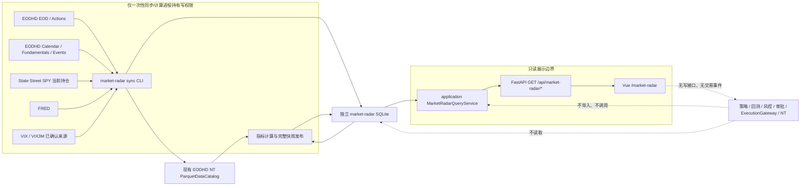

# 市场雷达实施方案（基于当前仓库）

> 状态：R0 至 R4B 已完成；价格、当前宽度、风险偏好和实际利率宏观象限均已通过真实数据、自动化与响应式浏览器验收。
> 核对基线：2026-09-04，分支 `feat/market-radar`。
> 原始产品设想：[HeyBoss 市场雷达数据面板高层实施方案](HeyBoss_market_radar_implementation_plan.md)。
> 事实优先级：`AGENTS.md` 与 [项目事实源](project-context.md) 高于原始设想；本文再以当前代码和实际供应商能力收敛实施路径。

## 1. 文档结论

市场雷达适合加入当前项目，但必须作为**独立、只读、可删除的市场监测域**，不能放入策略、因子、风控或执行目录，也不能把监测股票自动变成可交易股票。

当前仓库可以直接复用的部分是：

- EODHD EOD、splits、dividends 到 NT Instrument/双 BarType/ParquetDataCatalog 的链路；
- SQLAlchemy + SQLite、FastAPI、OpenAPI 生成、Vue 3、ECharts 与现有状态组件；
- Web API 只读数据库、只读挂载、同源代理和可删除性边界；
- 现有 Python 与前端质量门禁。

当前仓库**不能直接支撑**原始设想中的完整面板：

- EODHD 适配器目前只实现 EOD、拆股和分红，没有指数成分、Calendar Trends、Fundamentals 或 Economic Events；
- `config/instruments.yaml` 仍只管理 10 只可交易普通股；25 只固定监测池和 503 只动态当前成员已与交易资格隔离；
- 25 只价格监测池和当前 503 个成员均已进入共享 Catalog，但当前成员代理不能用于历史/PIT 宽度回放；
- 独立市场数据库已有同步运行、价格快照、当前成员、当前宽度、风险偏好、FRED 当前修订观测和宏观象限快照；没有基本面、预期或事件；
- Web API 与 Vue 已交付价格、当前宽度及完整宏观象限只读展示；盈利、基本面和事件仍未实现；
- 已有 FRED DFII10 适配器，但没有 Cboe 适配器、常驻调度器或可靠的未来美股交易日历能力；
- 当前 EODHD Token 已证明 EOD、VIX 与 VIX3M 可用，Calendar、Fundamentals、Economic Events、当前成分和历史成分仍受套餐权限阻塞。

因此不能直接从“画完整页面”开始。推荐采用**数据能力门禁 → 价格纵向切片 → 宽度 → 宏观 → 盈利/基本面/事件 → 完整 UI**的顺序。每一步都能独立验收，缺少数据时返回明确状态，不用占位数据伪装完成。

## 2. 当前实现核对

### 2.1 已有架构

```text
EODHD EOD / IBKR 历史
        ↓
HistoricalBarSource + HistoricalDataPipeline
        ↓
NT Instrument + INTERNAL/EXTERNAL Bar + ParquetDataCatalog
        ↓
策略 Actor → TradeSignalEvent → ExecutionGateway → 风控/审批 → NT 执行

交易审计 SQLite / Catalog / 回测报告 / 白名单配置
        ↓
application 只读查询服务
        ↓
FastAPI GET /api
        ↓
Vue 3 八个一级页面
```

现有 Web 已经完成八个页面：`/`、`/portfolio`、`/strategy`、`/activity`、`/orders`、`/market-radar`、`/backtests`、`/system`。市场雷达包含 URL 可恢复的总览、板块和个股视图。Web 没有写请求，没有 IBKR 或供应商凭据，停止 Web 不影响交易核心。

### 2.2 能力与缺口矩阵

| 需求 | 当前事实 | 处理决定 |
|---|---|---|
| EOD 价格 | 已实现 EODHD EOD + 双 BarType | 复用同一适配和 Catalog，不建另一套价格数据库 |
| 监测宇宙 | 25 只固定监测池 + 503 只动态成员已实现 | 与交易清单隔离，Catalog 存在不代表可交易 |
| 当前市场成员 | State Street SPY 每日持仓适配器已实现；EODHD 成分接口仍为 403 | 继续明确标注当前代理，不实现历史/PIT 成分 |
| 市场宽度 | 已离线计算并原子发布四项当前快照 | API 只读快照，不现场扫描 500 只股票 |
| FRED 实际利率/信用 | DFII10 当前修订适配、存储、计算、页面和真实 bootstrap 已完成 | 首版信用继续使用 HYG/LQD，不接入受限 HY OAS |
| VIX/VIX3M | 已作为 NT `IndexInstrument` 接入 EODHD EOD 与共享 Catalog | R4A 已验证；任一序列缺失时风险偏好模块失败关闭 |
| EPS Trends/财报日历 | 未实现 | 先探测 EODHD Calendar 权限和字段，再每日留存快照 |
| Fundamentals | 未实现 | 先探测字段、更新语义和额度；不把当前基本面伪装成历史 PIT 数据 |
| Economic Events | 未实现 | 先探测端点；MVP 使用明确的日历日期窗口 |
| 未来 10 个交易日 | 没有可靠未来交易日历 | MVP 改为 14 个日历日并准确标注；若必须精确 10 个交易日，单独申请日历依赖 |
| 监测数据库 | 已实现运行、价格、当前成员、宽度、风险偏好、宏观观测与象限七张表 | 继续使用独立 `market-radar.db`，后续按真实调用方增加表 |
| 查询/API | 价格、当前宽度和宏观象限均已有只读分层 | 保持请求路径不访问供应商、Catalog 或计算器 |
| Vue/ECharts | 市场雷达三视图、当前宽度卡片和宏观象限图已具备 | 后续模块继续使用独立状态和相同设计语言 |
| 调度 | 没有常驻调度 | 第一阶段仅提供一次性 CLI；由人工或宿主机外部调度触发 |
| 交易联动 | 唯一执行链路已有硬约束 | 市场雷达永不发布 `TradeSignalEvent`，不提供下单或审批操作 |

### 2.3 原始设想中需要修正的假设

1. **“已有 EODHD 适配即可同步全部监测数据”不成立。**现有类只有 `/eod`、`/splits`、`/div` 三类请求，非价格端点需要新增严格解析和测试。
2. **“直接扩充 `config/instruments.yaml`”不可接受。**该文件同时参与策略、回测和执行身份解析；监测宇宙必须独立。
3. **“每日用现有 replace 管道刷新 500 只股票”成本过高。**当前 EODHD 路线按完整范围替换，以 500 只股票每日全量重拉不合理。监测同步需要首次全量、日常重叠窗口、周期性全量校验三种明确动作，但仍复用同一 EODHD 解析、BarType 和 Catalog。
4. **当前阶段不再建设历史/PIT 宽度。**EODHD 当前与历史成分接口均未授权；R3 只使用带 `as_of_date` 的官方 SPY 当日持仓计算一个当前横截面，不能回填过去、不能输出历史宽度走势图，也不能把代理来源标成精确指数成分。
5. **“Calendar Trends 等于完整日度预期历史”不成立。**它包含财政期间记录和固定滞后预期，但不是逐交易日 PIT 快照；连续时间序列只能从首次采集后积累。
6. **“FRED HY OAS 可稳定提供长期历史”需要重新评估。**FRED 当前提示该 ICE 系列自 2026-04 起只保留三年观测，且有再分发限制；不能把它作为无条件长期真相源。
7. **“未来十个交易日”暂时没有可靠计算基础。**不能用周一至周五代替交易所日历并忽略节假日。

## 3. 最终架构



### 3.1 依赖方向

- `market_radar/` 可以复用 `data/` 中的 EODHD HTTP、NT Bar 和 Catalog 能力；
- `application/` 可以读取 `market_radar` 的只读仓储和不可变查询模型；
- `web_api/` 只依赖 `application/`；
- `web-ui/` 只依赖 OpenAPI；
- `signals/`、`strategies/`、`execution/`、`risk/`、`backtest/`、`live/`、`notify/` 和交易 `storage/` 不得反向依赖市场雷达；
- 删除 `market_radar/`、对应 API、页面和数据库后，交易与回测仍应完整运行。

### 3.2 数据写入与查询边界

同步/计算 CLI 是唯一写入者：

- 读取环境变量中的供应商凭据；
- 串行写现有 EODHD Catalog；
- 写 `market-radar.db`；
- 完成质量检查后把同步运行标记为 `complete`；
- 失败运行保留诊断，但不能覆盖最近完整派生快照。

Web API：

- 只以 SQLite `mode=ro` 打开 `market-radar.db`；
- 不接收 EODHD、FRED、Cboe、IBKR 或 Telegram 凭据；
- 不在 HTTP 请求内下载数据、扫描全市场或重新计算指标；
- 不返回供应商原始响应、本地路径或受许可限制的批量数据。

## 4. 目录与文件设计

以下是目标结构。每个里程碑开始前仍需按 `AGENTS.md` 给出当次精确文件清单并获得确认。

```text
config/
└── market-radar.yaml                 监测宇宙、阈值、板块映射和来源选择；无凭据

scripts/
├── check_market_radar_sources.py     权限/字段/额度探测，不保存原始响应
├── sync_market_radar.py              固定价格池 bootstrap/daily/reconcile 与快照
├── sync_market_breadth.py            当前成员 bootstrap/daily 与宽度快照
└── sync_market_macro.py              宏观价格、FRED 实际利率与象限原子发布

src/trading_assistant/
├── data/
│   └── eodhd_http.py                 从现有适配器抽出的共享认证 HTTP/JSON 边界
├── market_radar/
│   ├── config.py                     监测配置加载与失败关闭校验
│   ├── membership.py                 当前成员中立模型与唯一来源 Protocol
│   ├── state_street.py               State Street SPY holdings 首个来源适配器
│   ├── models.py                     独立同步运行、成员与派生快照表
│   ├── storage.py                    独立 SQLAlchemy Base、运行状态与只读/写仓储
│   ├── prices.py                     InstrumentSpec 装配与 INTERNAL Catalog 读取适配
│   ├── metrics.py                    无 IO 的价格指标、覆盖率和有效性计算
│   ├── macro.py                      无 IO 的风险偏好计算与严格 payload
│   ├── fred.py                       FRED 当前修订观测来源适配器
│   ├── regime.py                     无 IO 的实际利率压力、as-of 对齐与象限计算
│   └── service.py                    同步、质量检查、计算与事务发布编排
├── application/
│   └── market_radar.py               与 HTTP 无关的只读查询服务
└── web_api/
    └── routes/market_radar.py        只读 GET 路由

web-ui/src/
├── pages/MarketRadarPage.vue         一级页面、三个内部视图和模块独立状态
└── components/MacroRegimeChart.vue   后端坐标驱动的响应式宏观象限图

tests/
├── market_radar/                     配置、来源解析、存储、指标和编排测试
├── application/test_market_radar.py
└── web_api/test_market_radar.py

web-ui/tests/market-radar-page.test.ts
```

约束：

- 不新建 `signals/market_radar.py`；
- 不在交易 `storage/models.py` 中加入市场表；独立 Base 防止 market DB 被创建出交易审计表；
- 不新建第二个图表库、前端状态库或 UI 框架；
- 不拆出只有一个实现、没有调用方的 provider registry 或插件框架；
- `schemas.py` 是否继续集中维护由里程碑代码量决定，但不能手写另一套 TypeScript 字段模型。

## 5. 配置契约

R1 已新增 `config/market-radar.yaml`，R2A 增加 watchlist 到板块的显式映射。配置只保存确定的产品信息，不保存动态成员和凭据。当前加载器严格接受六个顶层区段：`market`、`sector_etfs`、`watchlist`、`watchlist_sectors`、`monitor_instruments` 和 `probe`。以下仅为省略重复项的结构摘要，完整可运行内容以仓库配置文件为准。

```yaml
market:
  benchmark: SPY.US
  equal_weight_benchmark: RSP.US
  credit_proxy: [HYG.US, LQD.US]
  volatility:
    vix: VIX.INDX
    vix3m: VIX3M.INDX
  index_membership_symbol: GSPC.INDX

sector_etfs:
  materials: XLB.US
  communication_services: XLC.US
  energy: XLE.US
  financials: XLF.US
  industrials: XLI.US
  information_technology: XLK.US
  consumer_staples: XLP.US
  real_estate: XLRE.US
  utilities: XLU.US
  health_care: XLV.US
  consumer_discretionary: XLY.US

watchlist: [AAPL.US, MSFT.US, NVDA.US, GOOGL.US, AMZN.US, META.US, JPM.US, XOM.US, JNJ.US, TSLA.US]

watchlist_sectors:
  AAPL.US: information_technology
  GOOGL.US: communication_services
  JPM.US: financials
  # 其余条目必须与 watchlist 一一对应

watchlist:
  - AAPL.US
  # 其余 9 只见实际配置，且必须能在 config/instruments.yaml 中解析。

monitor_instruments:
  - symbol: SPY
    instrument_id: SPY.US
    data_symbol: SPY.US
    instrument_kind: equity
    primary_exchange: ARCA
    first_trading_date: 1993-01-29
  - symbol: VIX
    instrument_id: VIX.INDX
    data_symbol: VIX.INDX
    instrument_kind: index
    primary_exchange: CBOE
    first_trading_date: 1990-01-02
  # 其余 15 只监测标的使用相同显式结构，完整清单见实际配置。

probe:
  # R0 代表性非价格端点探测标的仍供复验使用。
```

`monitor_instruments` 只包含不在交易清单中的 15 只市场 ETF 和 2 个波动率指数；10 只 watchlist 的完整 `InstrumentSpec` 复用交易配置。ETF 显式声明为 `equity`，VIX/VIX3M 显式声明为 `index`。动态 S&P 500 成员、公司名称、分类和供应商返回字段不得复制进 YAML。

环境变量新增项只允许出现在 `.env.example`：

```dotenv
MARKET_RADAR_DATABASE_URL=sqlite:///./data/market-radar.db
MARKET_RADAR_REPORT_ROOT=./reports/market-radar
```

`EODHD_API_TOKEN` 复用已有变量。R4B 已确认采用 FRED v1 API，因此 `.env.example` 包含 `FRED_API_KEY`；实际 key 仍只允许填写在未提交的本地 `.env`。

## 6. 数据源与现实门禁

### 6.1 R0 必须实测的请求

使用用户本地 Token 发起最小请求，只输出状态码、顶层字段、行数、最早/最晚日期、空值比例和错误类别，不输出 Token 或完整 payload：

| 能力 | 最小探测 | 通过条件 |
|---|---|---|
| EOD | `SPY.US` 小日期窗 | 当前适配仍可解析且配额可接受 |
| EODHD 当前/历史成分 | `GSPC.INDX` Components 与 HistoricalTickerComponents | 记录套餐边界；不再作为 R3 当前宽度的开工门禁 |
| SPY 当前持仓 | State Street 官方每日 holdings xlsx | 有明确持仓日期、固定字段、约 503 个可映射股票代码；不保存或对外提供原始文件 |
| Calendar Trends | `AAPL.US,MSFT.US` | 财政期、当前/7/30/60/90 日预期、分析师计数字段可解析 |
| Earnings Calendar | 30 日日期窗 + 两个 symbol | report date、盘前/盘后、actual/estimate 缺失语义明确 |
| Fundamentals | `AAPL.US` 和 `JPM.US` | 普通企业与金融业字段差异可识别；更新时间可记录 |
| Economic Events | 美国 30 日日期窗 | 事件类别、日期/时间、重要性、actual/estimate 字段可识别 |
| VIX/VIX3M | 候选 EODHD 指数代码 | 两条序列均存在、日期对齐、使用权明确 |
| FRED DFII10 | 最近 90 日 | 日频、缺失值和修订时间语义可处理 |
| HY OAS | 最近 90 日 | 仅作为可选增强；记录历史范围与使用限制 |

输出一份被 Git 忽略的 `reports/market-radar/capability-check-*.json`，并生成一份可提交的字段差异摘要。真实供应商数据不进入 fixture；测试使用合成 payload。

### 6.2 已由官方资料确认、但仍需 Token 实测的事实

- EODHD EOD API支持按 symbol 返回日/周/月 OHLC、adjusted close 和 volume；现有项目已用日线实现。
- EODHD Fundamentals 的指数响应包含当前成分；官方文档描述 S&P 指数族的历史成员区间，并说明 S&P 500 的额外历史快照能力，但当前 Token 对两者均返回 403。
- State Street 的 SPY 产品页提供带日期的每日全持仓下载；SPY 以跟踪 S&P 500 为目标，但基金持仓与指数成分不是同一法律和数据产品，因此页面必须标注为 SPY 持仓代理。
- EODHD Calendar 包含 earnings 和 trends；trends 返回财政期间记录及固定滞后的一致预期，不等于每日 PIT 归档。
- EODHD Economic Events 是独立端点，不能假设当前 EOD 套餐自动包含。
- FRED `DFII10` 是日频 10 年期实际利率序列。
- FRED `BAMLH0A0HYM2` 是日频 HY OAS，但官方页面当前说明自 2026-04 起仅保留三年观测，并带 ICE 数据使用约束。
- Cboe 提供 VIX 官方历史数据页面；VIX3M 的稳定程序化入口和许可仍需单独确认。

### 6.3 第一版来源选择

推荐顺序：

1. 固定价格、板块价格、个股趋势/风险：EODHD + 现有 NT Catalog；
2. 当前市场宽度成员：State Street SPY 每日持仓；成员价格仍使用 EODHD + 现有 NT Catalog；
3. 实际利率：FRED `DFII10`；
4. 信用：默认 `HYG/LQD` 20 日相对收益，HY OAS 仅在历史和许可确认后作为增强；
5. 波动率：只有 VIX 和 VIX3M 同时有可靠来源时才计算期限结构；
6. 盈利、基本面和事件：仅在对应 EODHD 权限探测通过后启用。

任何关键源未通过时，相关模块返回 `unconfigured`、`missing`、`stale`、`insufficient_coverage` 或 `unavailable`，不得偷偷改公式。

### 6.4 R0 实际核验结果（2026-09-03）

R0 已使用本地有效 Token 串行执行 10 次 EODHD 和 2 次 FRED 只读探测。运行时报告位于被 Git 忽略的 `reports/market-radar/capability-check-*.json`，报告只保存状态、字段、数量和日期范围，不保存数据值、完整 URL 或 Token。

| 能力 | 实际结果 | 已证明的边界 | 后续影响 |
|---|---|---|---|
| `SPY.US` EOD | `available`，HTTP 200 | 返回标准 EOD OHLC、adjusted close 与 volume；本次窗口 22 行 | R2 价格纵向切片可直接推进 |
| `GSPC.INDX` 当前成分 | `forbidden`，HTTP 403 | 当前 Token 可访问 EOD，但不能访问该 Fundamentals 过滤项 | R3 改用明确标注的 SPY 每日持仓代理 |
| `GSPC.INDX` 历史成分 | `forbidden`，HTTP 403 | 无法验证成员历史字段和实际覆盖起点 | 历史/PIT 宽度退出当前实施路线 |
| Calendar Trends | `forbidden`，HTTP 403 | 无法验证一致预期字段 | R5 盈利修正阻塞 |
| Earnings Calendar | `forbidden`，HTTP 403 | 无法验证财报事件字段 | R5 财报时间轴阻塞 |
| AAPL/JPM Fundamentals | `forbidden`，HTTP 403 | 普通公司与金融业字段均不可验证 | R5 质量与估值阻塞 |
| Economic Events | `forbidden`，HTTP 403 | 无法验证宏观事件字段 | R5 宏观事件轴阻塞 |
| `VIX.INDX` | `available`，HTTP 200 | EOD 序列和候选代码有效 | R4 波动率输入之一可用 |
| `VIX3M.INDX` | `available`，HTTP 200 | EOD 序列和候选代码有效 | R4 期限结构价格输入可用 |
| FRED `DFII10` | `unknown` | 官方 CSV 可由 `curl` 通过 HTTP/2 访问，但当前 Python 标准库 HTTP 请求断开或超时 | R4 实际利率阻塞；优先申请 FRED API Key，不增加临时依赖绕过 |
| FRED HY OAS | `unknown` | 与 DFII10 相同的程序化连接问题，且仍有历史与许可限制 | 不作为首版信用输入；首版保留 HYG/LQD 代理 |

以上保留 R0 当时的原始结论。R4B 在 2026-09-04 配置 FRED API Key 后已通过 v1 JSON 适配器完成真实 DFII10 bootstrap；HY OAS 仍未启用。

由于同一 Token 对 EOD 与波动率端点返回 200，对附加端点返回 403，可以证明 Token 本身有效；403 更可能是套餐授权边界，但最终仍以 EODHD 账户套餐页面或官方支持回复为准。

R0 后的实际执行顺序调整为：

1. R1 可继续建立独立存储和发布边界；
2. R2 可使用 EOD、VIX 和 VIX3M 已证明能力推进价格型页面；
3. R3 降级为当前市场宽度：只计算最新 SPY 持仓快照的横截面，不提供 PIT 或历史宽度；
4. R4 先保留 HYG/LQD 与 VIX/VIX3M 输入，DFII10 在获得 FRED API Key 后复验；
5. R5 在 Calendar、Fundamentals 和 Economic Events 权限获得前不编码对应业务模型。

## 7. 价格与监测宇宙设计

### 7.1 宇宙隔离

- 交易宇宙：继续只由 `config/instruments.yaml` 决定；
- 监测基准/ETF/自选股：由 `config/market-radar.yaml` 决定；
- 当前宽度成员：由已发布的 State Street SPY 持仓快照选择，来源日期必须不晚于价格日期且未陈旧；
- Catalog 中存在某个 Instrument/Bar 不代表其可交易；
- 市场雷达不得写 `config/instruments.yaml`。

同一 canonical ID 如果已在交易配置存在，必须复用其既有 Instrument 定义。动态监测股票由成员来源适配器输出已校验的 `instrument_id + data_symbol`，再构建不可执行的分析用 `InstrumentSpec`；与既有 ID 冲突或身份含糊时失败关闭，不能由下游按展示 ticker 猜测。

### 7.2 当前成员来源替换边界

`CurrentMarketMembershipSource.fetch_current_membership()` 是编排层依赖的唯一成员接口，返回按规范 ID 排序且去重的 `CurrentMarketMembership`。中立模型只包含来源名、成员日期，以及每行的 `source_symbol`、`instrument_id`、`data_symbol`。

首个 `StateStreetSpyHoldingsSource` 负责所有供应商细节：固定 HTTPS 地址、下载上限、xlsx sheet/header、日期解析、USD 校验、现金/占位过滤，以及经验证的类别股映射。`openpyxl` 只出现在该适配器；指标、价格、存储和服务均不得导入它或 State Street 模块。具体适配器只在 `sync_market_breadth.py` 组合根构造，测试使用实现同一 Protocol 的内存 fake。

未来接入付费 EODHD/S&P 或其他可靠来源时，只需增加或替换一个实现该 Protocol 的来源模块，并修改 CLI 组合点。规范成员模型、动态 `InstrumentSpec`、EODHD 价格链路、宽度公式、数据库表和 R3B API 契约保持不变；当前只有一个生产实现，因此不增加 provider registry、插件系统或无调用方的来源选择配置。

### 7.3 Catalog 语义

- 所有收益、均线、宽度和相对强弱使用 `1-DAY-LAST-INTERNAL`；
- UI 显示实际 EOD 价格使用 `1-DAY-LAST-EXTERNAL`；
- 不新增 `RADAR` BarType，不复制 CSV 价格仓库；
- 市场雷达指标只读取 Catalog，API 只读取计算后快照；
- Catalog 写入仍串行，交易同步和雷达同步不能并发执行。

### 7.4 同步模式

R2A 已在共享 `HistoricalDataPipeline` 上实现三种显式模式，监测服务不再照搬“每日完整 20 年 replace”行为：

1. `bootstrap → append_missing`：请求完整目标窗口，补齐序列两端缺口，不覆盖已有时间戳；
2. `daily → replace_range`：已有起点覆盖充分时从最后完整日期向前重叠 `overlap_days`，只替换该闭区间并追加新 Bar；
3. `reconcile → replace_full`：人工或低频请求并替换完整目标历史，处理深层供应商修订和公司行动变化。

三种模式都复用现有 EODHD 解析、公司行动规范化、双 BarType、质量规则和 `CatalogRepository`。范围替换由仓储集中实现：窗口外 Bar 和公司行动会保留，任一 BarType 写入失败会恢复替换前窗口；监测服务不直接调用底层删除 API。

R3A 当前宽度只开放 `bootstrap` 与 `daily`。它不开放 `reconcile`，因为宽度只请求约 400 个日历日，而 `replace_full` 会截断共享 Catalog 中交易与回测标的的更早历史。固定 25 只价格池仍可用完整目标历史执行 `reconcile`。

共享管道默认仍强制每个固定标的覆盖请求起点。只有当前宽度调用显式关闭该门禁，让新上市/拆分成员的已有 Bar 通过原质量检查后写入，再由每项指标的实际历史要求与覆盖率决定有效性；普通数据同步、回测和交易调用保持原有严格默认值。

## 8. 独立数据库

使用 `market-radar.db`，不使用 live/backtest 审计数据库，也不把原始 EOD Bar 存入 SQLite。

### 8.1 最小表集合

| 表职责 | 唯一键/关键字段 | 说明 |
|---|---|---|
| 同步运行 | `run_id` | 来源、开始/结束、状态、覆盖、错误摘要 |
| 当前成员快照 | `membership_date + instrument_id` | 只保存 SPY 当日持仓中的规范标识和来源代码；不构造成员区间 |
| 宏观观测 | `source + series_id + observation_date` | value、available/ingested 时间 |
| 一致预期快照 | `instrument_id + fiscal_period + period_type + snapshot_date` | 当前与滞后值、分析师/修正人数 |
| 基本面快照 | `instrument_id + fiscal_period + ingested_at` | 只保存指标计算所需字段和来源更新时间 |
| 市场事件 | `source + natural_key` | 事件日期/时间、类型、重要性、actual/estimate |
| 派生快照 | `snapshot_kind + entity_id + as_of_date` | 计算结果、覆盖率、有效性、来源和计算时间 |

派生结果可以在单一 `payload_json` 中保存模块专用结构，因为它只由一个计算器写、一个查询服务读，当前没有跨版本兼容需求。必须有 Pydantic/dataclass 校验和唯一键，但不引入 `schema_version`、版本注册表或内容哈希。

### 8.2 R1–R4B 实际存储边界

R1 创建 `sync_runs`；R2A 新增 `price_snapshots`；R3A 新增 `current_market_members` 与 `current_breadth_snapshots`；R4A 新增 `risk_appetite_snapshots`；R4B 新增 `macro_observations` 与 `macro_regime_snapshots`。运行表记录 `RUNNING → COMPLETE/FAILED`、请求日期、标的数量和 Bar 计数。四类派生快照都以 `as_of_date` 唯一保存严格 dataclass 校验的无版本 payload。当前成员只保存来源代码、规范标识、EODHD data symbol、来源和成员日期，不保存原始工作簿或历史成员区间。R4A 的四条原始输入仍是 Catalog 中的 NT Bar；`macro_observations` 只保存 DFII10 当前修订值、FRED realtime 日期、采集时间和所属运行，不保存原始响应或历史 vintage。基本面和事件尚无生产写入方，因此不提前建表。

- `MarketRadarBase` 与交易审计 `Base` 完全分离；market DB 只包含以上七张已有真实写入方的表；
- Web 后续使用 `MarketRadarRepository(..., read_only=True)`，SQLite 自身拒绝写入；
- 失败详情只保存异常类型或 `data_quality`，不保存 Token、URL 或供应商 payload；
- `latest_complete_run()`、各价格/宽度读取方法和 `latest_macro_bundle()` 都忽略失败运行；宏观 bundle 只返回同一 COMPLETE 运行的风险偏好和象限；
- 快照 upsert 与 `RUNNING → COMPLETE` 在同一数据库事务内发生；R4B 的当前修订观测、风险偏好、象限和运行完成也一次提交，任一更新失败会整体回滚；
- EOD Bar 和 Instrument 继续只保存在 NT `ParquetDataCatalog`，不会复制到 SQLite。

### 8.3 发布规则

```text
RUNNING
  → 来源逐项校验
  → Catalog 更新完成
  → 原始非价格记录写入
  → 指标计算完成
  → 单事务写入当日派生快照
  → COMPLETE

任一步失败 → FAILED；最近 COMPLETE 快照继续可读并被标记 stale
```

Catalog 与 SQLite 无法组成同一个事务。因此 Web 永远只读 `COMPLETE` 运行关联的派生快照，不能直接把半更新 Catalog 当成已发布面板。

### 8.4 R2A 价格快照口径

价格计算器没有 IO，也不依赖 EXTERNAL Bar。同步完成质量检查后，适配层只从 Catalog 读取 `1-DAY-LAST-INTERNAL`，再按 SPY 的最新日期对齐全部 25 个配置标的：

- 市场：SPY 20 日总回报、SPY 距 200 日均线、RSP 减 SPY 的 20 日总回报；
- 板块：11 个板块 ETF 相对 SPY 的 20/60 日强弱；
- 个股：126-21 动量、相对所属板块动量、距 200 日均线、20 日年化实现波动率、126 日最大回撤、ATR20/价格；
- 覆盖：`eligible` 固定取本次配置监测池，`observed` 只计最新日期与 SPY 相同的序列；
- 有效性：单项只返回 `complete`、`insufficient_history` 或 `unavailable`，没有足够数据时 `value=null`，禁止补零、向前填充或切换到 EXTERNAL。

payload 不含 `schema_version`、manifest 或内容哈希；当前只有一个同步升级的写入者与读取者。

## 9. 时间、覆盖率和有效性契约

### 9.1 时间字段

每个非价格记录至少包含：

- `observation_date`：数据描述的日期；
- `available_at_utc`：来源可证明的公开时间，可空；
- `ingested_at_utc`：本系统采集时间；
- `as_of_date`：派生快照对应的美股市场日期；
- `calculated_at_utc`：派生计算时间。

`available_at_utc` 不可证明时必须为 `null`。这类记录可以用于当前盘后监测，但不能声明可用于无前视历史回测。

### 9.2 统一模块状态

沿用现有 `SourceState` 表达源是否存在/可读，再为雷达模块增加独立有效性字段：

```text
source_state: available | empty | missing | invalid | unconfigured | unobserved
validity: complete | partial | stale | insufficient_history |
          insufficient_coverage | unavailable
```

不要扩写既有 `SourceState` 并改变七个现有页面语义。

每个模块必须返回：

- `as_of_date`；
- `calculated_at_utc`；
- `validity`；
- `coverage = {eligible, observed, ratio}`；
- `sources`；
- `freshness`；
- 对应原始分项和派生状态。

### 9.3 覆盖与陈旧默认值

- 价格：晚于最近完整美股交易日 2 个交易日后 stale；
- 实际利率/信用：3 个日历日；
- EPS 修正：3 个日历日；
- 基本面采集：14 个日历日，同时始终展示报告期；
- 事件：24 小时；
- 当前宽度每个指标分别计算覆盖率：`ratio >= 0.95` 为完整，`0.90–0.95` 只展示 raw/partial，低于 `0.90` 不返回数值；
- 任何比例都使用该指标真实 eligible 分母，不能用固定 500。

## 10. 指标实现口径

原始方案中的方向可保留，但实现时使用以下明确边界。

### 10.1 市场趋势与宽度

必需输入：SPY、RSP、最近未陈旧的 SPY 官方持仓快照，以及持仓股票的 INTERNAL Bar。

计算：

- SPY 20 日总回报；
- SPY 距 200 日均线；
- B50/B200：当日收盘严格高于含当日在内最近 50/200 个 INTERNAL 收盘均值的成员比例；
- AD10：只接受同时覆盖 SPY 最近 11 个交易日期的成员，逐日计算 `(上涨数-下跌数)/observed`，再对 10 个日值以 `alpha=2/(10+1)`、首值初始化做递归 EMA；平盘贡献 0；
- NHNL：当前 high 等于/高于最近 252 个观测最高 high 记新高，当前 low 等于/低于最低 low 记新低，最终为 `(新高数-新低数)/observed`；同日同时命中时净贡献 0；
- RSP 减 SPY 的 20 日总回报；
- 成员覆盖率和各指标实际分母。

R3 只发布最新横截面原始值、分项分母和覆盖率，不保存或返回宽度历史序列，不做三年标准化、热力带、连续三日状态切换或历史板块宽度。该状态只描述当前结构，不输出涨跌概率或交易建议。

### 10.2 宏观四象限

R4A 交付风险偏好纵轴：

- 信用项为 `Δ20 log(HYG/LQD)`；
- 波动率期限项为 `log(VIX/VIX3M)`；
- 分数为 `0.60 × RobustZ(信用项) - 0.40 × RobustZ(波动率项)`；
- 两项分别使用最多 756 个原始观测，至少需要 504 个观测，MAD 为零时返回 `unavailable`；
- 两项 Z-score 分别截断到 `[-3, 3]`，快照保存当前点和最多 60 个已评分点；
- 信用来源固定披露 `credit_source=etf_proxy`。

四条 EOD 序列只按精确共同日期内连接，不前向填充，且最新日期必须一致。关键输入缺失直接使同步失败；共同历史不足时可以发布 `insufficient_history` 快照，但不暴露分数或轨迹。

R4B 已冻结并实现实际利率横轴：FRED v1 JSON 的 `DFII10` 当前修订值相对 20 个有效观测前的变化。变化序列使用最多 756 个观测、至少 504 个观测计算 Robust Z，并截断至 `[-3, 3]`；同时披露当前利率水平和三年窗口百分位。当前修订值可被后续同步按相同日期更新，但不声称具备历史 vintage/PIT 语义。

关键规则：

- VIX3M 不可用时不计算风险偏好分数；
- 风险纵轴仍只在四条价格精确共同日期上计算；DFII10 则按每个风险日期向后选择最近观测，不允许未来值且最多滞后 3 个日历日；
- 实际利率或风险纵轴少于 504 个有效变化观测时标记 `insufficient_history`；
- Robust Z 截断到 `[-3, 3]`；
- 中性带固定为 `±0.35`；任一轴落入中性带时为“过渡区”，其余四区为“宽松型 Risk-on”“增长 / 再通胀”“增长担忧”“紧缩冲击”；
- 快照最多保存 60 个成功对齐的轨迹点，象限、中文标签和连续状态观测数由后端计算，Vue 只绘图。

### 10.3 板块领导力

11 个固定板块 ETF 继续用于价格代理。当前 SPY 持仓文件的实测 `Sector` 字段为空占位，R3 不据此生成板块宽度。

在可靠分类与 EPS Revision 来源接入前，板块页只展示已完成的 RS60/RS20，不生成混合领导力排名。当前市场宽度不得作为板块宽度替代品。

### 10.4 盈利预期

- FY1 当前与 30 日前预期计算修正宽度；
- 正且远离零的 EPS 才进入百分比修正幅度；
- 负/近零 EPS 只进入方向宽度，并单独报告数量；
- 无分析师覆盖不填 0；
- endpoint 提供的固定滞后值可展示当前横截面，日度历史从首次采集后积累。

### 10.5 个股雷达

只覆盖配置 watchlist，不读取持仓自动扩充。

- 趋势：126–21 日相对板块动量 + 距 200 日均线；
- 修正：30 日 EPS 变化 + 分析师上调/下调宽度；
- 质量：普通公司使用 ROIC、FCF Margin、Net Debt/EBITDA；
- 估值：普通盈利公司使用 Forward Earnings Yield、FCF Yield、EV/EBITDA；
- 风险：20 日实现波动率、126 日最大回撤、ATR20/Price；
- 行业内有效可比样本少于 5 时返回 `not_comparable`；
- 金融和 REIT 没有专用口径时展示原始字段，不生成伪综合分；
- 五个维度永远不合成“买入分”。

## 11. API 契约

统一前缀 `/api/market-radar`，不增加无兼容需求的 `/v1`。

| 方法与路径 | 页面消费者 | 返回内容 |
|---|---|---|
| `GET /summary` | 顶部状态条与总览卡片 | 六项摘要、各模块有效性、最近完整日期 |
| `GET /breadth` | 总览当前宽度卡片 | B50/B200、AD10、NHNL、各自覆盖、持仓与价格日期、代理来源 |
| `GET /macro` | 宏观四象限 | 当前点、最多 60 点轨迹、两轴状态、来源、当前修订口径与新鲜度 |
| `GET /sectors` | 总览摘要和板块页 | 11 行矩阵、排名、覆盖、有效性 |
| `GET /sectors/{sector_id}?window=1y` | 板块详情抽屉 | RS、宽度、修正、估值时间序列 |
| `GET /earnings-revisions?scope=market&window=1y` | 总览/板块 | 修正宽度、幅度、surprise 和覆盖 |
| `GET /events?from=...&to=...` | 事件时间轴 | 宏观与 watchlist 财报事件 |
| `GET /stocks?sector=...&query=...&offset=0&limit=50` | 个股表 | 后端筛选、排序和分页的五维结果 |
| `GET /stocks/{instrument_id}?window=1y` | 个股详情抽屉 | 价格、相对表现、预期、财务和估值 |

约束：

- 全部只有 GET；
- 已实现的无窗口端点不接受任意范围参数；后续时间序列端点的 `window` 只允许白名单值；
- 列表沿用 `offset/limit/has_more`；
- `sector_id` 和 `instrument_id` 必须由数据库实体白名单解析；
- 统一 `application/problem+json`；
- OpenAPI 生成 TypeScript；前端不手写响应字段；
- 请求路径不调用供应商、不触发计算、不打开可写数据库；
- API 不提供供应商历史原始数据下载。

## 12. 前端信息架构

在现有“研究与系统”导航组新增第八个一级入口：`/market-radar`，名称“市场雷达”。不修改既有“操作总览”的交易运行语义。

页面内部使用现有胶囊标签和 URL 查询参数：

```text
/market-radar?view=overview
/market-radar?view=sectors&sector=information_technology
/market-radar?view=stocks&sector=...&query=...&instrument=AAPL.US
```

### 12.1 总览

1. 六项紧凑状态条：SPY 趋势、市场宽度、等权确认、实际利率、风险偏好、EPS 修正；
2. 市场趋势保持当前价格横截面；当前宽度以四项大数字卡片呈现，不绘制历史时间轴；
3. 宏观四象限；
4. 板块领导力摘要矩阵；
5. 盈利预期脉冲；
6. 未来事件。

尚未接入的模块显示精确原因，不隐藏，也不使用模拟数据填充。

### 12.2 板块

- 11 行矩阵；
- 数值、色阶、排名变化和数据日期同时存在；
- 点击打开现有 `SideDrawer` 风格详情；
- 不做板块轮动图。

### 12.3 个股

- watchlist 搜索、板块筛选、后端排序/分页；
- 趋势、修正、质量、估值、风险五个独立列；
- 点击打开详情抽屉；
- 不读取持仓、不形成综合买入分、不提供交易按钮。

### 12.4 组件复用与新增

直接复用：`AppShell`、`SegmentedTabs`、`DataState`、`SideDrawer`、`StatusPill`、分页、格式化工具和现有设计 token。

需要新增但只在实际调用时创建：

- 连续热力带图；
- 二维象限轨迹图；
- 板块/个股热力矩阵；
- 横向事件时间轴。

继续使用 ECharts，不增加图表依赖。每张图必须有 `aria-label` 或等价文字摘要；颜色不是唯一信息载体。

## 13. 运行与部署

### 13.1 一次性同步

R2A 当前可运行的价格同步与快照发布：

```bash
uv run --frozen --env-file .env python scripts/check_market_radar_sources.py

uv run --frozen --env-file .env python scripts/sync_market_radar.py \
  --mode bootstrap \
  --start 2006-09-03 \
  --end 2026-09-03
```

`--mode` 必填，避免默认执行具有不同覆盖含义的写入。省略日期时按 `config/data.yaml` 的 `history_years` 计算目标窗口；`--instrument` 可重复使用以选择本次同步标的。快照计算始终读取 Catalog 中完整的 25 只配置监测池，因此首次隔离联调至少需要包含 SPY，正式发布前应完成全池 bootstrap。

三个模式都有真实且不同的写入实现：

```bash
uv run --frozen --env-file .env python scripts/sync_market_radar.py \
  --mode bootstrap

uv run --frozen --env-file .env python scripts/sync_market_radar.py \
  --mode daily

uv run --frozen --env-file .env python scripts/sync_market_radar.py \
  --mode reconcile
```

当前市场宽度首次和日常同步分别使用：

```bash
uv run --frozen --env-file .env python scripts/sync_market_breadth.py \
  --mode bootstrap

uv run --frozen --env-file .env python scripts/sync_market_breadth.py \
  --mode daily
```

宽度脚本不提供 `reconcile`。省略日期时请求截至当前 UTC 日期、向前 400 个日历日；成员来源只在 CLI 装配，替换来源时无需修改价格管道、指标、数据库或 API。

第一阶段不实现守护进程。日常运行计划为“美股 EOD 数据稳定后由操作者或宿主机外部调度运行 `daily`”。失败返回非零，不自动重试无限次，也不触发交易节点。

### 13.2 Compose

新增一次性 `market-radar-sync` profile 服务时：

- 只显式传入 `EODHD_API_TOKEN`、可选 `FRED_API_KEY` 和路径变量；
- 不继承 `TWS_PASSWORD`、Telegram token 或 VNC 密码；
- Catalog、data、reports 对同步服务可写；
- 不声明 `restart`，任务完成即退出；
- `web-api` 只新增 market DB URL，继续通过现有 `./data:/app/data:ro` 读取；
- `web-ui` 无供应商变量。

## 14. 实施里程碑

每个里程碑开始前必须再次提交精确文件清单、关键接口、依赖变化和验收方式，获得确认后编码。

### R0：数据能力与契约核验

状态：已完成（2026-09-03），实际结论见 6.4。

目标：证明当前 Token、字段、历史范围、额度和许可，不改交易行为。

预计改动：

- 新增来源探测脚本及合成测试；
- 固化 `market-radar.yaml` 最小配置；
- 输出能力差异表和最终字段词典。

验收：

- 九类最小探测均有明确 `available/forbidden/not_in_plan/invalid/unknown` 结果；
- Token、URL 查询串和完整 payload 不进日志或 Git；
- 确认 VIX3M 入口、EODHD 当前/历史成分套餐边界和 Calendar/Fundamentals 权限；
- 对未通过项给出页面降级行为；
- 不新增第三方依赖。

停止条件：当前成员代理无法取得明确日期或无法稳定映射到 EODHD 标的时，不进入当前市场宽度开发；VIX3M 不可用时，不进入完整宏观四象限开发。

### R1：无行为变化的 EODHD 边界重构与市场存储

状态：已完成（2026-09-03）。

目标：为多个 EODHD 端点建立可复用 HTTP/JSON 边界，创建独立市场数据库，并以真实价格 bootstrap 作为存储调用方。

实际改动：

- 共享 EODHD HTTP/JSON 边界因 R0 探测需要已在 R0 提前完成，现有 EOD/split/div 共用同一实现；
- 保持现有 EOD/split/div 输出逐字节/逐对象行为不变；
- 扩充 market config，将 15 只市场 ETF 与交易配置中的 10 只 watchlist 明确隔离；
- 增加独立 SQLAlchemy Base、`sync_runs`、原子状态转换和只读打开方式；
- 从现有同步服务提取接收已解析 `InstrumentSpec` 的共享入口，交易 CLI 行为不变；
- 增加只支持 bootstrap 的 `sync_market_radar.py`，没有提前加入单实现的 `--mode` 参数。

验收：

- 真实 Token 在隔离 `/private/tmp` 中完成 `SPY.US` 2026-08-18 至 2026-09-02 同步：12 个交易日、两种规范 BarType，共 24 根 Bar，质量问题为零；
- 现有 EODHD、交易同步、回测、Web API 测试全部回归通过；
- market DB 不创建交易审计表；
- read-only 模式无法写入；
- failed run 不改变最后 complete run；
- 完整 Python 门禁通过；
- 不新增第三方依赖。

### R2：EOD 价格纵向切片

状态：已完成（2026-09-03）。

目标：先交付真实可用的价格型市场雷达，而不是等待全部外部数据。

范围：SPY、RSP、HYG、LQD、11 个板块 ETF 和 watchlist。

交付：

- 在已有 bootstrap 上增加安全的 daily/reconcile 价格同步；
- 价格 freshness 与覆盖；
- SPY 趋势、RSP/SPY、板块相对强弱、watchlist 趋势和风险；
- 完整快照发布；
- 最小只读 API；
- `/market-radar` 页面骨架、总览/板块/个股三视图；
- 尚未实现的宽度、宏观、盈利模块显示明确 unavailable 原因。

验收：

- 交易配置仍为原 10 只股票；
- Catalog 使用既有 INTERNAL/EXTERNAL 语义；
- API 请求不触发计算；
- 页面没有模拟数据和交易按钮；
- 日常同步不会完整重拉所有历史；
- 现有七页回归通过。

#### R2A：安全同步、价格指标与原子发布

状态：已完成（2026-09-03）。

实际改动：

- 为共享 Catalog 管道增加调用方显式选择的 `append_missing`、`replace_range`、`replace_full`，不改变既有交易同步默认行为；
- 为 NT Catalog 增加带恢复路径的 Bar 闭区间替换，为公司行动 sidecar 增加保留区间外记录的闭区间替换；
- CLI 以必填 `--mode` 暴露 `bootstrap`、`daily`、`reconcile`，三者分别映射上述写入语义；
- 增加 watchlist 的 11 标准板块显式归属；
- 增加无 IO 的 INTERNAL 价格计算器、覆盖率和单项有效性；
- 增加 `price_snapshots`，在同一事务内 upsert 当日快照并完成同步运行；
- 未增加 API、Vue 页面或第三方依赖。

验收：

- 范围替换保留窗口外历史，模拟写入失败可恢复原窗口；
- daily 使用重叠窗口而不是完整重拉，公司行动窗口外记录保留；
- 价格指标公式、日期对齐、历史不足、实体当日缺失和 payload 严格恢复均有单元测试；
- 指标只加载规范 `1-DAY-LAST-INTERNAL`；
- 快照发布或运行完成任一步失败时事务整体回滚，失败运行不替代最新快照；
- 真实 Token 在隔离 `/private/tmp` 对 `SPY.US`、2026-08-18 至 2026-09-02 完成 bootstrap：12 个交易日、双 BarType 共抓取/写入 24 根，发布 2026-09-02 快照；
- 同一隔离 Catalog 随后运行 daily 只抓取重叠窗口的 16 根，而非完整窗口 24 根；数据未修订所以写入 0 根，Catalog 仍各保留 12 根 INTERNAL/EXTERNAL；
- 单标的验收快照覆盖为 `1/25`，这是配置全池中只有 SPY 已同步的真实结果，不伪造成完整覆盖；
- 真实验收发现并修复了 NT `ts_init` 位于次日零点前 1–2 纳秒而 `time.max` 仅有微秒精度的边界，范围末端现统一使用“下一自然日零点减 1 纳秒”并有回归测试。

#### R2B：只读 API 与价格页面

状态：已完成（2026-09-03）。

实际改动：

- 增加与 HTTP 无关的 `MarketRadarQueryService`，只读取最近完整价格快照；
- Web API 每个请求以 SQLite `mode=ro` 打开独立 market DB，请求结束关闭连接；
- 增加 `summary`、板块列表/详情、个股列表/详情五个 GET 接口；
- 个股列表支持后端搜索、板块筛选、白名单排序和偏移分页；
- OpenAPI 生成 Vue 类型，前端没有手写响应字段；
- 增加第八个一级页面 `/market-radar`，以 URL 参数恢复总览、板块和个股状态；
- 板块与个股详情复用 `SideDrawer`；页面只展示当前价格横截面；
- 宽度、实际利率、风险偏好、盈利修正、质量和估值均显示明确 unavailable 原因；
- 没有历史序列时不绘制伪时间图，不生成综合买入分，不提供交易按钮；
- Compose 的 Web API 只增加 `MARKET_RADAR_DATABASE_URL`，继续只读挂载 `data`。

验收：

- 缺失数据库、空数据库、损坏快照和未知实体都有显式测试；
- API 请求不读取 Catalog、不调用供应商、不计算金融指标且全部为 GET；
- 页面筛选、排序、分页和详情对象可由 URL 恢复；
- 既有七个页面回归通过；前端共 14 个测试文件、36 项测试通过；
- Python 共 342 项测试通过，总覆盖率 91.33%；
- Vue lint、TypeScript strict 检查和生产构建通过；
- 没有新增第三方依赖，交易配置和唯一下单链路未改变。

#### R2 正式数据验收（2026-09-03）

- 使用本机有效 EODHD Token 对完整 25 只监测池执行默认 20 年 `bootstrap`：处理 25/25，抓取双 BarType 共 235,776 根，新增写入 140,298 根，公司行动写入 18 条；
- Catalog 中 25 只标的均同时存在 INTERNAL 与 EXTERNAL 日线，两侧各 117,888 根；所有序列最新日期均为 2026-09-02，最短序列 XLC 也有 2,063 个观测；
- 原子发布的价格快照为 2026-09-02，覆盖 25/25，包含 11 个板块和 10 只 watchlist；market DB 没有遗留 `RUNNING`；
- 质量报告无 error。warning 包括 19,898 条既有 Catalog 与当前供应商响应的历史修订差异、8,782 条工作日候选缺 Bar，以及 14 条极端日收益提示；后两类继续受“真实交易日历暂缓”和人工质量复核约束；
- `bootstrap=append_missing` 按设计不覆盖既有 Bar，因此历史修订 warning 不会自动应用。需要把整段 Catalog 对齐到供应商当前口径时，应由操作者另行执行一次 `reconcile`，不能把 bootstrap 当作 reconcile；
- 正式 market DB 下五个只读接口全部返回 200；浏览器实测总览、板块、个股、URL 筛选/排序和两个详情抽屉，网络记录只有 GET 且均成功；
- `pre-commit run --all-files` 全部通过，包含 ruff、mypy strict、342 项 Python 测试（覆盖率 91.33%）、OpenAPI 类型再生成、Vue format/lint/typecheck 与 36 项前端测试；Compose Web 配置校验通过。

### R3：当前市场宽度

目标：在不购买指数成分权限、不伪造历史成员的前提下，交付一个来源透明、可复算的当前大盘宽度横截面。

#### R3A：当前成员、价格与原子快照

状态：已完成（2026-09-03）。

交付：

- 从 State Street 官方 SPY 每日 holdings xlsx 读取带日期的当前持仓；
- 只接受严格股票代码，过滤现金与基金会计占位行；将 `BRK.B`、`BF.B` 等类别股显式映射为 EODHD 的连字符代码；
- 复用 EODHD 历史管道、NT Instrument、INTERNAL/EXTERNAL 双 BarType 和现有 Catalog，为当前成员同步足够覆盖 252 个交易日的价格；
- 在独立 market DB 保存最小成员快照，并原子发布 B50、B200、AD10、NHNL 和各自真实覆盖率；
- 持仓快照超过 7 个日历日、持仓日期晚于价格日期、成员重复或规模不在合理区间时失败关闭；
- 不保存供应商原始 xlsx，不修改交易股票池，不产生交易事件。

验收：

- 合成 xlsx 覆盖字段漂移、日期、重复、现金/占位行和类别股映射；
- 每项指标的分子、分母、历史不足和 `0.90/0.95` 覆盖边界可人工复算；
- 最近失败运行不能替代最后完整宽度快照；
- 当前成员价格仍走既有 Catalog 路径，不建立 CSV/SQLite 行情副本；
- 使用真实持仓和 EODHD 完成一次约 503 只规模的 bootstrap，并记录请求量、运行时间、Catalog 增量和数据库大小。

实际验收：

- `CurrentMarketMembershipSource` 是下游唯一依赖；`StateStreetSpyHoldingsSource` 独占 HTTPS/xlsx、固定八列解析、来源日期、过滤与类别股映射，只有 CLI 组合根导入具体适配器；
- 官方 2026-09-01 SPY holdings 的 505 个数据行严格过滤为 503 个 USD 股票成员；现金和会计占位被排除，`BRK.B → BRK-B.US`、`BF.B → BF-B.US` 显式验证；
- 首次真实 bootstrap 发现 `FDXF`、`HONA`、`Q` 为窗口内新拆分/上市成员。共享管道增加默认保持严格的 `require_start_coverage`，仅宽度调用关闭并把历史充分性下放给指标覆盖；三者分别保留 70、56、214 个真实 INTERNAL 观测；
- 修正后的正式 bootstrap 运行 `0a2ccc17feda4646b924ea0d9c9cc0e2` 处理 503/503，按调用结构约发出 1,512 个远端请求（含 holdings 与一次 action pair 重试），抓取 276,680 根双 BarType，写入 0 根、公司行动写入 0，耗时约 7 分 44 秒，证明重复 bootstrap 幂等；
- 首次落库后 Catalog 约 39.6 MiB、1,585 个文件，market DB 155,648 bytes；原始 holdings xlsx 未落盘，价格未复制到 SQLite；
- 快照价格日为 2026-09-02：B50=`0.481113`（503/503）、B200=`0.664671`（501/503）、AD10=`-0.150220`（503/503）、NHNL=`0.022000`（500/503），四项均为 `complete`；
- 正式质量报告无 error；warning 为历史修订 1,864、工作日候选缺口 10,026、极端日收益 52。工作日候选仍受“真实交易日历暂缓”约束；bootstrap 不应用历史修订；
- 真实运行触发过一次截断 HTTP 响应和一次连接中断。共享 EODHD 与 holdings HTTP 边界现已把此类异常脱敏转换为可有限重试的连接错误；失败运行保留且没有替代最近完整快照；
- 合成测试覆盖字段漂移、日期、重复、现金/占位、非 USD、类别股、成员规模、`0.90/0.95` 阈值、四项公式、存储回滚和来源替换边界。

#### R3B：只读 API 与当前宽度页面

状态：已完成。

交付：

- 新增无 `window` 参数的 `GET /api/market-radar/breadth`；
- 总览状态条接入当前宽度有效性，展示持仓日期、价格日期、代理来源和四项覆盖；
- 使用四项大数字卡片和覆盖说明，不绘制历史曲线、热力带或板块宽度；
- Web API 继续只读数据库，请求内不下载 holdings、不扫描 Catalog、不计算指标。

验收：

- 缺失、陈旧、partial、insufficient coverage 与完整状态均有 API/页面测试；
- 页面明确显示“SPY 当前持仓代理”，不得写成历史或精确 PIT 指数宽度；
- 只有 GET；没有交易按钮、建议分数或第二条下单路径；
- 既有八页、Python、Vue、Compose 与可删除性门禁全部回归通过。

完成记录：

- `GET /api/market-radar/breadth` 只读取最近 COMPLETE 运行发布的快照，无查询参数；缺失时返回结构化 `unavailable`，损坏时返回脱敏 503；
- 总览六项状态条会聚合宽度的 `complete`、`partial`、`stale` 与 `insufficient_coverage`，宽度损坏不会隐藏仍可读取的价格摘要；
- 页面明确使用“SPY 当前持仓代理”口径，四张卡片分别展示 B50、B200、AD10、NHNL 的原始值、实际成员分母、覆盖率和历史要求；
- 陈旧状态按查询日距成员日期超过 7 个日历日判定，不在本阶段引入伪美股交易日历；
- HTTP 查询路径没有供应商、Catalog 或同步计算依赖，Vue 集中客户端仍只有 GET；
- 386 项 Python 测试与 40 项 Vue 测试通过，Python 总覆盖率 91.26%。

### R4A：风险偏好后端（已完成）

交付：

- HYG/LQD 以 NT `Equity`、VIX/VIX3M 以 NT `IndexInstrument` 经同一 EODHD 历史管道写入同一 Catalog；
- `bootstrap`、`daily`、`reconcile` 三种显式同步模式；
- 精确共同日期对齐、20 观测信用变化、三年 Robust Z、当前点与最多 60 点轨迹；
- `complete`、`insufficient_history`、`unavailable` 三种严格快照状态；
- `risk_appetite_snapshots` 与同步运行 COMPLETE 在同一事务发布；
- 本阶段不修改 Web API、OpenAPI 或 Vue。

完成记录：

- 纯计算、配置、指数 Instrument、公司行动空结果、存储事务与编排失败路径均有自动化测试；
- 本机有效 EODHD Token 以 `2022-01-01` 为起点完成 4/4 标的 bootstrap，共抓取 9,468 根双 BarType、写入 4,784 根，并发布 `2026-09-03` 的 `complete` 快照；
- 快照使用 756 个标准化窗口观测和 60 个轨迹点，明确披露 `credit_source=etf_proxy`；
- 质量报告无 error，4 个 warning 均为既有序列的历史修订检测；
- 完整 Python 测试为 406 项通过，总覆盖率 90.89%，ruff 与 mypy strict 通过。

### R4B：实际利率横轴、只读查询与页面（已完成）

状态：已完成（2026-09-04）。

实际交付：

- 新增最小 `FredObservationSource` 契约和 FRED v1 JSON 适配器，只请求 `DFII10` 当前修订观测；认证、429/5xx、网络中断、坏 JSON、`.` 缺失值和重试均失败关闭且不泄露 key；
- `sync_market_macro.py` 现同时编排 EODHD 四条价格和 FRED 实际利率，并原子发布当前修订观测、风险偏好、宏观象限和 COMPLETE 运行；
- 横轴固定为 DFII10 的 20 个有效观测变化 Robust Z，纵轴复用 R4A；按不晚于风险日期且最多滞后 3 个日历日作 as-of 对齐，后端输出中性带、象限标签、连续状态和最多 60 点轨迹；
- 新增无参数 `GET /api/market-radar/macro`；repository/query/API 只读取同次完整运行，不在请求中访问供应商、Catalog 或计算器；
- Vue 总览增加独立宏观状态、来源/当前修订/双轴新鲜度、指标卡和 ECharts 象限图；缺失、损坏、陈旧、历史不足不会拖垮价格和宽度模块；
- OpenAPI 生成 TypeScript 契约，浏览器不计算 Z-score 或象限，也没有交易按钮和写请求。

已完成验收：

- 认证与 HTTP 错误脱敏、缺失值、日期顺序、最小历史、零 MAD、未来观测过滤、3 日对齐边界、中性带/四象限、payload 严格恢复和事务回滚均有 Python 测试；
- API 覆盖缺失、空库、损坏、完整与陈旧状态；前端覆盖完整/缺失/历史不足等独立状态，集中客户端保持只读 GET；
- 合成原子快照在本机 1440、768、375 三档通过浏览器验收，无页面级横向溢出，手机端卡片和象限图正确堆叠，控制台无错误，服务端网络记录只有 GET；
- 完整 Python 回归为 438 项通过、总覆盖率 90.26%；前端 14 个测试文件共 43 项通过，Prettier、ESLint、TypeScript strict、生产构建、ruff、mypy strict 与 Compose 配置校验均通过；
- 使用本地 EODHD/FRED 凭据在 `/private/tmp` 隔离目录完成 `2022-01-01` 起的真实 bootstrap：4/4 个价格标的、9,468 根双 BarType、1,167 个 DFII10 有效观测和 51 个显式缺失值，质量报告为 0 error、0 warning；
- 原子快照日期为 2026-09-03，最新 DFII10 观测为 2026-09-02，滞后 1 个日历日；风险偏好和象限均为 `complete`，轨迹 60 点，当前状态为“过渡区”且已连续 7 个有效观测；
- 对轨迹首、中、末三个真实坐标复算 `0.60 × credit_z - 0.40 × volatility_z` 并核对实际利率日期，公式与最多 3 日的 as-of 约束全部通过；真实 payload、隔离 Catalog、数据库和报告均未进入 Git。

### R5：盈利、基本面与事件

前提：对应 EODHD 端点权限和字段已通过 R0。

交付：

- Calendar Trends、Earnings、Fundamentals、Economic Events 同步；
- EPS 修正、surprise、板块盈利修正；
- 个股质量与估值；
- 未来 14 个日历日事件轴；
- 如果用户另行批准可靠交易日历依赖，再改为精确未来 10 个美股交易日。

验收：

- 负 EPS、近零 EPS、无分析师、字段字符串/null 都有测试；
- 金融与 REIT 不使用错误口径；
- 首次采集前不伪造日度预期/估值历史；
- 事件时间未知时明确显示 TBD；
- 不提交真实供应商 fixture。

### R6：完整页面与交互验收

目标：完成原始设想中已获数据支持的视觉表达。

交付：

- 六项状态条、当前宽度卡片、宏观四象限、板块矩阵、盈利脉冲、事件轴；
- 板块和个股详情抽屉；
- URL 深链、筛选、后端分页；
- loading/empty/missing/invalid/stale/partial/unavailable 全状态；
- 桌面、平板和手机适配。

验收：

- 1440/768/375 无页面级横向溢出；
- Escape、焦点恢复、文字摘要和键盘访问通过；
- 数据日期、来源、覆盖和有效性始终可见；
- 不出现综合买入分、轮动图、期权、持仓联动或交易动作；
- TypeScript、ESLint、Prettier、Vitest、生产构建通过。

### R7：部署、隔离与文档

交付：

- 一次性同步 Compose profile；
- Web API market DB 只读挂载；
- README 使用说明、项目事实源和技术参考按已实现内容更新；
- 本地真实数据浏览器验收记录。

验收：

- 同步容器没有 IBKR/Telegram 凭据；
- Web API 没有供应商凭据；
- 停止/删除市场雷达页面、API 路由和 market DB 不影响 TradingNode、回测、Telegram 或 IB Gateway；
- `submit_order` 唯一调用位置仍为 `execution/gateway.py`；
- Python、前端、pre-commit、Compose 全门禁通过；
- Git 不包含真实市场数据、数据库、报告或凭据。

## 15. 测试策略

### 15.1 纯计算

- 均线、收益、EMA、NHNL、ATR、回撤；
- 当前成员快照日期、过滤规则与各指标 eligible/observed 分母；
- 横截面百分位、winsorize、Robust Z 的零 MAD；
- 504 条最小历史；
- 覆盖 95%/90% 边界；
- 三日状态切换；
- 负/零 EPS、缺失基本面和特殊行业；
- 所有函数无 IO、固定输入得到固定输出。

### 15.2 来源与存储

- 401/403、429、5xx、超时、坏 JSON、字段漂移、字符串数字/null；
- 同步重复运行幂等；
- failed run 不发布；
- SQLite 只读；
- Catalog 范围替换失败可恢复；
- 交易与监测 canonical ID 冲突失败关闭。

### 15.3 API

- 正常、空、缺失、损坏、陈旧、覆盖不足；
- 过滤、分页、非法 window/sector/instrument；
- 响应不泄露路径、Token、栈或原始供应商 payload；
- 只有 GET；
- API 包不导入 execution/live/backtest runner/notify。

### 15.4 前端

- 三视图和 URL 恢复；
- 模块级失败不拖垮整页；
- 热力格仍显示数值；
- 图表文字摘要；
- 抽屉键盘与焦点；
- API 断开/恢复；
- 不存在 POST/PUT/PATCH/DELETE 客户端。

### 15.5 真实数据验收

自动测试只用合成数据。完成每个外部来源后，再用本地 Token 做不入 Git 的 smoke test：

- 对最新持仓日期人工复算 B50/B200/AD10/NHNL，并核对四个真实分母；
- 选 3 个日期复算宏观坐标；
- 选普通公司、金融、REIT 各一只核对字段和 `not_comparable`；
- 核对一次财报日期变更与一次缺少预期的事件；
- 记录配额、运行时间、Catalog 增量和数据库大小。

## 16. 安全与许可

- Token 只来自环境变量；
- 探测和同步日志只记录 endpoint 类型、状态、数量和摘要，不打印带 token URL；
- Web API、Vue、OpenAPI、错误响应不包含供应商凭据；
- 仓库只提交合成 fixture；
- 不提供原始数据批量导出；
- HY OAS、Cboe 和 EODHD 的本地存储/展示/再分发范围在 R0 留档；
- 市场雷达是信息展示，不是投资建议，不产生交易信号。

## 17. 新依赖决策

R0–R2 没有新增第三方依赖。R3A 经用户明确批准新增直接生产依赖 `openpyxl>=3.1,<4`，只用于把下载到内存的官方 holdings 工作簿解析为严格行模型，避免自行维护脆弱的 OOXML 解包器。

其余能力继续复用现有依赖：

- HTTP：Python 标准库，沿用当前实现；
- 计算：已有 pandas；
- 存储：已有 SQLAlchemy；
- API：已有 FastAPI/Pydantic；
- UI：已有 Vue/ECharts。

唯一可预见但暂不批准的依赖是可靠美股交易日历库。当前项目没有该能力，手写假期表风险更高。R5 前应提交单独的依赖提案；未批准时事件窗口保持“未来 14 个日历日”，不冒充“10 个交易日”。

## 18. 全局完成标准

只有同时满足以下条件，才能把市场雷达写入 `project-context.md` 的“当前能力”：

1. 真实同步任务能产生至少一个完整快照；
2. Web 只从只读 API 展示，不在前端计算金融指标；
3. 三个视图正常，未授权数据模块有真实降级状态；
4. 当前市场宽度使用带日期的 SPY 持仓代理和每项指标的真实 eligible/observed 分母，并明确不提供 PIT 历史；
5. 所有模块披露日期、来源、覆盖率和有效性；
6. 没有综合买入分、下单按钮或第二条执行路径；
7. 停止/删除市场雷达不影响交易核心；
8. 完整 Python、前端、Compose 和安全门禁通过；
9. 公开仓库不含真实供应商数据或凭据；
10. README、事实源、技术参考只描述已经实现并验收的能力。

## 19. 官方资料核验入口

供应商页面可能变化，R0 应重新读取并以实际响应为准：

- [EODHD EOD Historical Data API](https://eodhd.com/financial-apis/api-for-historical-data-and-volumes)
- [EODHD Fundamental Data API / Index Constituents](https://eodhd.com/financial-apis/stock-etfs-fundamental-data-feeds)
- [State Street SPY 产品页与每日全持仓下载](https://www.ssga.com/us/en/individual/etfs/state-street-spdr-sp-500-etf-trust-spy)
- [EODHD Calendar Earnings and Trends API](https://eodhd.com/financial-apis/calendar-upcoming-earnings-ipos-and-splits)
- [EODHD Economic Events API](https://eodhd.com/financial-apis/economic-events-data-api)
- [FRED DFII10](https://fred.stlouisfed.org/series/DFII10)
- [FRED BAMLH0A0HYM2](https://fred.stlouisfed.org/series/BAMLH0A0HYM2)
- [Cboe VIX Historical Data](https://www.cboe.com/tradable_products/vix/vix_historical_data)

## 20. 推荐下一步

R4B 已形成“EODHD/NT Catalog 风险纵轴 + FRED DFII10 当前修订横轴 → 有界 as-of 对齐 → 独立数据库原子 bundle → 只读 API → Vue 象限图”的完整工程链路，并通过真实数据、自动化与三档响应式浏览器验收。

下一阶段是否进入 R5 取决于 EODHD Calendar、Fundamentals 和 Economic Events 权限；R0 的现有 Token 对这些端点均为 403，在权限未变化前不应编写无法用真实数据验收的业务模型或以替代值伪装完成。
