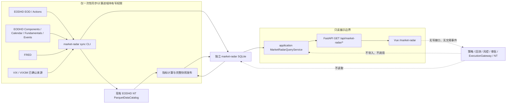

# 市场雷达实施方案（基于当前仓库）

> 状态：R0、R1 与 R2A（安全价格同步、INTERNAL 指标、原子快照发布）已完成；R2B 只读 API 与页面尚未实施。
> 核对基线：2026-09-02，提交 `07e14f1`（`origin/develop`），核对时工作区干净。
> 原始产品设想：[HeyBoss 市场雷达数据面板高层实施方案](HeyBoss_market_radar_implementation_plan.md)。
> 事实优先级：`AGENTS.md` 与 [项目事实源](project-context.md) 高于原始设想；本文再以当前代码和实际供应商能力收敛实施路径。

## 1. 文档结论

市场雷达适合加入当前项目，但必须作为**独立、只读、可删除的市场监测域**，不能放入策略、因子、风控或执行目录，也不能把监测股票自动变成可交易股票。

当前仓库可以直接复用的部分是：

- EODHD EOD、splits、dividends 到 NT Instrument/双 BarType/ParquetDataCatalog 的链路；
- SQLAlchemy + SQLite、FastAPI、OpenAPI 生成、Vue 3、ECharts 与现有状态组件；
- Web API 只读数据库、只读挂载、同源代理和可删除性边界；
- 现有 Python 与前端质量门禁。

当前仓库**不能直接支撑**原始设想中的完整面板：

- EODHD 适配器目前只实现 EOD、拆股和分红，没有指数成分、Calendar Trends、Fundamentals 或 Economic Events；
- `config/instruments.yaml` 是 10 只可交易普通股，不是监测宇宙，也不能扩成 S&P 500 监测清单；
- Catalog 只包含已显式同步的标的，25 只价格监测池仍需由操作者完成正式 bootstrap，且没有 S&P 500 全体成员数据；
- 独立市场数据库当前只有同步运行与价格派生快照，没有成员关系、宏观、基本面、预期或事件；
- Web API 与 Vue 没有市场雷达模型、接口、路由或页面；
- 没有 FRED/Cboe 适配器，没有常驻调度器，也没有可靠的未来美股交易日历能力；
- 当前 EODHD Token 已证明 EOD、VIX 与 VIX3M 可用，Calendar、Fundamentals、Economic Events 和历史成分仍受套餐权限阻塞。

因此不能直接从“画完整页面”开始。推荐采用**数据能力门禁 → 价格纵向切片 → 宽度 → 宏观 → 盈利/基本面/事件 → 完整 UI**的顺序。每一步都能独立验收，缺少数据时返回明确状态，不用占位数据伪装完成。

## 2. 当前实现核对

### 2.1 已有架构

```text
EODHD EOD / IBKR 历史
        ↓
HistoricalBarSource + HistoricalDataPipeline
        ↓
NT Instrument + INTERNAL/EXTERNAL Bar + ParquetDataCatalog
        ↓
策略 Actor → TradeSignalEvent → ExecutionGateway → 风控/审批 → NT 执行

交易审计 SQLite / Catalog / 回测报告 / 白名单配置
        ↓
application 只读查询服务
        ↓
FastAPI GET /api
        ↓
Vue 3 七个一级页面
```

现有 Web 已经完成七个页面：`/`、`/portfolio`、`/strategy`、`/activity`、`/orders`、`/backtests`、`/system`。它没有写请求，没有 IBKR 或供应商凭据，停止 Web 不影响交易核心。

### 2.2 能力与缺口矩阵

| 需求 | 当前事实 | 处理决定 |
|---|---|---|
| EOD 价格 | 已实现 EODHD EOD + 双 BarType | 复用同一适配和 Catalog，不建另一套价格数据库 |
| 监测宇宙 | 只有交易清单 | 新建独立配置；交易清单保持不变 |
| S&P 500 当前/历史成员 | 未实现 | 新建 EODHD 指数成分适配与成员表，先实测套餐 |
| 市场宽度 | 未实现 | 后端离线计算并发布快照，API 不现场扫描 500 只股票 |
| FRED 实际利率/信用 | 未实现 | 新建只读来源适配；信用源受许可和历史范围门禁 |
| VIX/VIX3M | 未实现且合法入口未确认 | 先探测 EODHD 指数符号/权限，再评估 Cboe；未确认时模块失败关闭 |
| EPS Trends/财报日历 | 未实现 | 先探测 EODHD Calendar 权限和字段，再每日留存快照 |
| Fundamentals | 未实现 | 先探测字段、更新语义和额度；不把当前基本面伪装成历史 PIT 数据 |
| Economic Events | 未实现 | 先探测端点；MVP 使用明确的日历日期窗口 |
| 未来 10 个交易日 | 没有可靠未来交易日历 | MVP 改为 14 个日历日并准确标注；若必须精确 10 个交易日，单独申请日历依赖 |
| 监测数据库 | 已实现 `sync_runs` 与 `price_snapshots` | 继续使用独立 `market-radar.db`，后续按真实调用方增加表 |
| 查询/API | 已有只读分层 | 新增独立查询服务和 GET 路由，沿用错误与 OpenAPI 约定 |
| Vue/ECharts | 已具备 | 新增一个一级入口和三个 URL 可恢复的内部视图 |
| 调度 | 没有常驻调度 | 第一阶段仅提供一次性 CLI；由人工或宿主机外部调度触发 |
| 交易联动 | 唯一执行链路已有硬约束 | 市场雷达永不发布 `TradeSignalEvent`，不提供下单或审批操作 |

### 2.3 原始设想中需要修正的假设

1. **“已有 EODHD 适配即可同步全部监测数据”不成立。**现有类只有 `/eod`、`/splits`、`/div` 三类请求，非价格端点需要新增严格解析和测试。
2. **“直接扩充 `config/instruments.yaml`”不可接受。**该文件同时参与策略、回测和执行身份解析；监测宇宙必须独立。
3. **“每日用现有 replace 管道刷新 500 只股票”成本过高。**当前 EODHD 路线按完整范围替换，以 500 只股票每日全量重拉不合理。监测同步需要首次全量、日常重叠窗口、周期性全量校验三种明确动作，但仍复用同一 EODHD 解析、BarType 和 Catalog。
4. **“S&P 500 历史宽度可覆盖任意历史”不成立。**EODHD 官方文档说明完整成员历史存在覆盖起点；方案只从可证明的成员历史开始发布 PIT 宽度。
5. **“Calendar Trends 等于完整日度预期历史”不成立。**它包含财政期间记录和固定滞后预期，但不是逐交易日 PIT 快照；连续时间序列只能从首次采集后积累。
6. **“FRED HY OAS 可稳定提供长期历史”需要重新评估。**FRED 当前提示该 ICE 系列自 2026-04 起只保留三年观测，且有再分发限制；不能把它作为无条件长期真相源。
7. **“未来十个交易日”暂时没有可靠计算基础。**不能用周一至周五代替交易所日历并忽略节假日。

## 3. 最终架构



### 3.1 依赖方向

- `market_radar/` 可以复用 `data/` 中的 EODHD HTTP、NT Bar 和 Catalog 能力；
- `application/` 可以读取 `market_radar` 的只读仓储和不可变查询模型；
- `web_api/` 只依赖 `application/`；
- `web-ui/` 只依赖 OpenAPI；
- `signals/`、`strategies/`、`execution/`、`risk/`、`backtest/`、`live/`、`notify/` 和交易 `storage/` 不得反向依赖市场雷达；
- 删除 `market_radar/`、对应 API、页面和数据库后，交易与回测仍应完整运行。

### 3.2 数据写入与查询边界

同步/计算 CLI 是唯一写入者：

- 读取环境变量中的供应商凭据；
- 串行写现有 EODHD Catalog；
- 写 `market-radar.db`；
- 完成质量检查后把同步运行标记为 `complete`；
- 失败运行保留诊断，但不能覆盖最近完整派生快照。

Web API：

- 只以 SQLite `mode=ro` 打开 `market-radar.db`；
- 不接收 EODHD、FRED、Cboe、IBKR 或 Telegram 凭据；
- 不在 HTTP 请求内下载数据、扫描全市场或重新计算指标；
- 不返回供应商原始响应、本地路径或受许可限制的批量数据。

## 4. 目录与文件设计

以下是目标结构。每个里程碑开始前仍需按 `AGENTS.md` 给出当次精确文件清单并获得确认。

```text
config/
└── market-radar.yaml                 监测宇宙、阈值、板块映射和来源选择；无凭据

scripts/
├── check_market_radar_sources.py     权限/字段/额度探测，不保存原始响应
└── sync_market_radar.py              显式 bootstrap/daily/reconcile，并发布价格快照

src/trading_assistant/
├── data/
│   └── eodhd_http.py                 从现有适配器抽出的共享认证 HTTP/JSON 边界
├── market_radar/
│   ├── config.py                     监测配置加载与失败关闭校验
│   ├── models.py                     独立同步运行与价格快照表
│   ├── sources.py                    EODHD 附加端点、FRED 和波动率适配
│   ├── storage.py                    独立 SQLAlchemy Base、运行状态与只读/写仓储
│   ├── prices.py                     InstrumentSpec 装配与 INTERNAL Catalog 读取适配
│   ├── metrics.py                    无 IO 的价格指标、覆盖率和有效性计算
│   └── service.py                    同步、质量检查、计算与事务发布编排
├── application/
│   └── market_radar.py               与 HTTP 无关的只读查询服务
└── web_api/
    └── routes/market_radar.py        只读 GET 路由

web-ui/src/
├── pages/MarketRadarPage.vue         一级页面与三个内部视图的 URL 状态
└── components/market-radar/          实际使用到的矩阵、轨迹、时间轴和详情组件

tests/
├── market_radar/                     配置、来源解析、存储、指标和编排测试
├── application/test_market_radar.py
└── web_api/test_market_radar.py

web-ui/tests/market-radar-page.test.ts
```

约束：

- 不新建 `signals/market_radar.py`；
- 不在交易 `storage/models.py` 中加入市场表；独立 Base 防止 market DB 被创建出交易审计表；
- 不新建第二个图表库、前端状态库或 UI 框架；
- 不拆出只有一个实现、没有调用方的 provider registry 或插件框架；
- `schemas.py` 是否继续集中维护由里程碑代码量决定，但不能手写另一套 TypeScript 字段模型。

## 5. 配置契约

R1 已新增 `config/market-radar.yaml`，R2A 增加 watchlist 到板块的显式映射。配置只保存确定的产品信息，不保存动态成员和凭据。当前加载器严格接受六个顶层区段：`market`、`sector_etfs`、`watchlist`、`watchlist_sectors`、`monitor_instruments` 和 `probe`。以下仅为省略重复项的结构摘要，完整可运行内容以仓库配置文件为准。

```yaml
market:
  benchmark: SPY.US
  equal_weight_benchmark: RSP.US
  credit_proxy: [HYG.US, LQD.US]
  index_membership_symbol: GSPC.INDX

sector_etfs:
  materials: XLB.US
  communication_services: XLC.US
  energy: XLE.US
  financials: XLF.US
  industrials: XLI.US
  information_technology: XLK.US
  consumer_staples: XLP.US
  real_estate: XLRE.US
  utilities: XLU.US
  health_care: XLV.US
  consumer_discretionary: XLY.US

watchlist: [AAPL.US, MSFT.US, NVDA.US, GOOGL.US, AMZN.US, META.US, JPM.US, XOM.US, JNJ.US, TSLA.US]

watchlist_sectors:
  AAPL.US: information_technology
  GOOGL.US: communication_services
  JPM.US: financials
  # 其余条目必须与 watchlist 一一对应

watchlist:
  - AAPL.US
  # 其余 9 只见实际配置，且必须能在 config/instruments.yaml 中解析。

monitor_instruments:
  - symbol: SPY
    instrument_id: SPY.US
    data_symbol: SPY.US
    primary_exchange: ARCA
    first_trading_date: 1993-01-29
  # 其余 14 只市场 ETF 使用相同显式结构，完整清单见实际配置。

probe:
  # R0 代表性端点探测标的与 VIX/VIX3M 候选代码，仍供复验使用。
```

`monitor_instruments` 只包含不在交易清单中的 15 只市场 ETF；10 只 watchlist 的完整 `InstrumentSpec` 复用交易配置。`freshness` 与 `coverage` 尚无 R1 调用方，留到 R2 指标实现时再按实际公式加入。动态 S&P 500 成员、公司名称、分类和供应商返回字段不得复制进 YAML。

环境变量新增项只允许出现在 `.env.example`：

```dotenv
MARKET_RADAR_DATABASE_URL=sqlite:///./data/market-radar.db
MARKET_RADAR_REPORT_ROOT=./reports/market-radar
```

`EODHD_API_TOKEN` 复用已有变量。只有确认采用需要凭据的 FRED API 时才加入 `FRED_API_KEY`；R1 没有预设未使用的凭据变量。

## 6. 数据源与现实门禁

### 6.1 R0 必须实测的请求

使用用户本地 Token 发起最小请求，只输出状态码、顶层字段、行数、最早/最晚日期、空值比例和错误类别，不输出 Token 或完整 payload：

| 能力 | 最小探测 | 通过条件 |
|---|---|---|
| EOD | `SPY.US` 小日期窗 | 当前适配仍可解析且配额可接受 |
| 当前/历史成分 | `GSPC.INDX` Components 与 HistoricalTickerComponents | 有明确起止日期、代码与分类字段；套餐授权 |
| Calendar Trends | `AAPL.US,MSFT.US` | 财政期、当前/7/30/60/90 日预期、分析师计数字段可解析 |
| Earnings Calendar | 30 日日期窗 + 两个 symbol | report date、盘前/盘后、actual/estimate 缺失语义明确 |
| Fundamentals | `AAPL.US` 和 `JPM.US` | 普通企业与金融业字段差异可识别；更新时间可记录 |
| Economic Events | 美国 30 日日期窗 | 事件类别、日期/时间、重要性、actual/estimate 字段可识别 |
| VIX/VIX3M | 候选 EODHD 指数代码 | 两条序列均存在、日期对齐、使用权明确 |
| FRED DFII10 | 最近 90 日 | 日频、缺失值和修订时间语义可处理 |
| HY OAS | 最近 90 日 | 仅作为可选增强；记录历史范围与使用限制 |

输出一份被 Git 忽略的 `reports/market-radar/capability-check-*.json`，并生成一份可提交的字段差异摘要。真实供应商数据不进入 fixture；测试使用合成 payload。

### 6.2 已由官方资料确认、但仍需 Token 实测的事实

- EODHD EOD API支持按 symbol 返回日/周/月 OHLC、adjusted close 和 volume；现有项目已用日线实现。
- EODHD Fundamentals 的指数响应包含当前成分；官方文档描述 S&P 指数族的历史成员区间，并说明 S&P 500 的额外历史快照能力。
- EODHD Calendar 包含 earnings 和 trends；trends 返回财政期间记录及固定滞后的一致预期，不等于每日 PIT 归档。
- EODHD Economic Events 是独立端点，不能假设当前 EOD 套餐自动包含。
- FRED `DFII10` 是日频 10 年期实际利率序列。
- FRED `BAMLH0A0HYM2` 是日频 HY OAS，但官方页面当前说明自 2026-04 起仅保留三年观测，并带 ICE 数据使用约束。
- Cboe 提供 VIX 官方历史数据页面；VIX3M 的稳定程序化入口和许可仍需单独确认。

### 6.3 第一版来源选择

推荐顺序：

1. 价格、市场宽度、板块价格、个股趋势/风险：EODHD + 现有 NT Catalog；
2. 实际利率：FRED `DFII10`；
3. 信用：默认 `HYG/LQD` 20 日相对收益，HY OAS 仅在历史和许可确认后作为增强；
4. 波动率：只有 VIX 和 VIX3M 同时有可靠来源时才计算期限结构；
5. 盈利、基本面和事件：仅在对应 EODHD 权限探测通过后启用。

任何关键源未通过时，相关模块返回 `unconfigured`、`missing`、`stale`、`insufficient_coverage` 或 `unavailable`，不得偷偷改公式。

### 6.4 R0 实际核验结果（2026-09-03）

R0 已使用本地有效 Token 串行执行 10 次 EODHD 和 2 次 FRED 只读探测。运行时报告位于被 Git 忽略的 `reports/market-radar/capability-check-*.json`，报告只保存状态、字段、数量和日期范围，不保存数据值、完整 URL 或 Token。

| 能力 | 实际结果 | 已证明的边界 | 后续影响 |
|---|---|---|---|
| `SPY.US` EOD | `available`，HTTP 200 | 返回标准 EOD OHLC、adjusted close 与 volume；本次窗口 22 行 | R2 价格纵向切片可直接推进 |
| `GSPC.INDX` 当前成分 | `forbidden`，HTTP 403 | 当前 Token 可访问 EOD，但不能访问该 Fundamentals 过滤项 | R3 阻塞，需确认或升级 EODHD 套餐 |
| `GSPC.INDX` 历史成分 | `forbidden`，HTTP 403 | 无法验证成员历史字段和实际覆盖起点 | R3 PIT 宽度不得开工 |
| Calendar Trends | `forbidden`，HTTP 403 | 无法验证一致预期字段 | R5 盈利修正阻塞 |
| Earnings Calendar | `forbidden`，HTTP 403 | 无法验证财报事件字段 | R5 财报时间轴阻塞 |
| AAPL/JPM Fundamentals | `forbidden`，HTTP 403 | 普通公司与金融业字段均不可验证 | R5 质量与估值阻塞 |
| Economic Events | `forbidden`，HTTP 403 | 无法验证宏观事件字段 | R5 宏观事件轴阻塞 |
| `VIX.INDX` | `available`，HTTP 200 | EOD 序列和候选代码有效 | R4 波动率输入之一可用 |
| `VIX3M.INDX` | `available`，HTTP 200 | EOD 序列和候选代码有效 | R4 期限结构价格输入可用 |
| FRED `DFII10` | `unknown` | 官方 CSV 可由 `curl` 通过 HTTP/2 访问，但当前 Python 标准库 HTTP 请求断开或超时 | R4 实际利率阻塞；优先申请 FRED API Key，不增加临时依赖绕过 |
| FRED HY OAS | `unknown` | 与 DFII10 相同的程序化连接问题，且仍有历史与许可限制 | 不作为首版信用输入；首版保留 HYG/LQD 代理 |

由于同一 Token 对 EOD 与波动率端点返回 200，对附加端点返回 403，可以证明 Token 本身有效；403 更可能是套餐授权边界，但最终仍以 EODHD 账户套餐页面或官方支持回复为准。

R0 后的实际执行顺序调整为：

1. R1 可继续建立独立存储和发布边界；
2. R2 可使用 EOD、VIX 和 VIX3M 已证明能力推进价格型页面；
3. R3 在历史成分权限获得前保持阻塞，不以当前成分替代 PIT 成分；
4. R4 先保留 HYG/LQD 与 VIX/VIX3M 输入，DFII10 在获得 FRED API Key 后复验；
5. R5 在 Calendar、Fundamentals 和 Economic Events 权限获得前不编码对应业务模型。

## 7. 价格与监测宇宙设计

### 7.1 宇宙隔离

- 交易宇宙：继续只由 `config/instruments.yaml` 决定；
- 监测基准/ETF/自选股：由 `config/market-radar.yaml` 决定；
- S&P 500 宽度成员：由已发布的成员区间表按 `as_of_date` 选择；
- Catalog 中存在某个 Instrument/Bar 不代表其可交易；
- 市场雷达不得写 `config/instruments.yaml`。

同一 canonical ID 如果已在交易配置存在，必须复用其既有 Instrument 定义。动态监测股票使用 EODHD 返回的 code/exchange 构建分析用 canonical ID；与既有 ID 冲突或身份含糊时失败关闭，不能按展示 ticker 猜测。

### 7.2 Catalog 语义

- 所有收益、均线、宽度和相对强弱使用 `1-DAY-LAST-INTERNAL`；
- UI 显示实际 EOD 价格使用 `1-DAY-LAST-EXTERNAL`；
- 不新增 `RADAR` BarType，不复制 CSV 价格仓库；
- 市场雷达指标只读取 Catalog，API 只读取计算后快照；
- Catalog 写入仍串行，交易同步和雷达同步不能并发执行。

### 7.3 同步模式

R2A 已在共享 `HistoricalDataPipeline` 上实现三种显式模式，监测服务不再照搬“每日完整 20 年 replace”行为：

1. `bootstrap → append_missing`：请求完整目标窗口，补齐序列两端缺口，不覆盖已有时间戳；
2. `daily → replace_range`：已有起点覆盖充分时从最后完整日期向前重叠 `overlap_days`，只替换该闭区间并追加新 Bar；
3. `reconcile → replace_full`：人工或低频请求并替换完整目标历史，处理深层供应商修订和公司行动变化。

三种模式都复用现有 EODHD 解析、公司行动规范化、双 BarType、质量规则和 `CatalogRepository`。范围替换由仓储集中实现：窗口外 Bar 和公司行动会保留，任一 BarType 写入失败会恢复替换前窗口；监测服务不直接调用底层删除 API。

## 8. 独立数据库

使用 `market-radar.db`，不使用 live/backtest 审计数据库，也不把原始 EOD Bar 存入 SQLite。

### 8.1 最小表集合

| 表职责 | 唯一键/关键字段 | 说明 |
|---|---|---|
| 同步运行 | `run_id` | 来源、开始/结束、状态、覆盖、错误摘要 |
| 指数成员区间 | `index_id + instrument_id + start_date` | `end_date` 可空；支持 PIT 选择 |
| 分类快照 | `instrument_id + effective_date` | sector/industry 和来源；不伪造历史变更 |
| 宏观观测 | `source + series_id + observation_date` | value、available/ingested 时间 |
| 一致预期快照 | `instrument_id + fiscal_period + period_type + snapshot_date` | 当前与滞后值、分析师/修正人数 |
| 基本面快照 | `instrument_id + fiscal_period + ingested_at` | 只保存指标计算所需字段和来源更新时间 |
| 市场事件 | `source + natural_key` | 事件日期/时间、类型、重要性、actual/estimate |
| 派生快照 | `snapshot_kind + entity_id + as_of_date` | 计算结果、覆盖率、有效性、来源和计算时间 |

派生结果可以在单一 `payload_json` 中保存模块专用结构，因为它只由一个计算器写、一个查询服务读，当前没有跨版本兼容需求。必须有 Pydantic/dataclass 校验和唯一键，但不引入 `schema_version`、版本注册表或内容哈希。

### 8.2 R1/R2A 实际存储边界

R1 创建 `sync_runs`；R2A 在价格计算器成为真实调用方后新增 `price_snapshots`。前者记录 `RUNNING → COMPLETE/FAILED`、请求日期、标的数量和 Bar 计数，后者以 `as_of_date` 唯一保存严格 dataclass 校验的价格 payload，并关联发布它的运行。来源观测、成员、基本面和事件尚无生产写入方，因此仍不提前建表。

- `MarketRadarBase` 与交易审计 `Base` 完全分离；market DB 只包含 `sync_runs` 与 `price_snapshots`；
- Web 后续使用 `MarketRadarRepository(..., read_only=True)`，SQLite 自身拒绝写入；
- 失败详情只保存异常类型或 `data_quality`，不保存 Token、URL 或供应商 payload；
- `latest_complete_run()` 和 `latest_price_snapshot()` 都忽略失败运行，较新的失败不会替代已发布快照；
- 快照 upsert 与 `RUNNING → COMPLETE` 在同一数据库事务内发生，任一更新失败会整体回滚；
- EOD Bar 和 Instrument 继续只保存在 NT `ParquetDataCatalog`，不会复制到 SQLite。

### 8.3 发布规则

```text
RUNNING
  → 来源逐项校验
  → Catalog 更新完成
  → 原始非价格记录写入
  → 指标计算完成
  → 单事务写入当日派生快照
  → COMPLETE

任一步失败 → FAILED；最近 COMPLETE 快照继续可读并被标记 stale
```

Catalog 与 SQLite 无法组成同一个事务。因此 Web 永远只读 `COMPLETE` 运行关联的派生快照，不能直接把半更新 Catalog 当成已发布面板。

### 8.4 R2A 价格快照口径

价格计算器没有 IO，也不依赖 EXTERNAL Bar。同步完成质量检查后，适配层只从 Catalog 读取 `1-DAY-LAST-INTERNAL`，再按 SPY 的最新日期对齐全部 25 个配置标的：

- 市场：SPY 20 日总回报、SPY 距 200 日均线、RSP 减 SPY 的 20 日总回报；
- 板块：11 个板块 ETF 相对 SPY 的 20/60 日强弱；
- 个股：126-21 动量、相对所属板块动量、距 200 日均线、20 日年化实现波动率、126 日最大回撤、ATR20/价格；
- 覆盖：`eligible` 固定取本次配置监测池，`observed` 只计最新日期与 SPY 相同的序列；
- 有效性：单项只返回 `complete`、`insufficient_history` 或 `unavailable`，没有足够数据时 `value=null`，禁止补零、向前填充或切换到 EXTERNAL。

payload 不含 `schema_version`、manifest 或内容哈希；当前只有一个同步升级的写入者与读取者。

## 9. 时间、覆盖率和有效性契约

### 9.1 时间字段

每个非价格记录至少包含：

- `observation_date`：数据描述的日期；
- `available_at_utc`：来源可证明的公开时间，可空；
- `ingested_at_utc`：本系统采集时间；
- `as_of_date`：派生快照对应的美股市场日期；
- `calculated_at_utc`：派生计算时间。

`available_at_utc` 不可证明时必须为 `null`。这类记录可以用于当前盘后监测，但不能声明可用于无前视历史回测。

### 9.2 统一模块状态

沿用现有 `SourceState` 表达源是否存在/可读，再为雷达模块增加独立有效性字段：

```text
source_state: available | empty | missing | invalid | unconfigured | unobserved
validity: complete | partial | stale | insufficient_history |
          insufficient_coverage | unavailable
```

不要扩写既有 `SourceState` 并改变七个现有页面语义。

每个模块必须返回：

- `as_of_date`；
- `calculated_at_utc`；
- `validity`；
- `coverage = {eligible, observed, ratio}`；
- `sources`；
- `freshness`；
- 对应原始分项和派生状态。

### 9.3 覆盖与陈旧默认值

- 价格：晚于最近完整美股交易日 2 个交易日后 stale；
- 实际利率/信用：3 个日历日；
- EPS 修正：3 个日历日；
- 基本面采集：14 个日历日，同时始终展示报告期；
- 事件：24 小时；
- 宽度 `ratio >= 0.95` 才可生成完整状态；`0.90–0.95` 只展示 raw/partial；低于 `0.90` 不生成状态；
- 任何比例都使用该指标真实 eligible 分母，不能用固定 500。

## 10. 指标实现口径

原始方案中的方向可保留，但实现时使用以下明确边界。

### 10.1 市场趋势与宽度

必需输入：SPY、RSP、当日有效 S&P 500 成员的 INTERNAL Bar。

计算：

- SPY 20 日总回报；
- SPY 距 200 日均线；
- 成员高于 50/200 日均线比例；
- 每日净上涨比例及 EMA10；
- 252 日新高减新低比例；
- RSP 减 SPY 的 20 日总回报；
- 成员覆盖率和各指标实际分母。

状态标准化使用最近三年有效观测；少于 504 个有效交易日时只返回原始值并标记 `insufficient_history`。PIT 宽度不早于供应商可证明的成员历史起点。

状态切换需连续三个有效交易日满足新区域；中性带沿用原始方案。该状态只描述结构，不输出涨跌概率或交易建议。

### 10.2 宏观四象限

横轴：`DFII10` 20 日变化的三年 Robust Z-score。
纵轴：优先使用已确认的信用输入与 `log(VIX/VIX3M)`；若只有 HYG/LQD，则明确标记 `credit_source=etf_proxy`。

关键规则：

- VIX3M 不可用时不计算完整纵轴；
- DFII10、信用和波动率日期不在允许共同窗口时不拼接；
- 三年窗口少于 504 个有效共同观测时标记 `insufficient_history`；
- Robust Z 截断到 `[-3, 3]`；
- 中性带和象限标签由后端计算，Vue 只绘图。

### 10.3 板块领导力

11 个固定板块 ETF 用于价格代理，S&P 500 成员分类用于内部宽度。

领导力只由 RS60、RS20、Breadth50 和 EPS Revision 构成；估值只作为背景，不进入排名。任一核心项不足最低覆盖时不生成排名。没有可证明历史分类时，板块历史宽度只能从首次分类快照起显示，不能用今天行业回填过去。

### 10.4 盈利预期

- FY1 当前与 30 日前预期计算修正宽度；
- 正且远离零的 EPS 才进入百分比修正幅度；
- 负/近零 EPS 只进入方向宽度，并单独报告数量；
- 无分析师覆盖不填 0；
- endpoint 提供的固定滞后值可展示当前横截面，日度历史从首次采集后积累。

### 10.5 个股雷达

只覆盖配置 watchlist，不读取持仓自动扩充。

- 趋势：126–21 日相对板块动量 + 距 200 日均线；
- 修正：30 日 EPS 变化 + 分析师上调/下调宽度；
- 质量：普通公司使用 ROIC、FCF Margin、Net Debt/EBITDA；
- 估值：普通盈利公司使用 Forward Earnings Yield、FCF Yield、EV/EBITDA；
- 风险：20 日实现波动率、126 日最大回撤、ATR20/Price；
- 行业内有效可比样本少于 5 时返回 `not_comparable`；
- 金融和 REIT 没有专用口径时展示原始字段，不生成伪综合分；
- 五个维度永远不合成“买入分”。

## 11. API 契约

统一前缀 `/api/market-radar`，不增加无兼容需求的 `/v1`。

| 方法与路径 | 页面消费者 | 返回内容 |
|---|---|---|
| `GET /summary` | 顶部状态条与总览卡片 | 六项摘要、各模块有效性、最近完整日期 |
| `GET /breadth?window=1y` | 总览宽度图 | SPY、B50/B200、AD10、NHNL、RSP/SPY、覆盖 |
| `GET /macro?window=1y` | 宏观四象限 | 当前点、轨迹、组成序列、来源与回退标记 |
| `GET /sectors` | 总览摘要和板块页 | 11 行矩阵、排名、覆盖、有效性 |
| `GET /sectors/{sector_id}?window=1y` | 板块详情抽屉 | RS、宽度、修正、估值时间序列 |
| `GET /earnings-revisions?scope=market&window=1y` | 总览/板块 | 修正宽度、幅度、surprise 和覆盖 |
| `GET /events?from=...&to=...` | 事件时间轴 | 宏观与 watchlist 财报事件 |
| `GET /stocks?sector=...&query=...&offset=0&limit=50` | 个股表 | 后端筛选、排序和分页的五维结果 |
| `GET /stocks/{instrument_id}?window=1y` | 个股详情抽屉 | 价格、相对表现、预期、财务和估值 |

约束：

- 全部只有 GET；
- `window` 只接受白名单值，不能构造任意大查询；
- 列表沿用 `offset/limit/has_more`；
- `sector_id` 和 `instrument_id` 必须由数据库实体白名单解析；
- 统一 `application/problem+json`；
- OpenAPI 生成 TypeScript；前端不手写响应字段；
- 请求路径不调用供应商、不触发计算、不打开可写数据库；
- API 不提供供应商历史原始数据下载。

## 12. 前端信息架构

在现有“研究与系统”导航组新增第八个一级入口：`/market-radar`，名称“市场雷达”。不修改既有“操作总览”的交易运行语义。

页面内部使用现有胶囊标签和 URL 查询参数：

```text
/market-radar?view=overview
/market-radar?view=sectors&sector=information_technology
/market-radar?view=stocks&sector=...&query=...&instrument=AAPL.US
```

### 12.1 总览

1. 六项紧凑状态条：SPY 趋势、市场宽度、等权确认、实际利率、风险偏好、EPS 修正；
2. 市场趋势与宽度共享时间轴；
3. 宏观四象限；
4. 板块领导力摘要矩阵；
5. 盈利预期脉冲；
6. 未来事件。

尚未接入的模块显示精确原因，不隐藏，也不使用模拟数据填充。

### 12.2 板块

- 11 行矩阵；
- 数值、色阶、排名变化和数据日期同时存在；
- 点击打开现有 `SideDrawer` 风格详情；
- 不做板块轮动图。

### 12.3 个股

- watchlist 搜索、板块筛选、后端排序/分页；
- 趋势、修正、质量、估值、风险五个独立列；
- 点击打开详情抽屉；
- 不读取持仓、不形成综合买入分、不提供交易按钮。

### 12.4 组件复用与新增

直接复用：`AppShell`、`SegmentedTabs`、`DataState`、`SideDrawer`、`StatusPill`、分页、格式化工具和现有设计 token。

需要新增但只在实际调用时创建：

- 连续热力带图；
- 二维象限轨迹图；
- 板块/个股热力矩阵；
- 横向事件时间轴。

继续使用 ECharts，不增加图表依赖。每张图必须有 `aria-label` 或等价文字摘要；颜色不是唯一信息载体。

## 13. 运行与部署

### 13.1 一次性同步

R2A 当前可运行的价格同步与快照发布：

```bash
uv run --frozen --env-file .env python scripts/check_market_radar_sources.py

uv run --frozen --env-file .env python scripts/sync_market_radar.py \
  --mode bootstrap \
  --start 2006-09-03 \
  --end 2026-09-03
```

`--mode` 必填，避免默认执行具有不同覆盖含义的写入。省略日期时按 `config/data.yaml` 的 `history_years` 计算目标窗口；`--instrument` 可重复使用以选择本次同步标的。快照计算始终读取 Catalog 中完整的 25 只配置监测池，因此首次隔离联调至少需要包含 SPY，正式发布前应完成全池 bootstrap。

三个模式都有真实且不同的写入实现：

```bash
uv run --frozen --env-file .env python scripts/sync_market_radar.py \
  --mode bootstrap

uv run --frozen --env-file .env python scripts/sync_market_radar.py \
  --mode daily

uv run --frozen --env-file .env python scripts/sync_market_radar.py \
  --mode reconcile
```

第一阶段不实现守护进程。日常运行计划为“美股 EOD 数据稳定后由操作者或宿主机外部调度运行 `daily`”。失败返回非零，不自动重试无限次，也不触发交易节点。

### 13.2 Compose

新增一次性 `market-radar-sync` profile 服务时：

- 只显式传入 `EODHD_API_TOKEN`、可选 `FRED_API_KEY` 和路径变量；
- 不继承 `TWS_PASSWORD`、Telegram token 或 VNC 密码；
- Catalog、data、reports 对同步服务可写；
- 不声明 `restart`，任务完成即退出；
- `web-api` 只新增 market DB URL，继续通过现有 `./data:/app/data:ro` 读取；
- `web-ui` 无供应商变量。

## 14. 实施里程碑

每个里程碑开始前必须再次提交精确文件清单、关键接口、依赖变化和验收方式，获得确认后编码。

### R0：数据能力与契约核验

状态：已完成（2026-09-03），实际结论见 6.4。

目标：证明当前 Token、字段、历史范围、额度和许可，不改交易行为。

预计改动：

- 新增来源探测脚本及合成测试；
- 固化 `market-radar.yaml` 最小配置；
- 输出能力差异表和最终字段词典。

验收：

- 九类最小探测均有明确 `available/forbidden/not_in_plan/invalid/unknown` 结果；
- Token、URL 查询串和完整 payload 不进日志或 Git；
- 确认 VIX3M 入口、S&P 历史成员起点和 Calendar/Fundamentals 权限；
- 对未通过项给出页面降级行为；
- 不新增第三方依赖。

停止条件：没有可用的历史成分端点时，不进入 PIT 市场宽度开发；VIX3M 不可用时，不进入完整宏观四象限开发。

### R1：无行为变化的 EODHD 边界重构与市场存储

状态：已完成（2026-09-03）。

目标：为多个 EODHD 端点建立可复用 HTTP/JSON 边界，创建独立市场数据库，并以真实价格 bootstrap 作为存储调用方。

实际改动：

- 共享 EODHD HTTP/JSON 边界因 R0 探测需要已在 R0 提前完成，现有 EOD/split/div 共用同一实现；
- 保持现有 EOD/split/div 输出逐字节/逐对象行为不变；
- 扩充 market config，将 15 只市场 ETF 与交易配置中的 10 只 watchlist 明确隔离；
- 增加独立 SQLAlchemy Base、`sync_runs`、原子状态转换和只读打开方式；
- 从现有同步服务提取接收已解析 `InstrumentSpec` 的共享入口，交易 CLI 行为不变；
- 增加只支持 bootstrap 的 `sync_market_radar.py`，没有提前加入单实现的 `--mode` 参数。

验收：

- 真实 Token 在隔离 `/private/tmp` 中完成 `SPY.US` 2026-08-18 至 2026-09-02 同步：12 个交易日、两种规范 BarType，共 24 根 Bar，质量问题为零；
- 现有 EODHD、交易同步、回测、Web API 测试全部回归通过；
- market DB 不创建交易审计表；
- read-only 模式无法写入；
- failed run 不改变最后 complete run；
- 完整 Python 门禁通过；
- 不新增第三方依赖。

### R2：EOD 价格纵向切片

状态：R2A 已完成；R2B 待确认后实施。

目标：先交付真实可用的价格型市场雷达，而不是等待全部外部数据。

范围：SPY、RSP、HYG、LQD、11 个板块 ETF 和 watchlist。

交付：

- 在已有 bootstrap 上增加安全的 daily/reconcile 价格同步；
- 价格 freshness 与覆盖；
- SPY 趋势、RSP/SPY、板块相对强弱、watchlist 趋势和风险；
- 完整快照发布；
- 最小只读 API；
- `/market-radar` 页面骨架、总览/板块/个股三视图；
- 尚未实现的宽度、宏观、盈利模块显示明确 unavailable 原因。

验收：

- 交易配置仍为原 10 只股票；
- Catalog 使用既有 INTERNAL/EXTERNAL 语义；
- API 请求不触发计算；
- 页面没有模拟数据和交易按钮；
- 日常同步不会完整重拉所有历史；
- 现有七页回归通过。

#### R2A：安全同步、价格指标与原子发布

状态：已完成（2026-09-03）。

实际改动：

- 为共享 Catalog 管道增加调用方显式选择的 `append_missing`、`replace_range`、`replace_full`，不改变既有交易同步默认行为；
- 为 NT Catalog 增加带恢复路径的 Bar 闭区间替换，为公司行动 sidecar 增加保留区间外记录的闭区间替换；
- CLI 以必填 `--mode` 暴露 `bootstrap`、`daily`、`reconcile`，三者分别映射上述写入语义；
- 增加 watchlist 的 11 标准板块显式归属；
- 增加无 IO 的 INTERNAL 价格计算器、覆盖率和单项有效性；
- 增加 `price_snapshots`，在同一事务内 upsert 当日快照并完成同步运行；
- 未增加 API、Vue 页面或第三方依赖。

验收：

- 范围替换保留窗口外历史，模拟写入失败可恢复原窗口；
- daily 使用重叠窗口而不是完整重拉，公司行动窗口外记录保留；
- 价格指标公式、日期对齐、历史不足、实体当日缺失和 payload 严格恢复均有单元测试；
- 指标只加载规范 `1-DAY-LAST-INTERNAL`；
- 快照发布或运行完成任一步失败时事务整体回滚，失败运行不替代最新快照；
- 真实 Token 在隔离 `/private/tmp` 对 `SPY.US`、2026-08-18 至 2026-09-02 完成 bootstrap：12 个交易日、双 BarType 共抓取/写入 24 根，发布 2026-09-02 快照；
- 同一隔离 Catalog 随后运行 daily 只抓取重叠窗口的 16 根，而非完整窗口 24 根；数据未修订所以写入 0 根，Catalog 仍各保留 12 根 INTERNAL/EXTERNAL；
- 单标的验收快照覆盖为 `1/25`，这是配置全池中只有 SPY 已同步的真实结果，不伪造成完整覆盖；
- 真实验收发现并修复了 NT `ts_init` 位于次日零点前 1–2 纳秒而 `time.max` 仅有微秒精度的边界，范围末端现统一使用“下一自然日零点减 1 纳秒”并有回归测试。

#### R2B：只读 API 与价格页面

待实施范围：最小只读查询服务、`/api/market-radar/*`、`/market-radar` 的总览/板块/个股视图，以及对宽度、宏观、盈利等未实现模块的明确 unavailable 原因。R2A 不提前创建这些边界。

### R3：S&P 500 PIT 市场宽度

目标：接入当前/历史成员，完成真实宽度。

交付：

- 成员区间与分类同步；
- 动态监测 Instrument 构建和价格覆盖；
- B50/B200、AD10、NHNL、覆盖率、SPY 状态与热力带；
- 当前整体市场宽度；
- 只有分类历史可证明的区间才提供历史板块宽度。

验收：

- 抽样日期的成员集合与供应商原始成员区间一致；
- 加入/退出当日边界有测试；
- 分母只含当日成员且有足够价格历史的股票；
- 低覆盖失败关闭；
- 不用今天成分回填过去；
- 500 只规模下同步和计算有记录的时间/内存基线。

### R4：宏观定价状态

前提：R0 证明 DFII10、信用输入、VIX 和 VIX3M 均可合法稳定访问。

交付：

- 宏观观测同步；
- 日期对齐、陈旧检查、Robust Z 与四象限；
- 当前点、60 个交易日轨迹、组成指标；
- 来源/回退标记和完整失败状态。

验收：

- 人工复算样本日期一致；
- 缺一条关键序列不生成完整象限；
- HYG/LQD 与 HY OAS 不静默切换；
- 少于最小历史不生成标准化状态；
- Vue 不计算 Z-score 或象限。

### R5：盈利、基本面与事件

前提：对应 EODHD 端点权限和字段已通过 R0。

交付：

- Calendar Trends、Earnings、Fundamentals、Economic Events 同步；
- EPS 修正、surprise、板块盈利修正；
- 个股质量与估值；
- 未来 14 个日历日事件轴；
- 如果用户另行批准可靠交易日历依赖，再改为精确未来 10 个美股交易日。

验收：

- 负 EPS、近零 EPS、无分析师、字段字符串/null 都有测试；
- 金融与 REIT 不使用错误口径；
- 首次采集前不伪造日度预期/估值历史；
- 事件时间未知时明确显示 TBD；
- 不提交真实供应商 fixture。

### R6：完整页面与交互验收

目标：完成原始设想中已获数据支持的视觉表达。

交付：

- 六项状态条、宽度图、宏观四象限、板块矩阵、盈利脉冲、事件轴；
- 板块和个股详情抽屉；
- URL 深链、筛选、后端分页；
- loading/empty/missing/invalid/stale/partial/unavailable 全状态；
- 桌面、平板和手机适配。

验收：

- 1440/768/375 无页面级横向溢出；
- Escape、焦点恢复、文字摘要和键盘访问通过；
- 数据日期、来源、覆盖和有效性始终可见；
- 不出现综合买入分、轮动图、期权、持仓联动或交易动作；
- TypeScript、ESLint、Prettier、Vitest、生产构建通过。

### R7：部署、隔离与文档

交付：

- 一次性同步 Compose profile；
- Web API market DB 只读挂载；
- README 使用说明、项目事实源和技术参考按已实现内容更新；
- 本地真实数据浏览器验收记录。

验收：

- 同步容器没有 IBKR/Telegram 凭据；
- Web API 没有供应商凭据；
- 停止/删除市场雷达页面、API 路由和 market DB 不影响 TradingNode、回测、Telegram 或 IB Gateway；
- `submit_order` 唯一调用位置仍为 `execution/gateway.py`；
- Python、前端、pre-commit、Compose 全门禁通过；
- Git 不包含真实市场数据、数据库、报告或凭据。

## 15. 测试策略

### 15.1 纯计算

- 均线、收益、EMA、NHNL、ATR、回撤；
- PIT 成员边界与 eligible 分母；
- 横截面百分位、winsorize、Robust Z 的零 MAD；
- 504 条最小历史；
- 覆盖 95%/90% 边界；
- 三日状态切换；
- 负/零 EPS、缺失基本面和特殊行业；
- 所有函数无 IO、固定输入得到固定输出。

### 15.2 来源与存储

- 401/403、429、5xx、超时、坏 JSON、字段漂移、字符串数字/null；
- 同步重复运行幂等；
- failed run 不发布；
- SQLite 只读；
- Catalog 范围替换失败可恢复；
- 交易与监测 canonical ID 冲突失败关闭。

### 15.3 API

- 正常、空、缺失、损坏、陈旧、覆盖不足；
- 过滤、分页、非法 window/sector/instrument；
- 响应不泄露路径、Token、栈或原始供应商 payload；
- 只有 GET；
- API 包不导入 execution/live/backtest runner/notify。

### 15.4 前端

- 三视图和 URL 恢复；
- 模块级失败不拖垮整页；
- 热力格仍显示数值；
- 图表文字摘要；
- 抽屉键盘与焦点；
- API 断开/恢复；
- 不存在 POST/PUT/PATCH/DELETE 客户端。

### 15.5 真实数据验收

自动测试只用合成数据。完成每个外部来源后，再用本地 Token 做不入 Git 的 smoke test：

- 选 3 个历史日期人工复算市场宽度；
- 选 3 个日期复算宏观坐标；
- 选普通公司、金融、REIT 各一只核对字段和 `not_comparable`；
- 核对一次财报日期变更与一次缺少预期的事件；
- 记录配额、运行时间、Catalog 增量和数据库大小。

## 16. 安全与许可

- Token 只来自环境变量；
- 探测和同步日志只记录 endpoint 类型、状态、数量和摘要，不打印带 token URL；
- Web API、Vue、OpenAPI、错误响应不包含供应商凭据；
- 仓库只提交合成 fixture；
- 不提供原始数据批量导出；
- HY OAS、Cboe 和 EODHD 的本地存储/展示/再分发范围在 R0 留档；
- 市场雷达是信息展示，不是投资建议，不产生交易信号。

## 17. 新依赖决策

R0–R4 不需要新第三方依赖：

- HTTP：Python 标准库，沿用当前实现；
- 计算：已有 pandas；
- 存储：已有 SQLAlchemy；
- API：已有 FastAPI/Pydantic；
- UI：已有 Vue/ECharts。

唯一可预见但暂不批准的依赖是可靠美股交易日历库。当前项目没有该能力，手写假期表风险更高。R5 前应提交单独的依赖提案；未批准时事件窗口保持“未来 14 个日历日”，不冒充“10 个交易日”。

## 18. 全局完成标准

只有同时满足以下条件，才能把市场雷达写入 `project-context.md` 的“当前能力”：

1. 真实同步任务能产生至少一个完整快照；
2. Web 只从只读 API 展示，不在前端计算金融指标；
3. 三个视图正常，未授权数据模块有真实降级状态；
4. 市场宽度使用可证明的 PIT 成员和真实 eligible 分母；
5. 所有模块披露日期、来源、覆盖率和有效性；
6. 没有综合买入分、下单按钮或第二条执行路径；
7. 停止/删除市场雷达不影响交易核心；
8. 完整 Python、前端、Compose 和安全门禁通过；
9. 公开仓库不含真实供应商数据或凭据；
10. README、事实源、技术参考只描述已经实现并验收的能力。

## 19. 官方资料核验入口

供应商页面可能变化，R0 应重新读取并以实际响应为准：

- [EODHD EOD Historical Data API](https://eodhd.com/financial-apis/api-for-historical-data-and-volumes)
- [EODHD Fundamental Data API / Index Constituents](https://eodhd.com/financial-apis/stock-etfs-fundamental-data-feeds)
- [EODHD Calendar Earnings and Trends API](https://eodhd.com/financial-apis/calendar-upcoming-earnings-ipos-and-splits)
- [EODHD Economic Events API](https://eodhd.com/financial-apis/economic-events-data-api)
- [FRED DFII10](https://fred.stlouisfed.org/series/DFII10)
- [FRED BAMLH0A0HYM2](https://fred.stlouisfed.org/series/BAMLH0A0HYM2)
- [Cboe VIX Historical Data](https://www.cboe.com/tradable_products/vix/vix_historical_data)

## 20. 推荐下一步

下一步只启动 **R0**。在编码前先提交：

1. 精确新增/修改文件清单；
2. 探测脚本的脱敏输出 Schema；
3. 九类请求的最小调用范围；
4. 不落原始数据、不泄露 Token 的测试方式；
5. R0 验收命令。

R0 获得确认并完成后，再根据真实套餐能力确定 R1–R5 哪些模块可以按完整方案实施，哪些必须保持明确降级。
